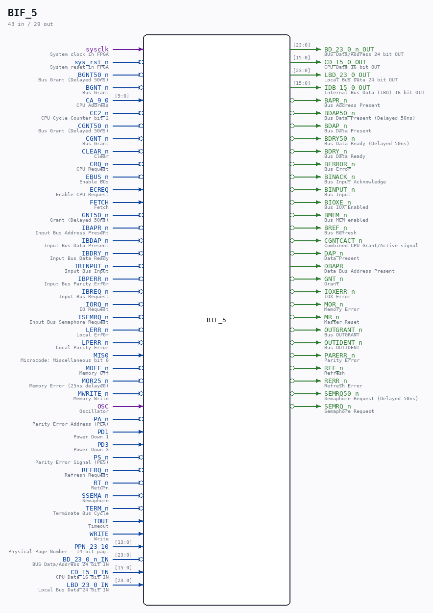
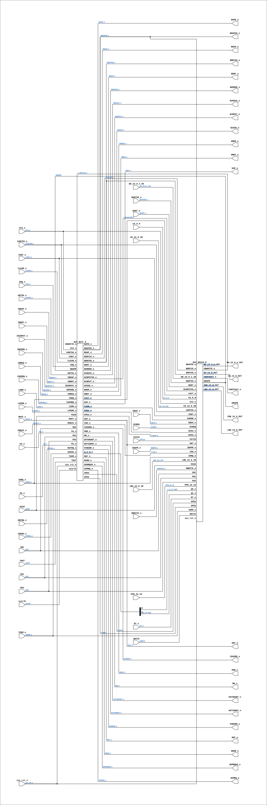

# BIF_5

Source: `Verilog/CPU-BOARD-3202/circuit/BIF_5.v`

<!-- Generated by Verilog/tests/module_doc.py from the //! comments in the source. Do not edit by hand - edit the RTL comments and regenerate. -->

<!-- HIERARCHY-NAV:BEGIN - written by Verilog/tests/gen_hierarchy.py, do not edit -->

**Where it sits** (Simulation): [ND120_TOP](../../../doc/ND120_TOP.md) > [ND120_CORE](../../../doc/ND120_CORE.md) > [ND3202D](ND3202D.md) > **BIF_5**
- instance path: `CORE.CPU_BOARD.BIF`

**Used in:** [ND3202D](ND3202D.md) (all tops)

**Contains:** [BIF_BCTL_6](BIF_BCTL_6.md), [BIF_DPATH_9](BIF_DPATH_9.md)

[Module hierarchy](../../../HIERARCHY.md) - [All modules](../../../MODULES.md)

<!-- HIERARCHY-NAV:END -->



<!-- SCHEMATIC:BEGIN - written by Verilog/tests/gen_schematics.py, do not edit -->

## Schematic

Drawn from the Verilog: the yosys netlist of the Simulation (Verilator) build, instance `CORE.CPU_BOARD.BIF`. Sub-modules are boxes (click the picture to open it full size; there every sub-module box links to its page, and every wire shows its Verilog name).

[](BIF_5.svg)

<!-- SCHEMATIC:END -->

## Description

ND120 CPU, MM&M
BIF/BCTL
BUS INTERFACE
SHEET 5  of 50
Last reviewed: 22-MAR-2025
Ronny Hansen

## Ports

| Direction | Width | Name | Description |
|---|---|---|---|
| input | `1` | `sysclk` | System clock in FPGA |
| input | `1` | `sys_rst_n` *(active low)* | System reset in FPGA |
| input | `1` | `BGNT50_n` *(active low)* | Bus Grant (Delayed 50ns) |
| input | `1` | `BGNT_n` *(active low)* | Bus Grant |
| input | `[9:0]` | `CA_9_0` | CPU Address |
| input | `1` | `CC2_n` *(active low)* | CPU Cycle Counter bit 2 |
| input | `1` | `CGNT50_n` *(active low)* | Bus Grant (Delayed 50ns) |
| input | `1` | `CGNT_n` *(active low)* | Bus Grant |
| input | `1` | `CLEAR_n` *(active low)* | Clear |
| input | `1` | `CRQ_n` *(active low)* | CPU Request |
| input | `1` | `EBUS_n` *(active low)* | Enable Bus |
| input | `1` | `ECREQ` | Enable CPU Request |
| input | `1` | `FETCH` | Fetch |
| input | `1` | `GNT50_n` *(active low)* | Grant (Delayed 50ns) |
| input | `1` | `IBAPR_n` *(active low)* | Input Bus Address Present |
| input | `1` | `IBDAP_n` *(active low)* | Input Bus Data Present |
| input | `1` | `IBDRY_n` *(active low)* | Input Bus Data Ready |
| input | `1` | `IBINPUT_n` *(active low)* | Input Bus Input |
| input | `1` | `IBPERR_n` *(active low)* | Input Bus Parity Error |
| input | `1` | `IBREQ_n` *(active low)* | Input Bus Request |
| input | `1` | `IORQ_n` *(active low)* | IO Request |
| input | `1` | `ISEMRQ_n` *(active low)* | Input Bus Semaphore Request |
| input | `1` | `LERR_n` *(active low)* | Local Error |
| input | `1` | `LPERR_n` *(active low)* | Local Parity Error |
| input | `1` | `MIS0` | Microcode: Miscellaneous bit 0 |
| input | `1` | `MOFF_n` *(active low)* | Memory Off |
| input | `1` | `MOR25_n` *(active low)* | Memory Error (25ns delayed) |
| input | `1` | `MWRITE_n` *(active low)* | Memory Write |
| input | `1` | `OSC` | Oscillator |
| input | `1` | `PA_n` *(active low)* | Parity Error Address (PEA) |
| input | `1` | `PD1` | Power Down 1 |
| input | `1` | `PD3` | Power Down 3 |
| input | `1` | `PS_n` *(active low)* | Parity Error Signal (PES) |
| input | `1` | `REFRQ_n` *(active low)* | Refresh Request |
| input | `1` | `RT_n` *(active low)* | Return |
| input | `1` | `SSEMA_n` *(active low)* | Semaphore |
| input | `1` | `TERM_n` *(active low)* | Terminate Bus Cycle |
| input | `1` | `TOUT` | Timeout |
| input | `1` | `WRITE` | Write |
| input | `[13:0]` | `PPN_23_10` | Physical Page Number - 14-bit page number for memory mapping (from CPU_15.PPN_23_10) |
| input | `[23:0]` | `BD_23_0_n_IN` | BUS Data/Address 24 bit IN |
| output | `[23:0]` | `BD_23_0_n_OUT` | BUS Data/Address 24 bit OUT |
| input | `[15:0]` | `CD_15_0_IN` | CPU Data 16 bit IN |
| output | `[15:0]` | `CD_15_0_OUT` | CPU Data 16 bit OUT |
| input | `[23:0]` | `LBD_23_0_IN` | Local Bus Data 24 bit IN |
| output | `[23:0]` | `LBD_23_0_OUT` | Local Bus Data 24 bit OUT |
| output | `[15:0]` | `IDB_15_0_OUT` | Internal Bus Data (IBD) 16 bit OUT |
| output | `1` | `BAPR_n` *(active low)* | Bus Address Present |
| output | `1` | `BDAP50_n` *(active low)* | Bus Data Present (Delayed 50ns) |
| output | `1` | `BDAP_n` *(active low)* | Bus Data Present |
| output | `1` | `BDRY50_n` *(active low)* | Bus Data Ready (Delayed 50ns) |
| output | `1` | `BDRY_n` *(active low)* | Bus Data Ready |
| output | `1` | `BERROR_n` *(active low)* | Bus Error |
| output | `1` | `BINACK_n` *(active low)* | Bus Input Acknowledge |
| output | `1` | `BINPUT_n` *(active low)* | Bus Input |
| output | `1` | `BIOXE_n` *(active low)* | Bus IOX Enabled |
| output | `1` | `BMEM_n` *(active low)* | Bus MEM enabled |
| output | `1` | `BREF_n` *(active low)* | Bus Refresh |
| output | `1` | `CGNTCACT_n` *(active low)* | Combined CPU Grant/Active signal |
| output | `1` | `DAP_n` *(active low)* | Data Present |
| output | `1` | `DBAPR` | Data Bus Address Present |
| output | `1` | `GNT_n` *(active low)* | Grant |
| output | `1` | `IOXERR_n` *(active low)* | IOX Error |
| output | `1` | `MOR_n` *(active low)* | Memory Error |
| output | `1` | `MR_n` *(active low)* | Master Reset |
| output | `1` | `OUTGRANT_n` *(active low)* | Bus OUTGRANT |
| output | `1` | `OUTIDENT_n` *(active low)* | Bus OUTIDENT |
| output | `1` | `PARERR_n` *(active low)* | Parity Error |
| output | `1` | `REF_n` *(active low)* | Refresh |
| output | `1` | `RERR_n` *(active low)* | Refresh Error |
| output | `1` | `SEMRQ50_n` *(active low)* | Semaphore Request (Delayed 50ns) |
| output | `1` | `SEMRQ_n` *(active low)* | Semaphore Request |

## Verilog source

[`Verilog/CPU-BOARD-3202/circuit/BIF_5.v`](https://github.com/RetroCoreLabs/nd-120/blob/main/Verilog/CPU-BOARD-3202/circuit/BIF_5.v) on GitHub.

<details markdown="1">
<summary>Show the Verilog of BIF_5 (435 lines)</summary>

```verilog
/**************************************************************************
** ND120 CPU, MM&M                                                       **
** BIF/BCTL                                                              **
** BUS INTERFACE                                                         **
** SHEET 5  of 50                                                        **
**                                                                       **
** Last reviewed: 22-MAR-2025                                            **
** Ronny Hansen                                                          **
***************************************************************************/

module BIF_5 (

    // FPGA signals
    input sysclk,    //! System clock in FPGA
    input sys_rst_n, //! System reset in FPGA

    // Inputs signals

    input       BGNT50_n,   //! Bus Grant (Delayed 50ns)
    input       BGNT_n,     //! Bus Grant
    input [9:0] CA_9_0,     //! CPU Address
    input       CC2_n,      //! CPU Cycle Counter bit 2
    input       CGNT50_n,   //! Bus Grant (Delayed 50ns)
    input       CGNT_n,     //! Bus Grant
    input       CLEAR_n,    //! Clear
    input       CRQ_n,      //! CPU Request
    input       EBUS_n,     //! Enable Bus
    input       ECREQ,      //! Enable CPU Request
    input       FETCH,      //! Fetch
    input       GNT50_n,    //! Grant (Delayed 50ns)
    input       IBAPR_n,    //! Input Bus Address Present
    input       IBDAP_n,    //! Input Bus Data Present
    input       IBDRY_n,    //! Input Bus Data Ready
    input       IBINPUT_n,  //! Input Bus Input
    input       IBPERR_n,   //! Input Bus Parity Error
    input       IBREQ_n,    //! Input Bus Request
    input       IORQ_n,     //! IO Request
    input       ISEMRQ_n,   //! Input Bus Semaphore Request
    input       LERR_n,     //! Local Error
    input       LPERR_n,    //! Local Parity Error
    input       MIS0,       //! Microcode: Miscellaneous bit 0
    input       MOFF_n,     //! Memory Off
    input       MOR25_n,    //! Memory Error (25ns delayed)
    input       MWRITE_n,   //! Memory Write
    input       OSC,        //! Oscillator
    input       PA_n,       //! Parity Error Address (PEA)
    input       PD1,        //! Power Down 1
    input       PD3,        //! Power Down 3
    input       PS_n,       //! Parity Error Signal (PES)
    input       REFRQ_n,    //! Refresh Request
    input       RT_n,       //! Return
    input       SSEMA_n,    //! Semaphore
    input       TERM_n,     //! Terminate Bus Cycle
    input       TOUT,       //! Timeout
    input       WRITE,      //! Write

    input [13:0] PPN_23_10,  //! Physical Page Number - 14-bit page number for memory mapping (from CPU_15.PPN_23_10)

    // INPUTS and OUTPUTS here

    input  [23:0] BD_23_0_n_IN,  //! BUS Data/Address 24 bit IN
    output [23:0] BD_23_0_n_OUT, //! BUS Data/Address 24 bit OUT


    input  [15:0] CD_15_0_IN,  //! CPU Data 16 bit IN
    output [15:0] CD_15_0_OUT, //! CPU Data 16 bit OUT


    input  [23:0] LBD_23_0_IN,  //! Local Bus Data 24 bit IN
    output [23:0] LBD_23_0_OUT, //! Local Bus Data 24 bit OUT

    // OUTPUT signals
    output [15:0] IDB_15_0_OUT,  //! Internal Bus Data (IBD) 16 bit OUT


    output BAPR_n,    //! Bus Address Present
    output BDAP50_n,  //! Bus Data Present (Delayed 50ns)
    output BDAP_n,    //! Bus Data Present
    output BDRY50_n,  //! Bus Data Ready (Delayed 50ns)
    output BDRY_n,    //! Bus Data Ready
    output BERROR_n,  //! Bus Error
    output BINACK_n,  //! Bus Input Acknowledge
    output BINPUT_n,  //! Bus Input
    output BIOXE_n,   //! Bus IOX Enabled
    output BMEM_n,    //! Bus MEM enabled
    output BREF_n,    //! Bus Refresh

    output CGNTCACT_n,  //! Combined CPU Grant/Active signal
    output DAP_n,       //! Data Present
    output DBAPR,       //! Data Bus Address Present
    output GNT_n,       //! Grant
    output IOXERR_n,    //! IOX Error
    output MOR_n,       //! Memory Error
    output MR_n,        //! Master Reset
    output OUTGRANT_n,  //! Bus OUTGRANT
    output OUTIDENT_n,  //! Bus OUTIDENT
    output PARERR_n,    //! Parity Error
    output REF_n,       //! Refresh
    output RERR_n,      //! Refresh Error
    output SEMRQ50_n,   //! Semaphore Request (Delayed 50ns)
    output SEMRQ_n      //! Semaphore Request
);


  /*******************************************************************************
   ** The wires are defined here                                                 **
   *******************************************************************************/
  wire [ 2:0] s_q_2_0_n;
  wire [ 9:0] s_ca_9_0;
  wire [13:0] s_ppn_23_10;


  wire [15:0] s_cd_15_0_in;
  wire [15:0] s_cd_15_0_out;

  wire [23:0] s_lbd_23_0_in;
  wire [23:0] s_lbd_23_0_out;

  wire [23:0] s_bd_23_0_n_in;
  wire [23:0] s_bd_23_0_n_out;


  wire [15:0] s_idb_15_0_out;

  wire        s_bapr_n;
  wire        s_bdap_n;
  wire        s_bdap50_n;
  wire        s_bdry_n;
  wire        s_bdry25_n;
  wire        s_bdry50_n;
  wire        s_berror_n;
  wire        s_bgnt_n;
  wire        s_bgnt50_n;
  wire        s_binack_n;
  wire        s_binput_n;
  wire        s_binput50_n;
  wire        s_bioxe_n;
  wire        s_bmem_n;
  wire        s_bref_n;
  wire        s_cact_n;
  wire        s_cbwrite_n;
  wire        s_cc2_n;
  wire        s_cgnt_n;
  wire        s_cgnt50_n;
  wire        s_cgntcact_n;
  wire        s_clear_n;
  wire        s_crq_n;
  wire        s_dap_n;
  wire        s_dbapr_n;
  wire        s_eaddr_n;
  wire        s_ebus_n;
  wire        s_ecreq;
  wire        s_epea_n;
  wire        s_epes_n;
  wire        s_fetch;
  wire        s_gnt_n;
  wire        s_gnt50_n;
  wire        s_ibapr_n;
  wire        s_ibdap_n;
  wire        s_ibdry_n;
  wire        s_ibinput_n;
  wire        s_ibperr_n;
  wire        s_ibreq_n;
  wire        s_iod_n;
  wire        s_ioreq_n;
  wire        s_ioxerr_n;
  wire        s_isemreq_n;
  wire        s_lerr_n;
  wire        s_lperr_n;
  wire        s_mis0;
  wire        s_moff_n;
  wire        s_mor_n;
  wire        s_mor25_n;
  wire        s_mr_n;
  wire        s_mwrite_n;
  wire        s_osc;
  wire        s_outgrant_n;
  wire        s_outident_n;
  wire        s_pa_n;
  wire        s_parerr_n;
  wire        s_pd1;
  wire        s_pd3;
  wire        s_ps_n;
  wire        s_ref_n;
  wire        s_refrq_n;
  wire        s_rerr_n;
  wire        s_rt_n;
  wire        s_semrq_n;
  wire        s_semrq50_n;
  wire        s_spea;
  wire        s_spes;
  wire        s_ssema_n;
  wire        s_term_n;
  wire        s_tout;
  wire        s_write;

  /*******************************************************************************
   ** Here all input connections are defined                                     **
   *******************************************************************************/

  assign s_bd_23_0_n_in[23:0] = BD_23_0_n_IN[23:0];
  assign s_ca_9_0[9:0]        = CA_9_0;
  assign s_cd_15_0_in[15:0]   = CD_15_0_IN;
  assign s_lbd_23_0_in[23:0]  = LBD_23_0_IN[23:0];
  assign s_ppn_23_10[13:0]    = PPN_23_10;

  assign s_bgnt_n             = BGNT_n;
  assign s_bgnt50_n           = BGNT50_n;
  assign s_cc2_n              = CC2_n;
  assign s_cgnt_n             = CGNT_n;
  assign s_cgnt50_n           = CGNT50_n;
  assign s_clear_n            = CLEAR_n;
  assign s_crq_n              = CRQ_n;
  assign s_ebus_n             = EBUS_n;
  assign s_ecreq              = ECREQ;
  assign s_fetch              = FETCH;
  assign s_gnt50_n            = GNT50_n;
  assign s_ibapr_n            = IBAPR_n;
  assign s_ibdap_n            = IBDAP_n;
  assign s_ibdry_n            = IBDRY_n;
  assign s_ibinput_n          = IBINPUT_n;
  assign s_ibperr_n           = IBPERR_n;
  assign s_ibreq_n            = IBREQ_n;
  assign s_ioreq_n            = IORQ_n;
  assign s_isemreq_n          = ISEMRQ_n;
  assign s_lerr_n             = LERR_n;
  assign s_lperr_n            = LPERR_n;
  assign s_mis0               = MIS0;
  assign s_moff_n             = MOFF_n;
  assign s_mor25_n            = MOR25_n;
  assign s_mwrite_n           = MWRITE_n;
  assign s_osc                = OSC;
  assign s_pa_n               = PA_n;
  assign s_pd1                = PD1;
  assign s_pd3                = PD3;
  assign s_ps_n               = PS_n;
  assign s_refrq_n            = REFRQ_n;
  assign s_rt_n               = RT_n;
  assign s_ssema_n            = SSEMA_n;
  assign s_term_n             = TERM_n;
  assign s_tout               = TOUT;
  assign s_write              = WRITE;

  /*******************************************************************************
   ** Here all output connections are defined                                    **
   *******************************************************************************/

  assign BD_23_0_n_OUT        = s_bd_23_0_n_out[23:0];
  assign CD_15_0_OUT          = s_cd_15_0_out[15:0];
  assign IDB_15_0_OUT         = s_idb_15_0_out[15:0];
  assign LBD_23_0_OUT         = s_lbd_23_0_out[23:0];

  assign BAPR_n               = s_bapr_n;
  assign BDAP_n               = s_bdap_n;
  assign BDAP50_n             = s_bdap50_n;
  assign BDRY_n               = s_bdry_n;
  assign BDRY50_n             = s_bdry50_n;
  assign BERROR_n             = s_berror_n;
  assign BINACK_n             = s_binack_n;
  assign BINPUT_n             = s_binput_n;
  assign BIOXE_n              = s_bioxe_n;
  assign BMEM_n               = s_bmem_n;
  assign BREF_n               = s_bref_n;
  assign CGNTCACT_n           = s_cgntcact_n;
  assign DAP_n                = s_dap_n;
  assign DBAPR                = s_dbapr_n;
  assign GNT_n                = s_gnt_n;
  assign IOXERR_n             = s_ioxerr_n;
  assign MOR_n                = s_mor_n;
  assign MR_n                 = s_mr_n;
  assign OUTGRANT_n           = s_outgrant_n;
  assign OUTIDENT_n           = s_outident_n;
  assign PARERR_n             = s_parerr_n;
  assign REF_n                = s_ref_n;
  assign RERR_n               = s_rerr_n;
  assign SEMRQ_n              = s_semrq_n;
  assign SEMRQ50_n            = s_semrq50_n;

  /*******************************************************************************
   ** Here all sub-circuits are defined                                          **
   *******************************************************************************/

  /*
   * BIF_DPATH_9 - Bus Interface Data Path Module
   *
   * This module handles the data path operations for the ND120 CPU bus interface.
   * It manages data transfers between the CPU, local bus, and system bus, including:
   * - Bus data and address routing
   * - CPU data transfers
   * - Internal bus data handling
   * - Control signal generation for bus operations
   * - Physical page number handling
   * - Error and status signal management
   * The module coordinates timing and control signals to ensure proper data flow
   * between different bus interfaces while maintaining signal integrity.
   */
  BIF_DPATH_9 DPATH (
      // Clock and reset (added for FPGA synthesis)
      .OSC         (s_osc),                   // Oscillator clock
      .sys_rst_n   (sys_rst_n),               // System reset

      // Outputs
      .BDAP50_n     (s_bdap50_n),             // Bus Data Present (50ns delayed)
      .BDRY25_n     (s_bdry25_n),             // Bus Data Ready (25ns delayed)
      .BDRY50_n     (s_bdry50_n),             // Bus Data Ready (50ns delayed)
      .CD_15_0_OUT  (s_cd_15_0_out[15:0]),    // CPU Data
      .IDB_15_0_OUT (s_idb_15_0_out[15:0]),   // Internal Bus Data
      .CGNTCACT_n   (s_cgntcact_n),           // Combined Grant/Active signal
      .DBAPR        (s_dbapr_n),              // Data Bus Address Present
      .SPEA         (s_spea),                 // Signal to latch PEA
      .SPES         (s_spes),                 // Signal to latch PES

      // Bus data in and out
      .BD_23_0_n_IN(s_bd_23_0_n_in[23:0]),  // Bus Data/Address
      .BD_23_0_n_OUT(s_bd_23_0_n_out[23:0]),  // Bus Data/Address

      .LBD_23_0_IN (s_lbd_23_0_in[23:0]),   // Local Bus Data
      .LBD_23_0_OUT (s_lbd_23_0_out[23:0]),   // Local Bus Data

      // Inputs
      .CD_15_0_IN  (s_cd_15_0_in[15:0]),    // CPU Data
      .BGNT50_n    (s_bgnt50_n),            // Bus Grant (50ns delayed)
      .BGNT_n      (s_bgnt_n),              // Bus Grant
      .BINPUT50_n  (s_binput50_n),          // Bus Input (50ns delayed)
      .CACT_n      (s_cact_n),              // CPU Active
      .CA_9_0      (s_ca_9_0[9:0]),         // CPU Address
      .CBWRITE_n   (s_cbwrite_n),           // CPU Bus Write
      .CC2_n       (s_cc2_n),               // Cycle Clock 2
      .CGNT50_n    (s_cgnt50_n),            // CPU Grant (50ns delayed)
      .CGNT_n      (s_cgnt_n),              // CPU Grant
      .EADDR_n     (s_eaddr_n),             // Error Address
      .EBUS_n      (s_ebus_n),              // Enable Bus
      .ECREQ       (s_ecreq),               // EnableCPU Request
      .EPEA_n      (s_epea_n),              // Enable PEA
      .EPES_n      (s_epes_n),              // Enable PES
      .FETCH       (s_fetch),               // Fetch cycle
      .GNT_n       (s_gnt_n),               // Grant
      .IBAPR_n     (s_ibapr_n),             // Input Bus Address Present
      .IOD_n       (s_iod_n),               // I/O Data
      .IORQ_n      (s_ioreq_n),             // I/O Request
      .MIS0        (s_mis0),                // Miscellaneous 0
      .MWRITE_n    (s_mwrite_n),            // Memory Write
      .PD1         (s_pd1),                 // Power Down 1
      .PD3         (s_pd3),                 // Power Down 3
      .PPN_23_10   (s_ppn_23_10[13:0]),     // Physical Page Number
      .Q0_n        (s_q_2_0_n[0]),          // State bit 0
      .Q2_n        (s_q_2_0_n[2]),          // State bit 2
      .RT_n        (s_rt_n),                // Return
      .TERM_n      (s_term_n),              // Terminate
      .WRITE       (s_write)                // Write cycle
  );

  (* keep = "true", DONT_TOUCH = "true" *) wire unused_s_Q1_bit;
  assign unused_s_Q1_bit = s_q_2_0_n[1];

  /*
   * BIF_BCTL_6 - Bus Interface Control Module
   *
   * This module handles bus control and timing for the ND120 CPU bus interface.
   * It manages bus transactions including data transfers, error handling,
   * semaphore operations, and refresh cycles. The module generates control
   * signals for bus operations and monitors status signals to coordinate
   * communication between the CPU and external devices.
   */
  BIF_BCTL_6 BCTL (
      .sysclk(sysclk),
      // Outputs
      .BAPR_n    (s_bapr_n),      // Bus Address Present
      .BDAP50_n  (s_bdap50_n),    // Bus Data Present (50ns delayed)
      .BDAP_n    (s_bdap_n),      // Bus Data Present
      .BDRY25_n  (s_bdry25_n),    // Bus Data Ready (25ns delayed)
      .BDRY50_n  (s_bdry50_n),    // Bus Data Ready (50ns delayed)
      .BDRY_n    (s_bdry_n),      // Bus Data Ready
      .BERROR_n  (s_berror_n),    // Bus Error
      .BINACK_n  (s_binack_n),    // Bus Input Acknowledge
      .BINPUT_n  (s_binput_n),    // Bus Input
      .BIOXE_n   (s_bioxe_n),     // Bus I/O Execute
      .BMEM_n    (s_bmem_n),      // Bus MEMory Reference
      .BREF_n    (s_bref_n),      // Bus Refresh
      .DAP_n     (s_dap_n),       // Data Present
      .IOXERR_n  (s_ioxerr_n),    // I/O Execute Error
      .MOR25_n   (s_mor25_n),     // Memory Error (25ns delayed)
      .MOR_n     (s_mor_n),       // Memory Error
      .MR_n      (s_mr_n),        // Memory Ready
      .OUTGRANT_n(s_outgrant_n),  // Output Grant
      .OUTIDENT_n(s_outident_n),  // Output Identify
      .PARERR_n  (s_parerr_n),    // Parity Error
      .REF_n     (s_ref_n),       // Refresh
      .RERR_n    (s_rerr_n),      // Read Error
      .SEMRQ50_n (s_semrq50_n),   // Semaphore Request (50ns delayed)
      .SEMRQ_n   (s_semrq_n),     // Semaphore Request
      .SPEA      (s_spea),        // Signal to latch PEA
      .SPES      (s_spes),        // Signal to latch PES

      // Inputs
      .BINPUT50_n(s_binput50_n),    // Bus Input (50ns delayed)
      .CACT_n    (s_cact_n),        // CPU Active
      .CBWRITE_n (s_cbwrite_n),     // CPU Bus Write
      .CC2_n     (s_cc2_n),         // Cycle Clock 2
      .CGNT50_n  (s_cgnt50_n),      // CPU Grant (50ns delayed)
      .CGNT_n    (s_cgnt_n),        // CPU Grant
      .CLEAR_n   (s_clear_n),       // Clear
      .CRQ_n     (s_crq_n),         // CPU Request
      .DBAPR     (s_dbapr_n),       // Data Bus Address Present
      .EADR_n    (s_eaddr_n),       // Error Address
      .EPEA_n    (s_epea_n),        // Enable PEA
      .EPES_n    (s_epes_n),        // Enable PES
      .GNT50_n   (s_gnt50_n),       // Grant (50ns delayed)
      .GNT_n     (s_gnt_n),         // Grant
      .IBDAP_n   (s_ibdap_n),       // Input Bus Data Present
      .IBDRY_n   (s_ibdry_n),       // Input Bus Data Ready
      .IBINPUT_n (s_ibinput_n),     // Input Bus Input
      .IBPERR_n  (s_ibperr_n),      // Input Bus Parity Error
      .IBREQ_n   (s_ibreq_n),       // Input Bus Request
      .IOD_n     (s_iod_n),         // IO SIGNAL TO LAST FOR THE ENTIRE BUS CYCLE
      .IORQ_n    (s_ioreq_n),       // I/O Request
      .ISEMRQ_n  (s_isemreq_n),     // Input Semaphore Request
      .LERR_n    (s_lerr_n),        // Local Error
      .LPERR_n   (s_lperr_n),       // Local Parity Error
      .MIS0      (s_mis0),          // Miscellaneous 0
      .MOFF_n    (s_moff_n),        // Memory Off
      .OSC       (s_osc),           // Oscillator
      .sys_rst_n (sys_rst_n),       // System reset
      .PA_n      (s_pa_n),          // Parity Error Address (PEA)
      .PD1       (s_pd1),           // Power Down 1
      .PD3       (s_pd3),           // Power Down 3
      .PS_n      (s_ps_n),          // Parity Error Signal (PES)
      .Q_2_0_n   (s_q_2_0_n[2:0]),  // State bits [2:0]
      .REFRQ_n   (s_refrq_n),       // Refresh Request
      .SSEMA_n   (s_ssema_n),       // Semaphore Semaphore
      .TERM_n    (s_term_n),        // Terminate Cycle
      .TOUT      (s_tout)           // Timeout
  );

endmodule
```

</details>
