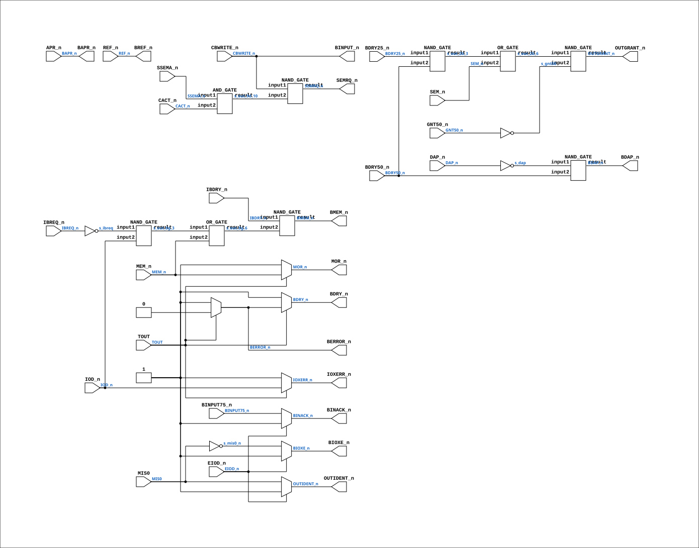

# BIF_BCTL_BDRV_7

Source: `Verilog/CPU-BOARD-3202/circuit/BIF_BCTL_BDRV_7.v`

<!-- Generated by Verilog/tests/module_doc.py from the //! comments in the source. Do not edit by hand - edit the RTL comments and regenerate. -->

<!-- HIERARCHY-NAV:BEGIN - written by Verilog/tests/gen_hierarchy.py, do not edit -->

**Where it sits** (Simulation): [ND120_TOP](../../../doc/ND120_TOP.md) > [ND120_CORE](../../../doc/ND120_CORE.md) > [ND3202D](ND3202D.md) > [BIF_5](BIF_5.md) > [BIF_BCTL_6](BIF_BCTL_6.md) > **BIF_BCTL_BDRV_7**
- instance path: `CORE.CPU_BOARD.BIF.BCTL.BDRV`

**Used in:** [BIF_BCTL_6](BIF_BCTL_6.md) (all tops)

**Contains:** [AND_GATE](../../../Shared/logisim/doc/AND_GATE.md), [NAND_GATE](../../../Shared/logisim/doc/NAND_GATE.md) x6, [OR_GATE](../../../Shared/logisim/doc/OR_GATE.md) x2

[Module hierarchy](../../../HIERARCHY.md) - [All modules](../../../MODULES.md)

<!-- HIERARCHY-NAV:END -->


<!-- SCHEMATIC:BEGIN - written by Verilog/tests/gen_schematics.py, do not edit -->

## Schematic

Drawn from the Verilog: the yosys netlist of the Simulation (Verilator) build, instance `CORE.CPU_BOARD.BIF.BCTL.BDRV`. Sub-modules are boxes (click the picture to open it full size; there every sub-module box links to its page, and every wire shows its Verilog name).

[](BIF_BCTL_BDRV_7.svg)

<!-- SCHEMATIC:END -->

## Description

ND120 CPU, MM&M
BIF/BCTL/BDRV
BUS DRIVER
SHEET 7 of 50
Last reviewed: 22-MAR-2024
Ronny Hansen

## Ports

| Direction | Width | Name | Description |
|---|---|---|---|
| input | `1` | `APR_n` *(active low)* | Address Present |
| input | `1` | `BDRY25_n` *(active low)* | Bus Data Ready (25ns delayed) |
| input | `1` | `BDRY50_n` *(active low)* | Bus Data Ready (50ns delayed) |
| input | `1` | `BINPUT75_n` *(active low)* | Bus Input (75ns delayed) |
| input | `1` | `CACT_n` *(active low)* | CPU Active |
| input | `1` | `CBWRITE_n` *(active low)* | CPU Bus Write |
| input | `1` | `DAP_n` *(active low)* | Data Present |
| input | `1` | `EIOD_n` *(active low)* | Enable I/O Data |
| input | `1` | `GNT50_n` *(active low)* | Grant (50ns delayed) |
| input | `1` | `IBDRY_n` *(active low)* | Input Bus Data Ready |
| input | `1` | `IBREQ_n` *(active low)* | Input Bus Request |
| input | `1` | `IOD_n` *(active low)* | IO D signal |
| input | `1` | `MEM_n` *(active low)* | Memory |
| input | `1` | `MIS0` | Microcode Misc 0 bit |
| input | `1` | `REF_n` *(active low)* | Refresh |
| input | `1` | `SEM_n` *(active low)* | Semaphore |
| input | `1` | `SSEMA_n` *(active low)* | Semaphore |
| input | `1` | `TOUT` | Timeout |
| output | `1` | `BAPR_n` *(active low)* | Bus Address Present |
| output | `1` | `BDAP_n` *(active low)* | Bus Data Present |
| output | `1` | `BDRY_n` *(active low)* | Bus Data Ready |
| output | `1` | `BERROR_n` *(active low)* | Bus Error |
| output | `1` | `BINACK_n` *(active low)* | Bus Input Acknowledge |
| output | `1` | `BINPUT_n` *(active low)* | Bus Input |
| output | `1` | `BIOXE_n` *(active low)* | Bus I/O Execute |
| output | `1` | `BMEM_n` *(active low)* | Bus MEMory Reference |
| output | `1` | `BREF_n` *(active low)* | Bus Refresh |
| output | `1` | `IOXERR_n` *(active low)* | I/O Execute Error |
| output | `1` | `MOR_n` *(active low)* | Memory Error |
| output | `1` | `OUTGRANT_n` *(active low)* | Output Grant |
| output | `1` | `OUTIDENT_n` *(active low)* | Output Identify |
| output | `1` | `SEMRQ_n` *(active low)* | Semaphore Request |

## Verilog source

[`Verilog/CPU-BOARD-3202/circuit/BIF_BCTL_BDRV_7.v`](https://github.com/RetroCoreLabs/nd-120/blob/main/Verilog/CPU-BOARD-3202/circuit/BIF_BCTL_BDRV_7.v) on GitHub.

<details markdown="1">
<summary>Show the Verilog of BIF_BCTL_BDRV_7 (258 lines)</summary>

```verilog
/**************************************************************************
** ND120 CPU, MM&M                                                       **
** BIF/BCTL/BDRV                                                         **
** BUS DRIVER                                                            **
** SHEET 7 of 50                                                         **
**                                                                       **
** Last reviewed: 22-MAR-2024                                            **
** Ronny Hansen                                                          **
***************************************************************************/

module BIF_BCTL_BDRV_7 (
    input APR_n,       //! Address Present
    input BDRY25_n,    //! Bus Data Ready (25ns delayed)
    input BDRY50_n,    //! Bus Data Ready (50ns delayed)
    input BINPUT75_n,  //! Bus Input (75ns delayed)
    input CACT_n,      //! CPU Active
    input CBWRITE_n,   //! CPU Bus Write
    input DAP_n,       //! Data Present
    input EIOD_n,      //! Enable I/O Data
    input GNT50_n,     //! Grant (50ns delayed)
    input IBDRY_n,     //! Input Bus Data Ready
    input IBREQ_n,     //! Input Bus Request
    input IOD_n,       //! IO D signal
    input MEM_n,       //! Memory
    input MIS0,        //! Microcode Misc 0 bit
    input REF_n,       //! Refresh
    input SEM_n,       //! Semaphore
    input SSEMA_n,     //! Semaphore
    input TOUT,        //! Timeout

    output BAPR_n,     //! Bus Address Present
    output BDAP_n,     //! Bus Data Present
    output BDRY_n,     //! Bus Data Ready
    output BERROR_n,   //! Bus Error
    output BINACK_n,   //! Bus Input Acknowledge
    output BINPUT_n,   //! Bus Input
    output BIOXE_n,    //! Bus I/O Execute
    output BMEM_n,     //! Bus MEMory Reference 
    output BREF_n,     //! Bus Refresh
    output IOXERR_n,   //! I/O Execute Error
    output MOR_n,      //! Memory Error
    output OUTGRANT_n, //! Output Grant
    output OUTIDENT_n, //! Output Identify
    output SEMRQ_n     //! Semaphore Request
);


// ND-06.016.01.PDF page 140
//
// BMEM_N serves two important functions.
// It enables the memory system for further operations and ”freezes” the DMA request status on the DMA controllers
// (0=Read from MEM to BUS)
//
// The ”freezing” of the DMA request status is done to ensure a stabilized test condition for the INGRANT/OUTGRANT search chain.
// (It might happen that a DMA controller activates its request simultaneously with the reception of INGRANT.)
// That is, leading edge of BMEM_n is the last chance for a DMA request to be served by the current INGRANT/OUTGRANT search.


  /*******************************************************************************
   ** The wires are defined here                                                 **
   *******************************************************************************/
  wire s_iod_n;
  wire s_eiod_n;
  wire s_outident_n;
  wire s_bioxe_n;
  wire s_binack_n;
  wire s_ioxerr_n;
  wire s_mor_n;
  wire s_bdry_n;
  wire s_ibdry_n;
  wire s_sem_n;
  wire s_cbwrite_n;

  wire s_out_8g_6;
  wire s_gnt50;
  wire s_gnd;
  wire s_mis0_n;
  wire s_dap_n;
  wire s_ssema_n;
  wire s_cact_n;
  wire s_bmem_n;
  wire s_mem_n;
  wire s_out_2a_8;
  wire s_berror_n;
  wire s_gnt50_n;
  wire s_out_2b_8;
  wire s_ibreq;
  wire s_out_8g_3;
  wire s_ref_n;
  wire s_apr_n;
  wire s_ibreq_n;
  wire s_bdry25_n;
  wire s_bdry50_n;
  wire s_bdap_n;
  wire s_binput75_n;
  wire s_out_2b_3;
  wire s_tout;
  wire s_dap;
  wire s_out_9d_10;
  wire s_mis0;
  wire s_out_2b_6;

  /*******************************************************************************
   ** Here all input connections are defined                                     **
   *******************************************************************************/
  assign s_apr_n      = APR_n;
  assign s_bdry25_n   = BDRY25_n;
  assign s_bdry50_n   = BDRY50_n;
  assign s_binput75_n = BINPUT75_n;
  assign s_cact_n     = CACT_n;
  assign s_cbwrite_n  = CBWRITE_n;
  assign s_dap_n      = DAP_n;
  assign s_gnt50_n    = GNT50_n;
  assign s_ibdry_n    = IBDRY_n;
  assign s_ibreq_n    = IBREQ_n;
  assign s_iod_n      = IOD_n;
  assign s_eiod_n     = EIOD_n;
  assign s_mem_n      = MEM_n;
  assign s_mis0       = MIS0;
  assign s_ref_n      = REF_n;
  assign s_sem_n      = SEM_n;
  assign s_ssema_n    = SSEMA_n;
  assign s_tout       = TOUT;

  /*******************************************************************************
   ** Here all output connections are defined                                    **
   *******************************************************************************/
  assign BAPR_n       = s_apr_n;
  assign BDAP_n       = s_bdap_n;
  assign BDRY_n       = s_bdry_n;
  assign BERROR_n     = s_berror_n;
  assign BINACK_n     = s_binack_n;
  assign BINPUT_n     = s_cbwrite_n;
  assign BIOXE_n      = s_bioxe_n;
  assign BMEM_n       = s_bmem_n;
  assign BREF_n       = s_ref_n;
  assign IOXERR_n     = s_ioxerr_n;
  assign MOR_n        = s_mor_n;
  assign OUTGRANT_n   = s_out_2b_8;
  assign OUTIDENT_n   = s_outident_n;
  assign SEMRQ_n      = s_out_2a_8;

  /*******************************************************************************
   ** Here all in-lined components are defined                                   **
   *******************************************************************************/

  // Ground
  assign s_gnd        = 1'b0;

  // Signal inverters
  assign s_gnt50      = ~s_gnt50_n;
  assign s_mis0_n     = ~s_mis0;
  assign s_ibreq      = ~s_ibreq_n;
  assign s_dap        = ~s_dap_n;

  /*******************************************************************************
   ** Here all normal components are defined                                     **
   *******************************************************************************/
  OR_GATE #(
      .BubblesMask(2'b11)
  ) GATES_1 (
      .input1(s_out_2b_3),
      .input2(s_sem_n),
      .result(s_out_2b_6)
  );

  NAND_GATE #(
      .BubblesMask(2'b00)
  ) GATES_2 (
      .input1(s_cbwrite_n),
      .input2(s_out_9d_10),
      .result(s_out_2a_8)
  );

  NAND_GATE #(
      .BubblesMask(2'b00)
  ) GATES_3 (
      .input1(s_out_2b_6),
      .input2(s_gnt50),
      .result(s_out_2b_8)
  );

  NAND_GATE #(
      .BubblesMask(2'b00)
  ) GATES_4 (
      .input1(s_ibreq),
      .input2(s_iod_n),
      .result(s_out_8g_3)
  );

  OR_GATE #(
      .BubblesMask(2'b11)
  ) GATES_5 (
      .input1(s_out_8g_3),
      .input2(s_mem_n),
      .result(s_out_8g_6)
  );

  AND_GATE #(
      .BubblesMask(2'b11)
  ) GATES_6 (
      .input1(s_ssema_n),
      .input2(s_cact_n),
      .result(s_out_9d_10)
  );

  NAND_GATE #(
      .BubblesMask(2'b00)
  ) GATES_7 (
      .input1(s_dap),
      .input2(s_bdry50_n),
      .result(s_bdap_n)
  );

  NAND_GATE #(
      .BubblesMask(2'b00)
  ) GATES_8 (
      .input1(s_ibdry_n),
      .input2(s_out_8g_6),
      .result(s_bmem_n)
  );

  NAND_GATE #(
      .BubblesMask(2'b00)
  ) GATES_9 (
      .input1(s_bdry25_n),
      .input2(s_bdry50_n),
      .result(s_out_2b_3)
  );


  /*******************************************************************************
   ** Here all sub-circuits are defined                                          **
   *******************************************************************************/

   // Refactored away the 74F241 CHIP 3A into logic

  // pull OUTIDENT_n high if EIOD_n is high (giving 3 state output on 74241-Y1)
  assign s_outident_n = s_eiod_n ? 1'b1 : s_mis0; // PULL UP

  // Changed from the original schematic - Pull BIOXE and BINACK high instead of three-state. Maybe there are some pull-up resisters somewhere else?
  // pull BIOXE_n high if EOID_n is high (giving 3 state output on 74241-Y1)
  assign s_bioxe_n = s_eiod_n ? 1'b1 : s_mis0_n; // No pull up here.. somewhere else ??

  // pull BINACK_n high if EOID_n is high (giving 3 state output on 74241-Y1)
  assign s_binack_n =  s_eiod_n ? 1'b1 : s_binput75_n; // No pull up here.. somewhere else ??
 
  // 4th output of 74241-Y1 is not connected

  // pull IOXERR_n, MOR_n,BERROR_n and BDRY_n high if TOUT is low (giving 3 state output on 74241-Y2)
  assign s_ioxerr_n = s_tout ? s_iod_n : 1'b1;  // PULL UP
  assign s_mor_n    = s_tout ? s_mem_n : 1'b1;  // PULL UP
  assign s_berror_n = s_tout ? s_gnd : 1'b1;    // No pull up here.. somewhere else ??
  assign s_bdry_n   = s_tout ? s_berror_n: 1'b1;// No pull up here.. somewhere else ??


endmodule
```

</details>
