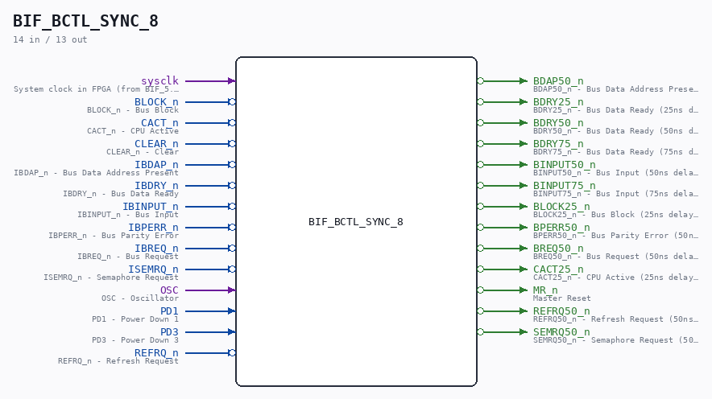
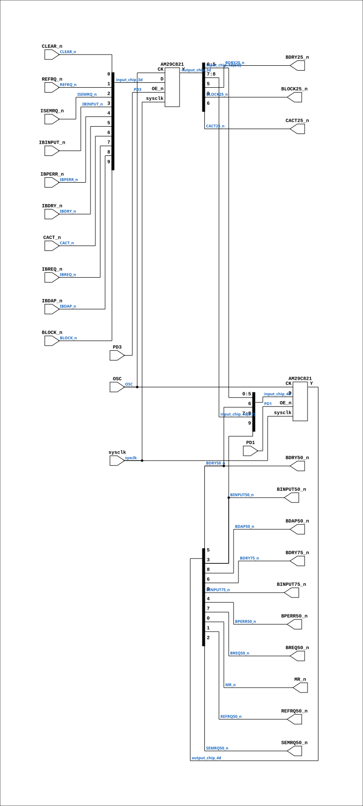

# BIF_BCTL_SYNC_8

Source: `Verilog/CPU-BOARD-3202/circuit/BIF_BCTL_SYNC_8.v`

<!-- Generated by Verilog/tests/module_doc.py from the //! comments in the source. Do not edit by hand - edit the RTL comments and regenerate. -->

<!-- HIERARCHY-NAV:BEGIN - written by Verilog/tests/gen_hierarchy.py, do not edit -->

**Where it sits** (Simulation): [ND120_TOP](../../../doc/ND120_TOP.md) > [ND120_CORE](../../../doc/ND120_CORE.md) > [ND3202D](ND3202D.md) > [BIF_5](BIF_5.md) > [BIF_BCTL_6](BIF_BCTL_6.md) > **BIF_BCTL_SYNC_8**
- instance path: `CORE.CPU_BOARD.BIF.BCTL.SYNC`

**Used in:** [BIF_BCTL_6](BIF_BCTL_6.md) (all tops)

**Contains:** [AM29C821](../../../Shared/support/doc/AM29C821.md) x2

[Module hierarchy](../../../HIERARCHY.md) - [All modules](../../../MODULES.md)

<!-- HIERARCHY-NAV:END -->



<!-- SCHEMATIC:BEGIN - written by Verilog/tests/gen_schematics.py, do not edit -->

## Schematic

Drawn from the Verilog: the yosys netlist of the Simulation (Verilator) build, instance `CORE.CPU_BOARD.BIF.BCTL.SYNC`. Sub-modules are boxes (click the picture to open it full size; there every sub-module box links to its page, and every wire shows its Verilog name).

[](BIF_BCTL_SYNC_8.svg)

<!-- SCHEMATIC:END -->

## Description

ND120 CPU, MM&M
BIF/BCTL/SYNC
BIF SYNC
SHEET 8 of 50
Last reviewed: 14-DEC-2024
Ronny Hansen

## Ports

| Direction | Width | Name | Description |
|---|---|---|---|
| input | `1` | `sysclk` | System clock in FPGA (from BIF_5.sysclk) |
| input | `1` | `BLOCK_n` *(active low)* | BLOCK_n - Bus Block |
| input | `1` | `CACT_n` *(active low)* | CACT_n - CPU Active |
| input | `1` | `CLEAR_n` *(active low)* | CLEAR_n - Clear |
| input | `1` | `IBDAP_n` *(active low)* | IBDAP_n - Bus Data Address Present |
| input | `1` | `IBDRY_n` *(active low)* | IBDRY_n - Bus Data Ready |
| input | `1` | `IBINPUT_n` *(active low)* | IBINPUT_n - Bus Input |
| input | `1` | `IBPERR_n` *(active low)* | IBPERR_n - Bus Parity Error |
| input | `1` | `IBREQ_n` *(active low)* | IBREQ_n - Bus Request |
| input | `1` | `ISEMRQ_n` *(active low)* | ISEMRQ_n - Semaphore Request |
| input | `1` | `OSC` | OSC - Oscillator |
| input | `1` | `PD1` | PD1 - Power Down 1 |
| input | `1` | `PD3` | PD3 - Power Down 3 |
| input | `1` | `REFRQ_n` *(active low)* | REFRQ_n - Refresh Request |
| output | `1` | `BDAP50_n` *(active low)* | BDAP50_n - Bus Data Address Present (50ns delayed) |
| output | `1` | `BDRY25_n` *(active low)* | BDRY25_n - Bus Data Ready (25ns delayed) |
| output | `1` | `BDRY50_n` *(active low)* | BDRY50_n - Bus Data Ready (50ns delayed) |
| output | `1` | `BDRY75_n` *(active low)* | BDRY75_n - Bus Data Ready (75ns delayed) |
| output | `1` | `BINPUT50_n` *(active low)* | BINPUT50_n - Bus Input (50ns delayed) |
| output | `1` | `BINPUT75_n` *(active low)* | BINPUT75_n - Bus Input (75ns delayed) |
| output | `1` | `BLOCK25_n` *(active low)* | BLOCK25_n - Bus Block (25ns delayed) |
| output | `1` | `BPERR50_n` *(active low)* | BPERR50_n - Bus Parity Error (50ns delayed) |
| output | `1` | `BREQ50_n` *(active low)* | BREQ50_n - Bus Request (50ns delayed) |
| output | `1` | `CACT25_n` *(active low)* | CACT25_n - CPU Active (25ns delayed) |
| output | `1` | `MR_n` *(active low)* | Master Reset |
| output | `1` | `REFRQ50_n` *(active low)* | REFRQ50_n - Refresh Request (50ns delayed) |
| output | `1` | `SEMRQ50_n` *(active low)* | SEMRQ50_n - Semaphore Request (50ns delayed) |

## Verilog source

[`Verilog/CPU-BOARD-3202/circuit/BIF_BCTL_SYNC_8.v`](https://github.com/RetroCoreLabs/nd-120/blob/main/Verilog/CPU-BOARD-3202/circuit/BIF_BCTL_SYNC_8.v) on GitHub.

<details markdown="1">
<summary>Show the Verilog of BIF_BCTL_SYNC_8 (202 lines)</summary>

```verilog
/**************************************************************************
** ND120 CPU, MM&M                                                       **
** BIF/BCTL/SYNC                                                         **
** BIF SYNC                                                              **
** SHEET 8 of 50                                                         **
**                                                                       **
** Last reviewed: 14-DEC-2024                                            **
** Ronny Hansen                                                          **
***************************************************************************/

module BIF_BCTL_SYNC_8 (

    // Inputs signals
    input sysclk,     //! System clock in FPGA (from BIF_5.sysclk)
    input BLOCK_n,    //! BLOCK_n - Bus Block
    input CACT_n,     //! CACT_n - CPU Active
    input CLEAR_n,    //! CLEAR_n - Clear
    input IBDAP_n,    //! IBDAP_n - Bus Data Address Present
    input IBDRY_n,    //! IBDRY_n - Bus Data Ready
    input IBINPUT_n,  //! IBINPUT_n - Bus Input
    input IBPERR_n,   //! IBPERR_n - Bus Parity Error
    input IBREQ_n,    //! IBREQ_n - Bus Request
    input ISEMRQ_n,   //! ISEMRQ_n - Semaphore Request
    input OSC,        //! OSC - Oscillator
    input PD1,        //! PD1 - Power Down 1
    input PD3,        //! PD3 - Power Down 3
    input REFRQ_n,    //! REFRQ_n - Refresh Request

    // Output signals
    output BDAP50_n,    //! BDAP50_n - Bus Data Address Present (50ns delayed)
    output BDRY25_n,    //! BDRY25_n - Bus Data Ready (25ns delayed)
    output BDRY50_n,    //! BDRY50_n - Bus Data Ready (50ns delayed)
    output BDRY75_n,    //! BDRY75_n - Bus Data Ready (75ns delayed)
    output BINPUT50_n,  //! BINPUT50_n - Bus Input (50ns delayed)
    output BINPUT75_n,  //! BINPUT75_n - Bus Input (75ns delayed)
    output BLOCK25_n,   //! BLOCK25_n - Bus Block (25ns delayed)
    output BPERR50_n,   //! BPERR50_n - Bus Parity Error (50ns delayed)
    output BREQ50_n,    //! BREQ50_n - Bus Request (50ns delayed)
    output CACT25_n,    //! CACT25_n - CPU Active (25ns delayed)
    output MR_n,        //! Master Reset
    output REFRQ50_n,   //! REFRQ50_n - Refresh Request (50ns delayed)
    output SEMRQ50_n    //! SEMRQ50_n - Semaphore Request (50ns delayed)
);

  /*******************************************************************************
   ** The wires are defined here                                                 **
   *******************************************************************************/
  wire s_bdry25_n;
  wire s_binput50_n;
  wire s_osc;
  wire s_pd1;
  wire s_pd3;
  wire s_ibreq_n;
  wire s_block_n;
  wire s_cact_n;
  wire s_ibperr_n;
  wire s_isemrq_n;
  wire s_clear_n;
  wire s_refrq_n;
  wire s_ibinput_n;
  wire s_ibdry_n;
  wire s_ibdap_n;
  wire s_binput75_n;
  wire s_breq50_n;
  wire s_bdap50_n;
  wire s_bdry50_n;
  wire s_bdry75_n;
  wire s_block25_n;
  wire s_cact25_n;
  wire s_mr_n;
  wire s_refrq50_n;
  wire s_semrq50_n;
  wire s_bperr50_n;

  // Intermediate wires for CHIP_3D outputs
  wire s_bdap25_n;
  wire s_breq25_n;
  wire s_bperr25_n;
  wire s_binput25_n;
  wire s_semrq25_n;
  wire s_refrq25_n;
  wire s_clear25_n;

  // Intermediate wires for CHIP_3D and CHIP_4D inputs and outputs
  wire [9:0] input_chip_3d;
  wire [9:0] output_chip_3d;
  wire [9:0] input_chip_4d;
  wire [9:0] output_chip_4d;

  /*******************************************************************************
   ** Here all input connections are defined                                     **
   *******************************************************************************/
  assign s_ibdap_n   = IBDAP_n;
  assign s_block_n   = BLOCK_n;
  assign s_cact_n    = CACT_n;
  assign s_osc       = OSC;
  assign s_ibperr_n  = IBPERR_n;
  assign s_isemrq_n  = ISEMRQ_n;
  assign s_clear_n   = CLEAR_n;
  assign s_refrq_n   = REFRQ_n;
  assign s_ibinput_n = IBINPUT_n;
  assign s_ibdry_n   = IBDRY_n;
  assign s_pd1       = PD1;
  assign s_pd3       = PD3;
  assign s_ibreq_n   = IBREQ_n;

  /*******************************************************************************
   ** Here all output connections are defined                                    **
   *******************************************************************************/
  assign BDAP50_n    = s_bdap50_n;
  assign BDRY25_n    = s_bdry25_n;
  assign BDRY50_n    = s_bdry50_n;
  assign BDRY75_n    = s_bdry75_n;
  assign BINPUT50_n  = s_binput50_n;
  assign BINPUT75_n  = s_binput75_n;
  assign BLOCK25_n   = s_block25_n;
  assign BPERR50_n   = s_bperr50_n;
  assign BREQ50_n    = s_breq50_n;
  assign CACT25_n    = s_cact25_n;
  assign MR_n        = s_mr_n;
  assign REFRQ50_n   = s_refrq50_n;
  assign SEMRQ50_n   = s_semrq50_n;

  /*******************************************************************************
   ** Here all sub-circuits are defined                                          **
   *******************************************************************************/

  // Bus Driver 10 bits. Positive edge-triggered registers with D-type flip-flops and 3-state
  AM29C821 CHIP_3D (
      .sysclk(sysclk),
      .CK(s_osc),
      .OE_n(s_pd3),
      .D(input_chip_3d),
      .Y(output_chip_3d)
  );

  // Assignments for CHIP_3D inputs and outputs
  assign input_chip_3d = {
    s_block_n,
    s_ibdap_n,
    s_ibreq_n,
    s_cact_n,
    s_ibdry_n,
    s_ibperr_n,
    s_ibinput_n,
    s_isemrq_n,
    s_refrq_n,
    s_clear_n
  };


  assign {
      s_block25_n,
      s_bdap25_n,
      s_breq25_n,
      s_cact25_n,
      s_bdry25_n,
      s_bperr25_n,
      s_binput25_n,
      s_semrq25_n,
      s_refrq25_n,
      s_clear25_n
      } = output_chip_3d;


  // Bus Driver 10 bits. Positive edge-triggered registers with D-type flip-flops and 3-state
  AM29C821 CHIP_4D (
      .sysclk(sysclk),
      .CK(s_osc),
      .OE_n(s_pd1),
      .D(input_chip_4d),
      .Y(output_chip_4d)
  );

  // Assignments for CHIP_4D inputs and outputs
  assign input_chip_4d = {
    s_binput50_n,
    s_bdap25_n,
    s_breq25_n,
    s_bdry50_n,
    s_bdry25_n,
    s_bperr25_n,
    s_binput25_n,
    s_semrq25_n,
    s_refrq25_n,
    s_clear25_n
  };

  assign {
   s_binput75_n,
   s_bdap50_n,
   s_breq50_n,
   s_bdry75_n,
   s_bdry50_n,
   s_bperr50_n,
   s_binput50_n,
   s_semrq50_n,
   s_refrq50_n,
   s_mr_n
   } = output_chip_4d;

endmodule
```

</details>
