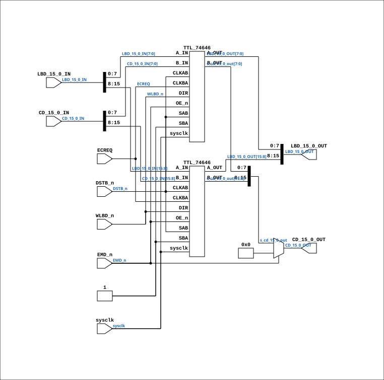

# BIF_DPATH_CDLBD_11

Source: `Verilog/CPU-BOARD-3202/circuit/BIF_DPATH_CDLBD_11.v`

<!-- Generated by Verilog/tests/module_doc.py from the //! comments in the source. Do not edit by hand - edit the RTL comments and regenerate. -->

<!-- HIERARCHY-NAV:BEGIN - written by Verilog/tests/gen_hierarchy.py, do not edit -->

**Where it sits** (Simulation): [ND120_TOP](../../../doc/ND120_TOP.md) > [ND120_CORE](../../../doc/ND120_CORE.md) > [ND3202D](ND3202D.md) > [BIF_5](BIF_5.md) > [BIF_DPATH_9](BIF_DPATH_9.md) > **BIF_DPATH_CDLBD_11**
- instance path: `CORE.CPU_BOARD.BIF.DPATH.CDLBD`

**Used in:** [BIF_DPATH_9](BIF_DPATH_9.md) (all tops)

**Contains:** [TTL_74646](../../../Shared/support/doc/TTL_74646.md) x2

[Module hierarchy](../../../HIERARCHY.md) - [All modules](../../../MODULES.md)

<!-- HIERARCHY-NAV:END -->


<!-- SCHEMATIC:BEGIN - written by Verilog/tests/gen_schematics.py, do not edit -->

## Schematic

Drawn from the Verilog: the yosys netlist of the Simulation (Verilator) build, instance `CORE.CPU_BOARD.BIF.DPATH.CDLBD`. Sub-modules are boxes (click the picture to open it full size; there every sub-module box links to its page, and every wire shows its Verilog name).

[](BIF_DPATH_CDLBD_11.svg)

<!-- SCHEMATIC:END -->

## Description

ND120 CPU, MM&M
BIF/DPATH/CDLBD
BIF CD TO LBD
SHEET 11 of 50
Last reviewed: 20-DEC-2024
Ronny Hansen

## Ports

| Direction | Width | Name | Description |
|---|---|---|---|
| input | `1` | `sysclk` | System clock (used only for the FF-mode strobe edge-capture) |
| input | `1` | `DSTB_n` *(active low)* | Data Strobe |
| input | `1` | `ECREQ` | Enable CPU Request |
| input | `1` | `EMD_n` *(active low)* | Enable Memory |
| input | `1` | `WLBD_n` *(active low)* | Write Local Bus Data |
| input | `[15:0]` | `LBD_15_0_IN` | Local Bus Data Input (16 bits) |
| output | `[15:0]` | `LBD_15_0_OUT` | Local Bus Data Output (16 bits) |
| input | `[15:0]` | `CD_15_0_IN` | CPU Data Input (16 bits) |
| output | `[15:0]` | `CD_15_0_OUT` | CPU Data Output (16 bits) |

## Verilog source

[`Verilog/CPU-BOARD-3202/circuit/BIF_DPATH_CDLBD_11.v`](https://github.com/RetroCoreLabs/nd-120/blob/main/Verilog/CPU-BOARD-3202/circuit/BIF_DPATH_CDLBD_11.v) on GitHub.

<details markdown="1">
<summary>Show the Verilog of BIF_DPATH_CDLBD_11 (123 lines)</summary>

```verilog
/**************************************************************************
** ND120 CPU, MM&M                                                       **
** BIF/DPATH/CDLBD                                                       **
** BIF CD TO LBD                                                         **
** SHEET 11 of 50                                                        **
**                                                                       **
** Last reviewed: 20-DEC-2024                                            **
** Ronny Hansen                                                          **
***************************************************************************/

module BIF_DPATH_CDLBD_11 (
    input sysclk,  //! System clock (used only for the FF-mode strobe edge-capture)
    input DSTB_n,  //! Data Strobe
    input ECREQ,   //! Enable CPU Request
    input EMD_n,   //! Enable Memory
    input WLBD_n,  //! Write Local Bus Data

    input  [15:0] LBD_15_0_IN,  //! Local Bus Data Input (16 bits)
    output [15:0] LBD_15_0_OUT, //! Local Bus Data Output (16 bits)

    input  [15:0] CD_15_0_IN,  //! CPU Data Input (16 bits)
    output [15:0] CD_15_0_OUT  //! CPU Data Output (16 bits)
);


  // Seems like the signal CD15-0 is pulled high if the B port on the 74AS646 is in high state
  // Which happens when signal EMD_n is high


  /*******************************************************************************
   ** The wires are defined here                                                 **
   *******************************************************************************/
  wire [15:0] s_cd_15_0_in;
  wire [15:0] s_cd_15_0_out;

  wire [15:0] s_lbd_15_0_in;
  wire [15:0] s_lbd_15_0_out;

  wire        s_wlbd;
  wire        s_ecreq;
  wire        s_dstb_n;
  wire        s_emd_n;
  wire        s_sba;

  /*******************************************************************************
   ** Here all input connections are defined                                     **
   *******************************************************************************/
  assign s_lbd_15_0_in[15:0] = LBD_15_0_IN[15:0];
  assign s_cd_15_0_in[15:0] = CD_15_0_IN[15:0];
  assign s_wlbd = WLBD_n;
  assign s_ecreq = ECREQ;
  assign s_dstb_n = DSTB_n;
  assign s_emd_n = EMD_n;

  /*******************************************************************************
   ** Here all output connections are defined                                    **
   *******************************************************************************/

  // Set CD_15_0 to 0 if EMD_n is high (3state)
  assign CD_15_0_OUT[15:0] = EMD_n ? 16'b0 : s_cd_15_0_out[15:0];
  assign LBD_15_0_OUT[15:0] = s_lbd_15_0_out[15:0];


  // Signal SBA is connecte to Power
  assign s_sba = 1'b1;


  /*******************************************************************************
   ** Here all sub-circuits are defined                                          **
   *******************************************************************************/

  // P1c-2 (docs/plan-fix-unconstrained-clocks.md): ECREQ is a CPU-request
  // strobe, not a clock. In FF mode the CLKBA registers capture on a
  // sysclk-detected ECREQ rise instead of clocking on the routed net.
  // P3: CLKAB (DSTB_n) is an END-of-window strobe - the memory read data
  // on LBD is only valid until the DSTB_n rise, so the mode-2 (rise+1)
  // capture reads a dead bus. Mode 3 follows LBD while DSTB_n is low and
  // holds from the rise - the at-rise value, no lag. regA is unobserved
  // during the low window (SAB=DSTB_n selects real-time data then).
`ifdef FPGA_FF_MODE
  localparam ECREQ_CAPTURE = 2;
  localparam DSTB_CAPTURE = 3;
`else
  localparam ECREQ_CAPTURE = 0;
  localparam DSTB_CAPTURE = 0;
`endif

  TTL_74646 #(.USE_SYSCLK_AB(DSTB_CAPTURE), .USE_SYSCLK_BA(ECREQ_CAPTURE)) CHIP_7B (
      .sysclk(sysclk),
      .A_IN (s_lbd_15_0_in[15:8]),
      .A_OUT(s_lbd_15_0_out[15:8]),
      .B_IN (s_cd_15_0_in[15:8]),
      .B_OUT(s_cd_15_0_out[15:8]),

      .CLKAB(s_dstb_n),
      .CLKBA(s_ecreq),

      .SAB(s_dstb_n),
      .SBA(s_sba),

      .DIR (s_wlbd),
      .OE_n(s_emd_n)
  );

  TTL_74646 #(.USE_SYSCLK_AB(DSTB_CAPTURE), .USE_SYSCLK_BA(ECREQ_CAPTURE)) CHIP_6B (
      .sysclk(sysclk),
      .A_IN (s_lbd_15_0_in[7:0]),
      .A_OUT(s_lbd_15_0_out[7:0]),
      .B_IN (s_cd_15_0_in[7:0]),
      .B_OUT(s_cd_15_0_out[7:0]),

      .CLKAB(s_dstb_n),
      .CLKBA(s_ecreq),

      .SAB(s_dstb_n),
      .SBA(s_sba),

      .DIR (s_wlbd),
      .OE_n(s_emd_n)
  );

endmodule
```

</details>
