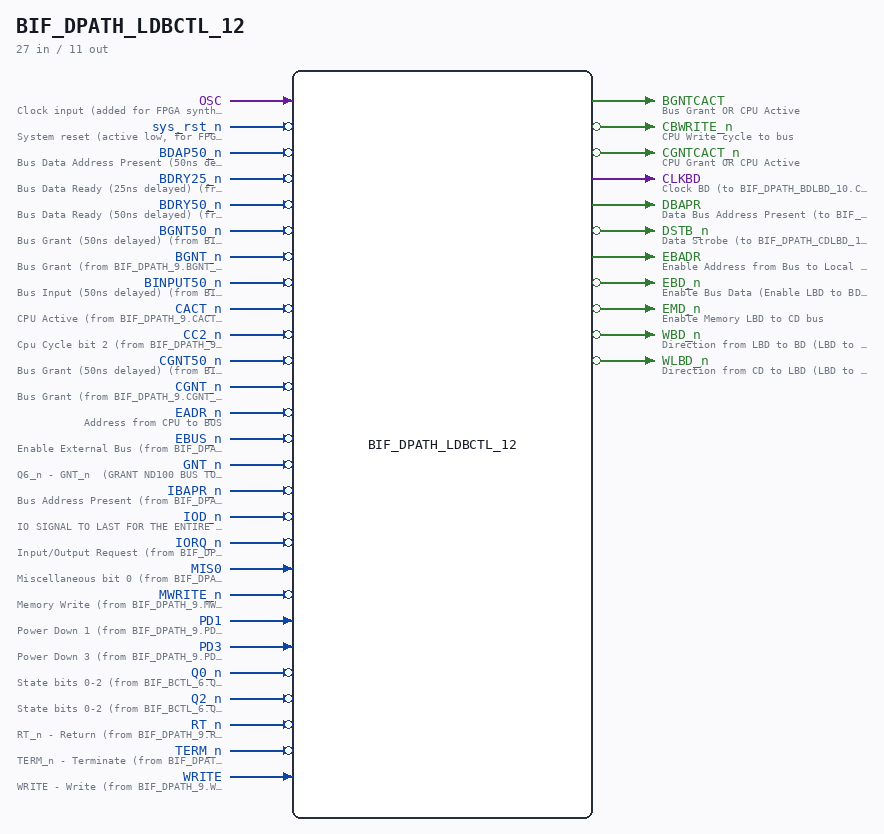
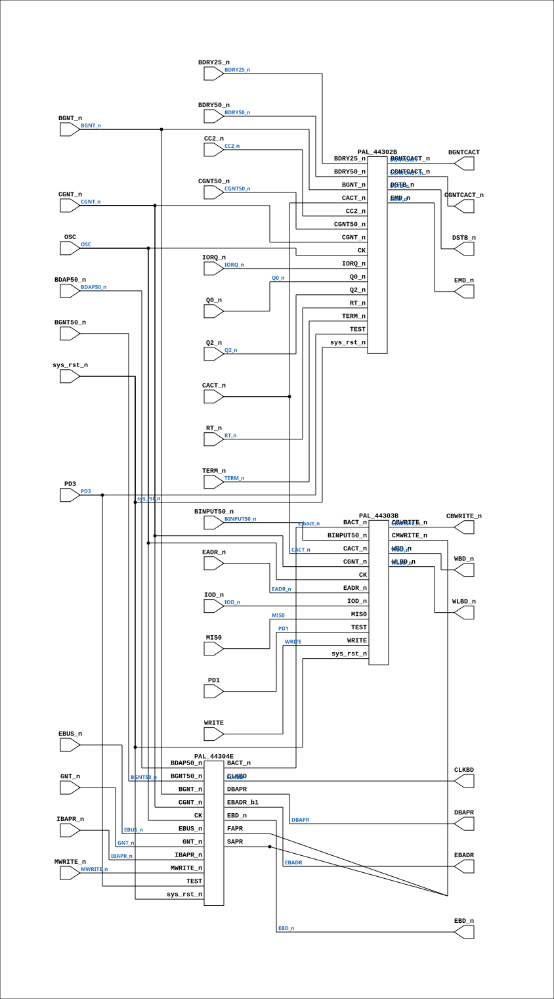

# BIF_DPATH_LDBCTL_12

Source: `Verilog/CPU-BOARD-3202/circuit/BIF_DPATH_LDBCTL_12.v`

<!-- Generated by Verilog/tests/module_doc.py from the //! comments in the source. Do not edit by hand - edit the RTL comments and regenerate. -->

<!-- HIERARCHY-NAV:BEGIN - written by Verilog/tests/gen_hierarchy.py, do not edit -->

**Where it sits** (Simulation): [ND120_TOP](../../../doc/ND120_TOP.md) > [ND120_CORE](../../../doc/ND120_CORE.md) > [ND3202D](ND3202D.md) > [BIF_5](BIF_5.md) > [BIF_DPATH_9](BIF_DPATH_9.md) > **BIF_DPATH_LDBCTL_12**
- instance path: `CORE.CPU_BOARD.BIF.DPATH.LDBCTL`

**Used in:** [BIF_DPATH_9](BIF_DPATH_9.md) (all tops)

**Contains:** [PAL_44302B](../../../PAL/doc/PAL_44302B.md), [PAL_44303B](../../../PAL/doc/PAL_44303B.md), [PAL_44304E](../../../PAL/doc/PAL_44304E.md)

[Module hierarchy](../../../HIERARCHY.md) - [All modules](../../../MODULES.md)

<!-- HIERARCHY-NAV:END -->



<!-- SCHEMATIC:BEGIN - written by Verilog/tests/gen_schematics.py, do not edit -->

## Schematic

Drawn from the Verilog: the yosys netlist of the Simulation (Verilator) build, instance `CORE.CPU_BOARD.BIF.DPATH.LDBCTL`. Sub-modules are boxes (click the picture to open it full size; there every sub-module box links to its page, and every wire shows its Verilog name).

[](BIF_DPATH_LDBCTL_12.svg)

<!-- SCHEMATIC:END -->

## Description

ND120 CPU, MM&M
BIF/DPATH/LDBCTL
IO DECODING
SHEET 12 of 50
Last reviewed: 14-DEC-2024
Ronny Hansen

## Ports

| Direction | Width | Name | Description |
|---|---|---|---|
| input | `1` | `OSC` | Clock input (added for FPGA synthesis) |
| input | `1` | `sys_rst_n` *(active low)* | System reset (active low, for FPGA synthesis) |
| input | `1` | `BDAP50_n` *(active low)* | Bus Data Address Present (50ns delayed) (from BIF_DPATH_9.BDAP50_n) |
| input | `1` | `BDRY25_n` *(active low)* | Bus Data Ready (25ns delayed) (from BIF_DPATH_9.BDRY25_n) |
| input | `1` | `BDRY50_n` *(active low)* | Bus Data Ready (50ns delayed) (from BIF_DPATH_9.BDRY50_n) |
| input | `1` | `BGNT50_n` *(active low)* | Bus Grant (50ns delayed) (from BIF_DPATH_9.BGNT50_n) |
| input | `1` | `BGNT_n` *(active low)* | Bus Grant (from BIF_DPATH_9.BGNT_n) |
| input | `1` | `BINPUT50_n` *(active low)* | Bus Input (50ns delayed) (from BIF_DPATH_9.BINPUT50_n) |
| input | `1` | `CACT_n` *(active low)* | CPU Active (from BIF_DPATH_9.CACT_n) |
| input | `1` | `CC2_n` *(active low)* | Cpu Cycle bit 2 (from BIF_DPATH_9.CC2_n) |
| input | `1` | `CGNT50_n` *(active low)* | Bus Grant (50ns delayed) (from BIF_DPATH_9.CGNT50_n) |
| input | `1` | `CGNT_n` *(active low)* | Bus Grant (from BIF_DPATH_9.CGNT_n) |
| input | `1` | `EADR_n` *(active low)* | Address from CPU to BUS |
| input | `1` | `EBUS_n` *(active low)* | Enable External Bus (from BIF_DPATH_9.EBUS_n) |
| input | `1` | `GNT_n` *(active low)* | Q6_n - GNT_n  (GRANT ND100 BUS TO A DMA DEVICE OR EXTERNAL BUS CONTROLLER) (from PAL_44801A.GNT_n) |
| input | `1` | `IBAPR_n` *(active low)* | Bus Address Present (from BIF_DPATH_9.IBAPR_n) |
| input | `1` | `IOD_n` *(active low)* | IO SIGNAL TO LAST FOR THE ENTIRE BUS CYCLE (from BIF_DPATH_9.IOD_n) |
| input | `1` | `IORQ_n` *(active low)* | Input/Output Request (from BIF_DPATH_9.IORQ_n) |
| input | `1` | `MIS0` | Miscellaneous bit 0 (from BIF_DPATH_9.MIS0) |
| input | `1` | `MWRITE_n` *(active low)* | Memory Write (from BIF_DPATH_9.MWRITE_n) |
| input | `1` | `PD1` | Power Down 1 (from BIF_DPATH_9.PD1) |
| input | `1` | `PD3` | Power Down 3 (from BIF_DPATH_9.PD3) |
| input | `1` | `Q0_n` *(active low)* | State bits 0-2 (from BIF_BCTL_6.Q_2_0_n[0]) |
| input | `1` | `Q2_n` *(active low)* | State bits 0-2 (from BIF_BCTL_6.Q_2_0_n[2]) |
| input | `1` | `RT_n` *(active low)* | RT_n - Return (from BIF_DPATH_9.RT_n) |
| input | `1` | `TERM_n` *(active low)* | TERM_n - Terminate (from BIF_DPATH_9.TERM_n) |
| input | `1` | `WRITE` | WRITE - Write (from BIF_DPATH_9.WRITE) |
| output | `1` | `BGNTCACT` | Bus Grant OR CPU Active |
| output | `1` | `CBWRITE_n` *(active low)* | CPU Write cycle to bus |
| output | `1` | `CGNTCACT_n` *(active low)* | CPU Grant OR CPU Active |
| output | `1` | `CLKBD` | Clock BD (to BIF_DPATH_BDLBD_10.CLKBD) |
| output | `1` | `DBAPR` | Data Bus Address Present (to BIF_DPATH_9.DBAPR) |
| output | `1` | `DSTB_n` *(active low)* | Data Strobe (to BIF_DPATH_CDLBD_11.DSTB_n) |
| output | `1` | `EBADR` | Enable Address from Bus to Local Memory (to BIF_DPATH_BDLBD_10.EBADR) |
| output | `1` | `EBD_n` *(active low)* | Enable Bus Data (Enable LBD to BD transceiver). (to BIF_DPATH_BDLBD_10.EBD_n) |
| output | `1` | `EMD_n` *(active low)* | Enable Memory LBD to CD bus |
| output | `1` | `WBD_n` *(active low)* | Direction from LBD to BD (LBD to BD transceiver) |
| output | `1` | `WLBD_n` *(active low)* | Direction from CD to LBD (LBD to BD transceiver) |

## Verilog source

[`Verilog/CPU-BOARD-3202/circuit/BIF_DPATH_LDBCTL_12.v`](https://github.com/RetroCoreLabs/nd-120/blob/main/Verilog/CPU-BOARD-3202/circuit/BIF_DPATH_LDBCTL_12.v) on GitHub.

<details markdown="1">
<summary>Show the Verilog of BIF_DPATH_LDBCTL_12 (224 lines)</summary>

```verilog
/**************************************************************************
** ND120 CPU, MM&M                                                       **
** BIF/DPATH/LDBCTL                                                      **
** IO DECODING                                                           **
** SHEET 12 of 50                                                        **
**                                                                       **
** Last reviewed: 14-DEC-2024                                            **
** Ronny Hansen                                                          **
***************************************************************************/

module BIF_DPATH_LDBCTL_12 (
    input OSC,       //! Clock input (added for FPGA synthesis)
    input sys_rst_n, //! System reset (active low, for FPGA synthesis)

    input BDAP50_n,  //! Bus Data Address Present (50ns delayed) (from BIF_DPATH_9.BDAP50_n)
    input BDRY25_n,  //! Bus Data Ready (25ns delayed) (from BIF_DPATH_9.BDRY25_n)
    input BDRY50_n,  //! Bus Data Ready (50ns delayed) (from BIF_DPATH_9.BDRY50_n)
    input BGNT50_n,  //! Bus Grant (50ns delayed) (from BIF_DPATH_9.BGNT50_n)
    input BGNT_n,  //! Bus Grant (from BIF_DPATH_9.BGNT_n)
    input BINPUT50_n,  //! Bus Input (50ns delayed) (from BIF_DPATH_9.BINPUT50_n)
    input CACT_n,  //! CPU Active (from BIF_DPATH_9.CACT_n)
    input CC2_n,   //! Cpu Cycle bit 2 (from BIF_DPATH_9.CC2_n)
    input CGNT50_n,  //! Bus Grant (50ns delayed) (from BIF_DPATH_9.CGNT50_n)
    input CGNT_n,  //! Bus Grant (from BIF_DPATH_9.CGNT_n)
    input EADR_n, //! Address from CPU to BUS
    input EBUS_n,  //! Enable External Bus (from BIF_DPATH_9.EBUS_n)
    input GNT_n,   //! Q6_n - GNT_n  (GRANT ND100 BUS TO A DMA DEVICE OR EXTERNAL BUS CONTROLLER) (from PAL_44801A.GNT_n)
    input IBAPR_n,  //! Bus Address Present (from BIF_DPATH_9.IBAPR_n)
    input IOD_n,   //! IO SIGNAL TO LAST FOR THE ENTIRE BUS CYCLE (from BIF_DPATH_9.IOD_n)
    input IORQ_n,  //! Input/Output Request (from BIF_DPATH_9.IORQ_n)
    input MIS0,    //! Miscellaneous bit 0 (from BIF_DPATH_9.MIS0)
    input MWRITE_n,  //! Memory Write (from BIF_DPATH_9.MWRITE_n)
    input PD1,     //! Power Down 1 (from BIF_DPATH_9.PD1)
    input PD3,     //! Power Down 3 (from BIF_DPATH_9.PD3)
    input Q0_n,    //! State bits 0-2 (from BIF_BCTL_6.Q_2_0_n[0])
    input Q2_n,    //! State bits 0-2 (from BIF_BCTL_6.Q_2_0_n[2])
    input RT_n,    //! RT_n - Return (from BIF_DPATH_9.RT_n)
    input TERM_n,  //! TERM_n - Terminate (from BIF_DPATH_9.TERM_n)
    input WRITE,   //! WRITE - Write (from BIF_DPATH_9.WRITE)

    output BGNTCACT,  //! Bus Grant OR CPU Active
    output CBWRITE_n,  //! CPU Write cycle to bus
    output CGNTCACT_n,  //! CPU Grant OR CPU Active
    output CLKBD,  //! Clock BD (to BIF_DPATH_BDLBD_10.CLKBD)
    output DBAPR,  //! Data Bus Address Present (to BIF_DPATH_9.DBAPR)
    output DSTB_n,  //! Data Strobe (to BIF_DPATH_CDLBD_11.DSTB_n)
    output EBADR,  //! Enable Address from Bus to Local Memory (to BIF_DPATH_BDLBD_10.EBADR)
    output EBD_n,  //! Enable Bus Data (Enable LBD to BD transceiver). (to BIF_DPATH_BDLBD_10.EBD_n)
    output EMD_n,  //! Enable Memory LBD to CD bus
    output WBD_n,  //! Direction from LBD to BD (LBD to BD transceiver)
    output WLBD_n  //! Direction from CD to LBD (LBD to BD transceiver)
);

  /*******************************************************************************
   ** The wires are defined here                                                 **
   *******************************************************************************/
  wire s_osc;
  wire s_bact_n;
  wire s_bdap50_n;
  wire s_bdry25_n;
  wire s_bdry50_n;
  wire s_bgncact;
  wire s_bgnt_n;
  wire s_bgnt50_n;
  wire s_binput50_n;
  wire s_cact_n;
  wire s_cbwrite_n;
  wire s_cc2_n;
  wire s_cgnt_n;
  wire s_cgnt50_n;
  wire s_cgntcact_n;
  wire s_clkbd;
  wire s_dbapr;
  wire s_dstb_n;
  wire s_eadr_n;
  wire s_ebadr;
  wire s_ebd_n;
  wire s_ebus_n;
  wire s_emd_n;
  wire s_gnt_n;
  wire s_ibapr_n;
  wire s_iod_n;
  wire s_iorq_n;
  wire s_mis0;
  wire s_mwrite_n;
  wire s_pd1;
  wire s_pd3;
  wire s_q0_n;
  wire s_q2_n;
  wire s_rt_n;
  wire s_term_n;
  wire s_wbd_n;
  wire s_wlbd_n;
  wire s_write;

  /*******************************************************************************
   ** The module functionality is described here                                 **
   *******************************************************************************/

  /*******************************************************************************
   ** Here all input connections are defined                                     **
   *******************************************************************************/
  assign s_osc        = OSC;
  assign s_bdap50_n   = BDAP50_n;
  assign s_bdry25_n   = BDRY25_n;
  assign s_bdry50_n   = BDRY50_n;
  assign s_bgnt_n     = BGNT_n;
  assign s_bgnt50_n   = BGNT50_n;
  assign s_binput50_n = BINPUT50_n;
  assign s_cact_n     = CACT_n;
  assign s_cc2_n      = CC2_n;
  assign s_cgnt_n     = CGNT_n;
  assign s_cgnt50_n   = CGNT50_n;
  assign s_eadr_n     = EADR_n;
  assign s_ebus_n     = EBUS_n;
  assign s_gnt_n      = GNT_n;
  assign s_ibapr_n    = IBAPR_n;
  assign s_iod_n      = IOD_n;
  assign s_iorq_n     = IORQ_n;
  assign s_mis0       = MIS0;
  assign s_mwrite_n   = MWRITE_n;
  assign s_pd1        = PD1;
  assign s_pd3        = PD3;
  assign s_q0_n       = Q0_n;
  assign s_q2_n       = Q2_n;
  assign s_rt_n       = RT_n;
  assign s_term_n     = TERM_n;
  assign s_write      = WRITE;

  /*******************************************************************************
   ** Here all output connections are defined                                    **
   *******************************************************************************/
  assign BGNTCACT     = s_bgncact;
  assign CBWRITE_n    = s_cbwrite_n;
  assign CGNTCACT_n   = s_cgntcact_n;
  assign CLKBD        = s_clkbd;
  assign DBAPR        = s_dbapr;
  assign DSTB_n       = s_dstb_n;
  assign EBADR        = s_ebadr;
  assign EBD_n        = s_ebd_n;
  assign EMD_n        = s_emd_n;
  assign WBD_n        = s_wbd_n;
  assign WLBD_n       = s_wlbd_n;

  /*******************************************************************************
   ** Here all sub-circuits are defined                                          **
   *******************************************************************************/

  PAL_44303B PAL_44303_ULBC2 (
      .CK        (s_osc),         // Clock (added for FPGA synthesis)
      .sys_rst_n (sys_rst_n),     // System reset (for FPGA synthesis)

      .CACT_n    (s_cact_n),      // I0
      .CGNT_n    (s_cgnt_n),      // I1
      .EADR_n    (s_eadr_n),      // I2 - Address from CPU to Bus
      .BINPUT50_n(s_binput50_n),  // I3
      .MIS0      (s_mis0),        // I4
      .IOD_n     (s_iod_n),       // I5
      .WRITE     (s_write),       // I6
      .TEST      (s_pd1),         //PD1          // I7 - PD1
      //.I8(), // not connected   // I8
      .BACT_n    (s_bact_n),      // I9

      .WBD_n    (s_wbd_n),  // Y0_n - Write Bus Direction
      .CBWRITE_n(s_cbwrite_n), // Y1_n - CPU Write cycle to Bus

      .WLBD_n(s_wlbd_n),  // B0_n - Write Local Bus Direction
      .CMWRITE_n()  // B1_n - CPU Write to Local Memory (not connected, just used internal in PAL)
  );

  PAL_44302B PAL_44302_ULBC1 (
      .CK      (s_osc),       // Clock (added for FPGA synthesis)
      .sys_rst_n(sys_rst_n),  // System reset (for FPGA synthesis)

      .Q0_n    (s_q0_n),      // I0
      .Q2_n    (s_q2_n),      // I1
      .CC2_n   (s_cc2_n),     // I2
      .BDRY25_n(s_bdry25_n),  // I3
      .BDRY50_n(s_bdry50_n),  // I4
      .CGNT_n  (s_cgnt_n),    // I5
      .CGNT50_n(s_cgnt50_n),  // I6
      .CACT_n  (s_cact_n),    // I7
      .TERM_n  (s_term_n),    // I8
      .BGNT_n  (s_bgnt_n),    // I9

      .BGNTCACT_n(s_bgncact),    // Y0_n
      .CGNTCACT_n(s_cgntcact_n), // Y1_n

      .EMD_n (s_emd_n),   // B0_n
      .DSTB_n(s_dstb_n),  // B1_n
      //.B2_n(),                    // B2_n
      .TEST  (s_pd3),     //PD3          // B3_n
      .IORQ_n(s_iorq_n),  // B4_n
      .RT_n  (s_rt_n)     // B5_n

  );

  PAL_44304E PAL_44304_ULBC3 (
      .CK      (s_osc),       // Clock (added for FPGA synthesis)
      .sys_rst_n(sys_rst_n),  // System reset (for FPGA synthesis)

      .CGNT_n  (s_cgnt_n),    // I0
      .BGNT_n  (s_bgnt_n),    // I1
      .BGNT50_n(s_bgnt50_n),  // I2
      .MWRITE_n(s_mwrite_n),  // I3
      .BDAP50_n(s_bdap50_n),  // I4
      .EBUS_n  (s_ebus_n),    // I5
      .IBAPR_n (s_ibapr_n),   // I6
      .GNT_n   (s_gnt_n),     // I7
      .TEST    (s_pd3),       // I8 - PD3
      //.I9(),                // I9

      .DBAPR(s_dbapr),  // Y0_n
      //.Y1_n()            // Y1_n

      .BACT_n  (s_bact_n),  // B0_n  DMA Output Cycle
      .EBADR_b1(s_ebadr),   // B1_n
      .FAPR    (),          // B2_n  - not in use
      .SAPR    (),          // B3_n  - not in use
      .CLKBD   (s_clkbd),   // B4_n
      .EBD_n   (s_ebd_n)    // B5_n
  );

endmodule
```

</details>
