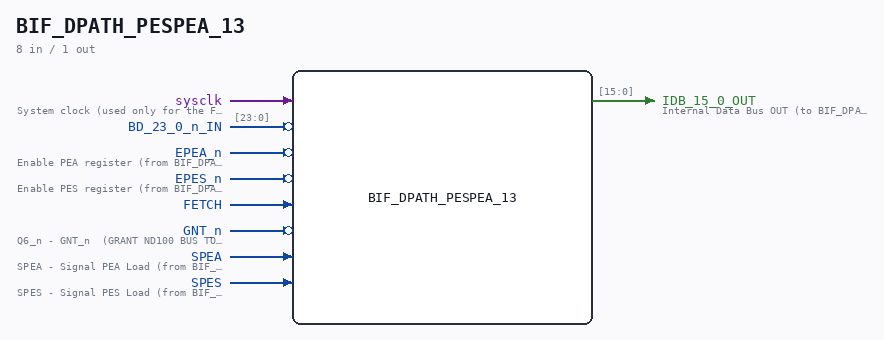

# BIF_DPATH_PESPEA_13

Source: `Verilog/CPU-BOARD-3202/circuit/BIF_DPATH_PESPEA_13.v`

> Generated by `Verilog/tests/module_doc.py` from the `//!`
> comments in the source. Do not edit by hand - edit the RTL comments and regenerate.

<!-- HIERARCHY-NAV:BEGIN - written by Verilog/tests/gen_hierarchy.py, do not edit -->

**Where it sits** (Simulation): [ND120_TOP](../../../doc/ND120_TOP.md) > [ND120_CORE](../../../doc/ND120_CORE.md) > [ND3202D](ND3202D.md) > [BIF_5](BIF_5.md) > [BIF_DPATH_9](BIF_DPATH_9.md) > **BIF_DPATH_PESPEA_13**
- instance path: `CORE.CPU_BOARD.BIF.DPATH.PESPEA`

**Used in:** [BIF_DPATH_9](BIF_DPATH_9.md) (all tops)

**Contains:** [TTL_74534](../../../Shared/support/doc/TTL_74534.md) x4

[Module hierarchy](../../../HIERARCHY.md) - [All modules](../../../MODULES.md)

<!-- HIERARCHY-NAV:END -->

## Description

ND120 CPU, MM&M
BIF/DPATH/PESPEA
BIF PES & PEA
SHEET 13 of 50
Last reviewed: 13-MAY-2024
Ronny Hansen

## Ports

| Direction | Width | Name | Description |
|---|---|---|---|
| input | `1` | `sysclk` | System clock (used only for the FF-mode strobe edge-capture) |
| input | `[23:0]` | `BD_23_0_n_IN` |  |
| input | `1` | `EPEA_n` *(active low)* |  |
| input | `1` | `EPES_n` *(active low)* |  |
| input | `1` | `FETCH` |  |
| input | `1` | `GNT_n` *(active low)* |  |
| input | `1` | `SPEA` |  |
| input | `1` | `SPES` |  |
| output | `[15:0]` | `IDB_15_0_OUT` |  |
