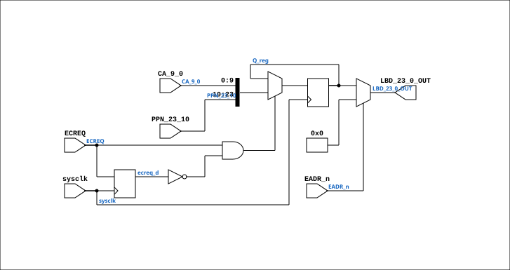

# BIF_DPATH_PPNLBD_14

Source: `Verilog/CPU-BOARD-3202/circuit/BIF_DPATH_PPNLBD_14.v`

<!-- Generated by Verilog/tests/module_doc.py from the //! comments in the source. Do not edit by hand - edit the RTL comments and regenerate. -->

<!-- HIERARCHY-NAV:BEGIN - written by Verilog/tests/gen_hierarchy.py, do not edit -->

**Where it sits** (Simulation): [ND120_TOP](../../../doc/ND120_TOP.md) > [ND120_CORE](../../../doc/ND120_CORE.md) > [ND3202D](ND3202D.md) > [BIF_5](BIF_5.md) > [BIF_DPATH_9](BIF_DPATH_9.md) > **BIF_DPATH_PPNLBD_14**
- instance path: `CORE.CPU_BOARD.BIF.DPATH.PPNLBD`

**Used in:** [BIF_DPATH_9](BIF_DPATH_9.md) (all tops)

**Contains:** no other modules.

[Module hierarchy](../../../HIERARCHY.md) - [All modules](../../../MODULES.md)

<!-- HIERARCHY-NAV:END -->


<!-- SCHEMATIC:BEGIN - written by Verilog/tests/gen_schematics.py, do not edit -->

## Schematic

Drawn from the Verilog: the yosys netlist of the Simulation (Verilator) build, instance `CORE.CPU_BOARD.BIF.DPATH.PPNLBD`. Sub-modules are boxes (click the picture to open it full size; there every sub-module box links to its page, and every wire shows its Verilog name).

[](BIF_DPATH_PPNLBD_14.svg)

<!-- SCHEMATIC:END -->

## Description

ND120 CPU, MM&M
BIF/DPATH/PPNLBD
BIF PPN TO LBD
SHEET 14  of 50
Last reviewed: 09-NOV-2024
Ronny Hansen

## Ports

| Direction | Width | Name | Description |
|---|---|---|---|
| input | `1` | `sysclk` | System clock (used only for the FF-mode strobe edge-capture) |
| input | `[13:0]` | `PPN_23_10` | Physical Page Number (from BIF_DPATH_9.PPN_23_10) |
| input | `[9:0]` | `CA_9_0` | Control Store Address (from BIF_DPATH_9.CA_9_0) |
| input | `1` | `EADR_n` *(active low)* | Enable External Address (from BIF_DPATH_9.EADDR_n) |
| input | `1` | `ECREQ` | Enable CPU Request (from BIF_DPATH_9.ECREQ) |
| output | `[23:0]` | `LBD_23_0_OUT` |  |

## Verilog source

[`Verilog/CPU-BOARD-3202/circuit/BIF_DPATH_PPNLBD_14.v`](https://github.com/RetroCoreLabs/nd-120/blob/main/Verilog/CPU-BOARD-3202/circuit/BIF_DPATH_PPNLBD_14.v) on GitHub.

<details markdown="1">
<summary>Show the Verilog of BIF_DPATH_PPNLBD_14 (41 lines)</summary>

```verilog
/**************************************************************************
** ND120 CPU, MM&M                                                       **
** BIF/DPATH/PPNLBD                                                      **
** BIF PPN TO LBD                                                        **
** SHEET 14  of 50                                                       **
**                                                                       **
** Last reviewed: 09-NOV-2024                                            **
** Ronny Hansen                                                          **
***************************************************************************/

module BIF_DPATH_PPNLBD_14 (
    input sysclk,  //! System clock (used only for the FF-mode strobe edge-capture)
    input [13:0] PPN_23_10,  //! Physical Page Number (from BIF_DPATH_9.PPN_23_10)
    input [ 9:0] CA_9_0,  //! Control Store Address (from BIF_DPATH_9.CA_9_0)

    input EADR_n,  //! Enable External Address (from BIF_DPATH_9.EADDR_n)
    input ECREQ,   //! Enable CPU Request (from BIF_DPATH_9.ECREQ)

    output [23:0] LBD_23_0_OUT
);

  reg [23:0] Q_reg;  // Internal register

  // P3 (docs/plan-fix-unconstrained-clocks.md): ECREQ is a CPU-request
  // strobe, not a clock. In FF mode capture on a sysclk-detected ECREQ
  // rise instead of clocking on the routed net.
`ifdef FPGA_FF_MODE
  reg ecreq_d = 1'b0;
  always @(posedge sysclk) begin
    ecreq_d <= ECREQ;
    if (ECREQ && !ecreq_d) Q_reg <= {PPN_23_10[13:0], CA_9_0[9:0]};
  end
`else
  // Latch data on rising edge of CK
  always @(posedge ECREQ) begin
    Q_reg <= {PPN_23_10[13:0], CA_9_0[9:0]};
  end
`endif

  assign LBD_23_0_OUT = EADR_n ? 24'b0 : Q_reg;
endmodule
```

</details>
