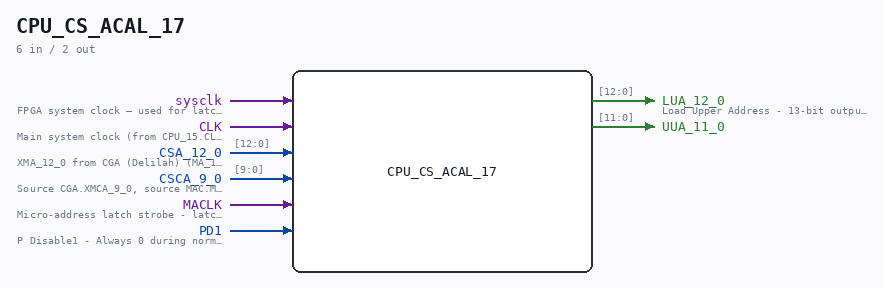

# CPU_CS_ACAL_17

Source: `Verilog/CPU-BOARD-3202/circuit/CPU_CS_ACAL_17.v`

> Generated by `Verilog/tests/module_doc.py` from the `//!`
> comments in the source. Do not edit by hand - edit the RTL comments and regenerate.

<!-- HIERARCHY-NAV:BEGIN - written by Verilog/tests/gen_hierarchy.py, do not edit -->

**Where it sits** (Simulation): [ND120_TOP](../../../doc/ND120_TOP.md) > [ND120_CORE](../../../doc/ND120_CORE.md) > [ND3202D](ND3202D.md) > [CPU_15](CPU_15.md) > [CPU_CS_16](CPU_CS_16.md) > **CPU_CS_ACAL_17**
- instance path: `CORE.CPU_BOARD.CPU.CS.ACAL`

**Used in:** [CPU_CS_16](CPU_CS_16.md) (all tops)

**Contains:** no other modules.

[Module hierarchy](../../../HIERARCHY.md) - [All modules](../../../MODULES.md)

<!-- HIERARCHY-NAV:END -->

## Description

ND120 CPU, MM&M
CPU/CS/ACAL
MICRO ADDR CALC UNIT
SHEET 17 of 50
Last reviewed: 6-APR-2025
Ronny Hansen

## Ports

| Direction | Width | Name | Description |
|---|---|---|---|
| input | `1` | `sysclk` | FPGA system clock — used for latch-equivalent FFs |
| input | `1` | `CLK` |  |
| input | `[12:0]` | `CSA_12_0` |  |
| input | `[9:0]` | `CSCA_9_0` |  |
| input | `1` | `MACLK` |  |
| input | `1` | `PD1` |  |
| output | `[12:0]` | `LUA_12_0` |  |
| output | `[11:0]` | `UUA_11_0` |  |
