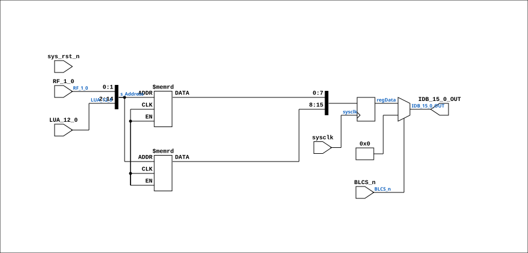

# CPU_CS_PROM_19

Source: `Verilog/CPU-BOARD-3202/circuit/CPU_CS_PROM_19.v`

<!-- Generated by Verilog/tests/module_doc.py from the //! comments in the source. Do not edit by hand - edit the RTL comments and regenerate. -->

<!-- HIERARCHY-NAV:BEGIN - written by Verilog/tests/gen_hierarchy.py, do not edit -->

**Where it sits** (Simulation): [ND120_TOP](../../../doc/ND120_TOP.md) > [ND120_CORE](../../../doc/ND120_CORE.md) > [ND3202D](ND3202D.md) > [CPU_15](CPU_15.md) > [CPU_CS_16](CPU_CS_16.md) > **CPU_CS_PROM_19**
- instance path: `CORE.CPU_BOARD.CPU.CS.PROM`

**Used in:** [CPU_CS_16](CPU_CS_16.md) (all tops)

**Contains:** no other modules.

[Module hierarchy](../../../HIERARCHY.md) - [All modules](../../../MODULES.md)

<!-- HIERARCHY-NAV:END -->


<!-- SCHEMATIC:BEGIN - written by Verilog/tests/gen_schematics.py, do not edit -->

## Schematic

Drawn from the Verilog: the yosys netlist of the Simulation (Verilator) build, instance `CORE.CPU_BOARD.CPU.CS.PROM`. Sub-modules are boxes (click the picture to open it full size; there every sub-module box links to its page, and every wire shows its Verilog name).

[](CPU_CS_PROM_19.svg)

<!-- SCHEMATIC:END -->

## Description

ND120 CPU, MM&M
CPU/CS/PROM
PROMS
SHEET 19 of 50
Last reviewed: 9-FEB-2025
Ronny Hansen

## Ports

| Direction | Width | Name | Description |
|---|---|---|---|
| input | `1` | `sysclk` | System clock in FPGA |
| input | `1` | `sys_rst_n` *(active low)* | System reset in FPGA |
| input | `1` | `BLCS_n` *(active low)* | Set to 0 to enable the output to IDB |
| input | `[1:0]` | `RF_1_0` | Selects which of the 4 16 bit's of the microcoe to fetch |
| input | `[12:0]` | `LUA_12_0` | Address of the microcode to fetch |
| output | `[15:0]` | `IDB_15_0_OUT` | The 16 bit microcode word |

## Verilog source

[`Verilog/CPU-BOARD-3202/circuit/CPU_CS_PROM_19.v`](https://github.com/RetroCoreLabs/nd-120/blob/main/Verilog/CPU-BOARD-3202/circuit/CPU_CS_PROM_19.v) on GitHub.

<details markdown="1">
<summary>Show the Verilog of CPU_CS_PROM_19 (81 lines)</summary>

```verilog
/**************************************************************************
** ND120 CPU, MM&M                                                       **
** CPU/CS/PROM                                                           **
** PROMS                                                                 **
** SHEET 19 of 50                                                        **
**                                                                       **
** Last reviewed: 9-FEB-2025                                             **
** Ronny Hansen                                                          **
***************************************************************************/

//`define GOWIN // Uncomment this for Gowin platform

module CPU_CS_PROM_19 (
  // System Input signals
  input sysclk,    //! System clock in FPGA
  input sys_rst_n, //! System reset in FPGA

    // Input signals
  input        BLCS_n,   // Set to 0 to enable the output to IDB
  input [ 1:0] RF_1_0,   // Selects which of the 4 16 bit's of the microcoe to fetch
  input [12:0] LUA_12_0, // Address of the microcode to fetch

  output [15:0] IDB_15_0_OUT  // The 16 bit microcode word
);


  wire [14:0] s_Address;
  (* mark_debug = "true", DONT_TOUCH = "true" *) reg [15:0] regData;

  assign s_Address = {LUA_12_0, RF_1_0};  // Concatenate the bits to form a 15-bit address

  // AM27256_45132L = Contains the LO 8 bits (0-7) AM27256_45133L = Contains the HI 8 bits (8-15)

  // Drop the microcode ROM arrays entirely when they are never read:
  //  - GOWIN         : Tang Nano 20K loads microcode via SKIP_WCS_LOAD; no ROM path.
  //  - SKIP_WCS_LOAD : the WCS is bitstream-preloaded, so the PROM->WCS runtime load
  //                    never runs and this PROM is dead. On Xilinx this reclaims the
  //                    ~7850 LUTs / BRAM the ROM would otherwise consume.
  // The Verilog preprocessor has no `||`, so fold both triggers into one helper.
`ifdef GOWIN
  `define ND_DROP_PROM_ROM
`endif
`ifdef SKIP_WCS_LOAD
  `define ND_DROP_PROM_ROM
`endif

`ifdef ND_DROP_PROM_ROM

`else

  // Xilinx: ram_style forces BRAM inference for ROM
  // Gowin: syn_ramstyle for block RAM inference
  (* ram_style = "block", syn_ramstyle = "block_ram" *)
  reg [7:0] rom_lo[0:32767];  // 32K x 8 bit ROM (LO 8 bits)
  initial $readmemh("AM27256_45132L.hex", rom_lo);

  (* ram_style = "block", syn_ramstyle = "block_ram" *)
  reg [7:0] rom_hi[0:32767];  // 32K x 8 bit ROM (HI 8 bits)
  initial $readmemh("AM27256_45133L.hex", rom_hi);
`endif

  // Registered ROM read - single stage (1 cycle latency).
  // The microcode sequencer expects data 1 cycle after address.
  // NOTE: Vivado may map this to LUT ROM instead of BRAM.
  // That's OK -- correctness over BRAM savings.

  always @(posedge sysclk) begin
    `ifdef ND_DROP_PROM_ROM
      // ROM arrays removed (GOWIN or SKIP_WCS_LOAD): the PROM is never read.
      regData <= 0;
    `else
      regData[7:0]  <= rom_lo[s_Address];
      regData[15:8] <= rom_hi[s_Address];
    `endif
  end

  // Controlled Buffer
  assign IDB_15_0_OUT = (BLCS_n) ? 16'b0 : regData;


endmodule
```

</details>
