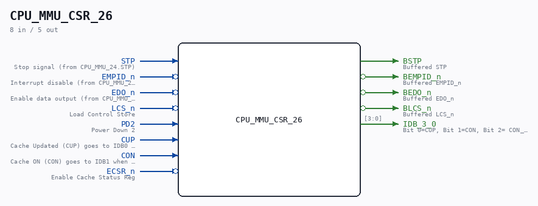
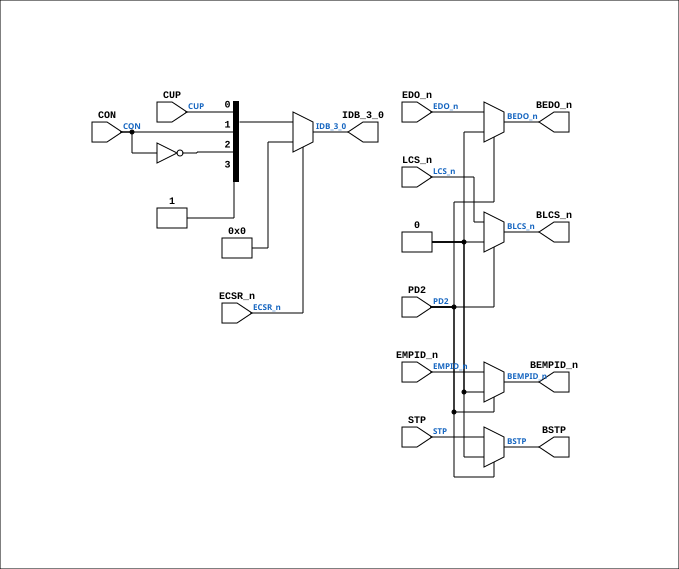

# CPU_MMU_CSR_26

Source: `Verilog/CPU-BOARD-3202/circuit/CPU_MMU_CSR_26.v`

<!-- Generated by Verilog/tests/module_doc.py from the //! comments in the source. Do not edit by hand - edit the RTL comments and regenerate. -->

<!-- HIERARCHY-NAV:BEGIN - written by Verilog/tests/gen_hierarchy.py, do not edit -->

**Where it sits** (Simulation): [ND120_TOP](../../../doc/ND120_TOP.md) > [ND120_CORE](../../../doc/ND120_CORE.md) > [ND3202D](ND3202D.md) > [CPU_15](CPU_15.md) > [CPU_MMU_24](CPU_MMU_24.md) > **CPU_MMU_CSR_26**
- instance path: `CORE.CPU_BOARD.CPU.MMU.CSR`

**Used in:** [CPU_MMU_24](CPU_MMU_24.md) (all tops)

**Contains:** no other modules.

[Module hierarchy](../../../HIERARCHY.md) - [All modules](../../../MODULES.md)

<!-- HIERARCHY-NAV:END -->



<!-- SCHEMATIC:BEGIN - written by Verilog/tests/gen_schematics.py, do not edit -->

## Schematic

Drawn from the Verilog: the yosys netlist of the Simulation (Verilator) build, instance `CORE.CPU_BOARD.CPU.MMU.CSR`. Sub-modules are boxes (click the picture to open it full size; there every sub-module box links to its page, and every wire shows its Verilog name).

[](CPU_MMU_CSR_26.svg)

<!-- SCHEMATIC:END -->

## Description

ND120 CPU, MM&M
CPU/MMU/CSR
CACHE STATUS REGISER
SHEET 26 of 50
Last reviewed: 29-JAN-2025
Ronny Hansen

## Ports

| Direction | Width | Name | Description |
|---|---|---|---|
| input | `1` | `STP` | Stop signal (from CPU_MMU_24.STP) |
| input | `1` | `EMPID_n` *(active low)* | Interrupt disable (from CPU_MMU_24.EMPID_n) |
| input | `1` | `EDO_n` *(active low)* | Enable data output (from CPU_MMU_24.EDO_n) |
| input | `1` | `LCS_n` *(active low)* | Load Control Store |
| input | `1` | `PD2` | Power Down 2 |
| input | `1` | `CUP` | Cache Updated (CUP) goes to IDB0 when ECSR_n is low |
| input | `1` | `CON` | Cache ON (CON) goes to IDB1 when ECSR_n is low. CON_n goes to IDB2 |
| input | `1` | `ECSR_n` *(active low)* | Enable Cache Status Reg |
| output | `1` | `BSTP` | Buffered STP |
| output | `1` | `BEMPID_n` *(active low)* | Buffered EMPID_n |
| output | `1` | `BEDO_n` *(active low)* | Buffered EDO_n |
| output | `1` | `BLCS_n` *(active low)* | Buffered LCS_n |
| output | `[3:0]` | `IDB_3_0` | Bit 0=CUP, Bit 1=CON, Bit 2= CON_n, Bit 3=1 (FIN-Cache Clear finished. Not currently enabled) |

## Verilog source

[`Verilog/CPU-BOARD-3202/circuit/CPU_MMU_CSR_26.v`](https://github.com/RetroCoreLabs/nd-120/blob/main/Verilog/CPU-BOARD-3202/circuit/CPU_MMU_CSR_26.v) on GitHub.

<details markdown="1">
<summary>Show the Verilog of CPU_MMU_CSR_26 (46 lines)</summary>

```verilog
/**************************************************************************
** ND120 CPU, MM&M                                                       **
** CPU/MMU/CSR                                                           **
** CACHE STATUS REGISER                                                  **
** SHEET 26 of 50                                                        **
**                                                                       **
** Last reviewed: 29-JAN-2025                                            **
** Ronny Hansen                                                          **
***************************************************************************/
module CPU_MMU_CSR_26 (
    input STP,    //! Stop signal (from CPU_MMU_24.STP)
    input EMPID_n,  //! Interrupt disable (from CPU_MMU_24.EMPID_n)
    input EDO_n,  //! Enable data output (from CPU_MMU_24.EDO_n)
    input LCS_n,  //! Load Control Store
    input PD2,    //! Power Down 2

    input CUP,    //! Cache Updated (CUP) goes to IDB0 when ECSR_n is low 
    input CON,    //! Cache ON (CON) goes to IDB1 when ECSR_n is low. CON_n goes to IDB2
    input ECSR_n, //! Enable Cache Status Reg

    // IF PD2 goes active to 1, then all B-signals goes to high-impediance aka 0)
    output BSTP,      //! Buffered STP 
    output BEMPID_n,  //! Buffered EMPID_n
    output BEDO_n,    //! Buffered EDO_n
    output BLCS_n,    //! Buffered LCS_n

    output [3:0] IDB_3_0  // Bit 0=CUP, Bit 1=CON, Bit 2= CON_n, Bit 3=1 (FIN-Cache Clear finished. Not currently enabled)
);


  // This code replaces one 74244 (CHIP 27H)
  // 74LS244 (NONE negated outputs)
  // Octal Buffers and Line Drivers With 3-State Outputs


  assign BSTP = PD2 ? 1'b0 : STP;
  assign BEMPID_n = PD2 ? 1'b0 : EMPID_n;
  assign BEDO_n = PD2 ? 1'b0 : EDO_n;
  assign BLCS_n = PD2 ? 1'b0 : LCS_n;

  wire [3:0] idb = {1'b1, ~CON, CON, CUP};

  assign IDB_3_0 = ECSR_n ? 4'b0 : idb;

endmodule
```

</details>
