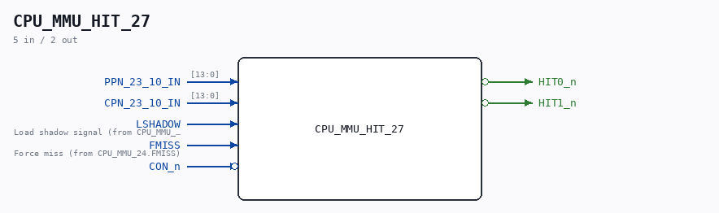

# CPU_MMU_HIT_27

Source: `Verilog/CPU-BOARD-3202/circuit/CPU_MMU_HIT_27.v`

> Generated by `Verilog/tests/module_doc.py` from the `//!`
> comments in the source. Do not edit by hand - edit the RTL comments and regenerate.

<!-- HIERARCHY-NAV:BEGIN - written by Verilog/tests/gen_hierarchy.py, do not edit -->

**Where it sits** (Simulation): [ND120_TOP](../../../doc/ND120_TOP.md) > [ND120_CORE](../../../doc/ND120_CORE.md) > [ND3202D](ND3202D.md) > [CPU_15](CPU_15.md) > [CPU_MMU_24](CPU_MMU_24.md) > **CPU_MMU_HIT_27**
- instance path: `CORE.CPU_BOARD.CPU.MMU.MMU_HIT`

**Used in:** [CPU_MMU_24](CPU_MMU_24.md) (all tops)

**Contains:** no other modules.

[Module hierarchy](../../../HIERARCHY.md) - [All modules](../../../MODULES.md)

<!-- HIERARCHY-NAV:END -->

## Description

ND120 CPU, MM&M
CPU/MMU/HIT
HIT DETECTOR
SHEET 27 of 50
Last reviewed: 21-APRIL-2024
Ronny Hansen

## Ports

| Direction | Width | Name | Description |
|---|---|---|---|
| input | `[13:0]` | `PPN_23_10_IN` |  |
| input | `[13:0]` | `CPN_23_10_IN` |  |
| input | `1` | `LSHADOW` |  |
| input | `1` | `FMISS` |  |
| input | `1` | `CON_n` *(active low)* |  |
| output | `1` | `HIT0_n` *(active low)* |  |
| output | `1` | `HIT1_n` *(active low)* |  |
