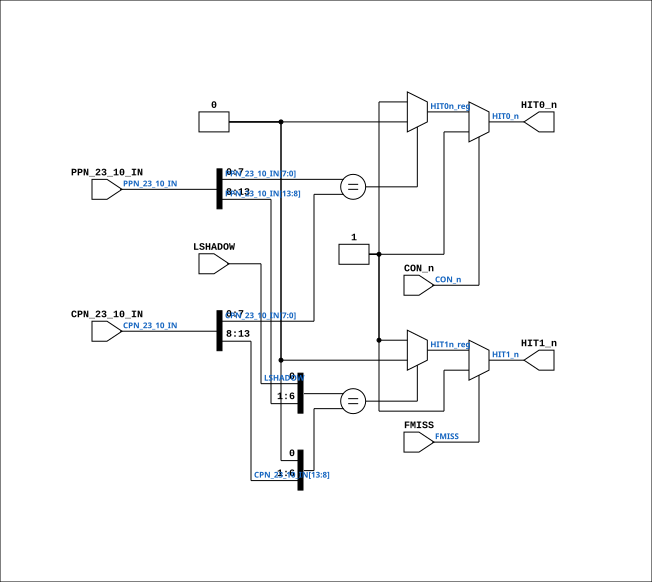

# CPU_MMU_HIT_27

Source: `Verilog/CPU-BOARD-3202/circuit/CPU_MMU_HIT_27.v`

<!-- Generated by Verilog/tests/module_doc.py from the //! comments in the source. Do not edit by hand - edit the RTL comments and regenerate. -->

<!-- HIERARCHY-NAV:BEGIN - written by Verilog/tests/gen_hierarchy.py, do not edit -->

**Where it sits** (Simulation): [ND120_TOP](../../../doc/ND120_TOP.md) > [ND120_CORE](../../../doc/ND120_CORE.md) > [ND3202D](ND3202D.md) > [CPU_15](CPU_15.md) > [CPU_MMU_24](CPU_MMU_24.md) > **CPU_MMU_HIT_27**
- instance path: `CORE.CPU_BOARD.CPU.MMU.MMU_HIT`

**Used in:** [CPU_MMU_24](CPU_MMU_24.md) (all tops)

**Contains:** no other modules.

[Module hierarchy](../../../HIERARCHY.md) - [All modules](../../../MODULES.md)

<!-- HIERARCHY-NAV:END -->


<!-- SCHEMATIC:BEGIN - written by Verilog/tests/gen_schematics.py, do not edit -->

## Schematic

Drawn from the Verilog: the yosys netlist of the Simulation (Verilator) build, instance `CORE.CPU_BOARD.CPU.MMU.MMU_HIT`. Sub-modules are boxes (click the picture to open it full size; there every sub-module box links to its page, and every wire shows its Verilog name).

[](CPU_MMU_HIT_27.svg)

<!-- SCHEMATIC:END -->

## Description

ND120 CPU, MM&M
CPU/MMU/HIT
HIT DETECTOR
SHEET 27 of 50
Last reviewed: 21-APRIL-2024
Ronny Hansen

## Ports

| Direction | Width | Name | Description |
|---|---|---|---|
| input | `[13:0]` | `PPN_23_10_IN` |  |
| input | `[13:0]` | `CPN_23_10_IN` |  |
| input | `1` | `LSHADOW` | Load shadow signal (from CPU_MMU_24.LSHADOW) |
| input | `1` | `FMISS` | Force miss (from CPU_MMU_24.FMISS) |
| input | `1` | `CON_n` *(active low)* |  |
| output | `1` | `HIT0_n` *(active low)* |  |
| output | `1` | `HIT1_n` *(active low)* |  |

## Verilog source

[`Verilog/CPU-BOARD-3202/circuit/CPU_MMU_HIT_27.v`](https://github.com/RetroCoreLabs/nd-120/blob/main/Verilog/CPU-BOARD-3202/circuit/CPU_MMU_HIT_27.v) on GitHub.

<details markdown="1">
<summary>Show the Verilog of CPU_MMU_HIT_27 (78 lines)</summary>

```verilog
/**************************************************************************
** ND120 CPU, MM&M                                                       **
** CPU/MMU/HIT                                                           **
** HIT DETECTOR                                                          **
** SHEET 27 of 50                                                        **
**                                                                       **
** Last reviewed: 21-APRIL-2024                                          **
** Ronny Hansen                                                          **
***************************************************************************/


module CPU_MMU_HIT_27 (
    input [13:0] PPN_23_10_IN,
    input [13:0] CPN_23_10_IN,
    input        LSHADOW,  //! Load shadow signal (from CPU_MMU_24.LSHADOW)
    input        FMISS,  //! Force miss (from CPU_MMU_24.FMISS)
    input        CON_n,

    output wire HIT0_n,
    output wire HIT1_n
);


  // Register to store the calculated HIT value
  reg HIT0n_reg;
  reg HIT1n_reg;


  // Temporary signals for comparison
  reg [7:0] PPN_HI;
  reg [7:0] CPN_HI;


  // HIT0 is false if PPN_23_10[7:0] == CPN_23_10[7:0]
  always @(*) begin
    HIT0n_reg = (PPN_23_10_IN[7:0] == CPN_23_10_IN[7:0]) ? 1'b0 : 1'b1;
  end


  // HIT1 compares the UPPER six page-number bits, PPN23..PPN18 against
  // CPN23..CPN18, plus LSHADOW against 0.
  //
  // Drawing sheet 27, chip 18G (74FCT521A): A0=GND, A1=LSHADOW,
  // A2..A7 = PPN23..PPN18; B0=GND, B1=GND, B2..B7 = CPN23..CPN18.
  // PPN_23_10_IN carries PPN23..PPN10 in bits [13:0], so PPN23..PPN18 is
  // [13:8] - NOT [5:0], which is PPN15..PPN10 and is already covered by 19G.
  // With [5:0] the cache tag was effectively 8 bits instead of 14, so any two
  // physical pages 256 pages apart aliased onto the same line and reported a
  // hit - the cache returning another page's data on any machine with more
  // than 1 MB of physical memory.
  always @(*) begin
    // Construct PPN_HI
    PPN_HI[7:2] = PPN_23_10_IN[13:8];
    PPN_HI[1]   = LSHADOW;
    PPN_HI[0]   = 1'b0;

    // Construct CPN_HI
    CPN_HI[7:2] = CPN_23_10_IN[13:8];
    CPN_HI[1:0] = 2'b00;  // Set both bits to 0

    HIT1n_reg   = (PPN_HI == CPN_HI) ? 1'b0 : 1'b1;
  end


  // A 74FCT521A with /E HIGH drives its output HIGH, and HIT~=1 means NO
  // MATCH (21H on sheet 25 is a NOR, so HIT~=1 forces HIT=0). These forced
  // the hit-ASSERTED level instead, which meant switching the cache off at
  // SW1 (CON~=1) still reported hits, and FMISS - "force miss", implemented
  // on the drawing by disabling 18G so HIT~1 goes high - forced a HIT.
  //
  // The house "disabled drives 0" convention does not apply here: HIT~0 and
  // HIT~1 are single-driver point-to-point nets to 21H and PAL 18F, not
  // wired-OR buses, so the chip's own function table governs.
  assign HIT0_n = CON_n ? 1'b1 : HIT0n_reg;
  assign HIT1_n = FMISS ? 1'b1 : HIT1n_reg;


endmodule
```

</details>
