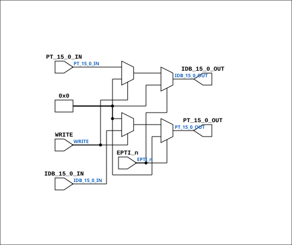

# CPU_MMU_PTIDB_30

Source: `Verilog/CPU-BOARD-3202/circuit/CPU_MMU_PTIDB_30.v`

<!-- Generated by Verilog/tests/module_doc.py from the //! comments in the source. Do not edit by hand - edit the RTL comments and regenerate. -->

<!-- HIERARCHY-NAV:BEGIN - written by Verilog/tests/gen_hierarchy.py, do not edit -->

**Where it sits** (Simulation): [ND120_TOP](../../../doc/ND120_TOP.md) > [ND120_CORE](../../../doc/ND120_CORE.md) > [ND3202D](ND3202D.md) > [CPU_15](CPU_15.md) > [CPU_MMU_24](CPU_MMU_24.md) > **CPU_MMU_PTIDB_30**
- instance path: `CORE.CPU_BOARD.CPU.MMU.PTIDB`

**Used in:** [CPU_MMU_24](CPU_MMU_24.md) (all tops)

**Contains:** no other modules.

[Module hierarchy](../../../HIERARCHY.md) - [All modules](../../../MODULES.md)

<!-- HIERARCHY-NAV:END -->


<!-- SCHEMATIC:BEGIN - written by Verilog/tests/gen_schematics.py, do not edit -->

## Schematic

Drawn from the Verilog: the yosys netlist of the Simulation (Verilator) build, instance `CORE.CPU_BOARD.CPU.MMU.PTIDB`. Sub-modules are boxes (click the picture to open it full size; there every sub-module box links to its page, and every wire shows its Verilog name).

[](CPU_MMU_PTIDB_30.svg)

<!-- SCHEMATIC:END -->

## Description

ND120 CPU, MM&M
CPU/MMU/PTIDB
PT TO IDB
SHEET 30 of 50
Last reviewed: 2-FEB-2025
Ronny Hansen

## Ports

| Direction | Width | Name | Description |
|---|---|---|---|
| input | `1` | `WRITE` | Direction: 0=Read from B,1=Write to B  (DIR) |
| input | `1` | `EPTI_n` *(active low)* | Enable PTI(negated)        (OE_n) |
| input | `[15:0]` | `IDB_15_0_IN` | IDB in and |
| output | `[15:0]` | `IDB_15_0_OUT` | out |
| input | `[15:0]` | `PT_15_0_IN` | PT data bus  (B) in and out |
| output | `[15:0]` | `PT_15_0_OUT` |  |

## Verilog source

[`Verilog/CPU-BOARD-3202/circuit/CPU_MMU_PTIDB_30.v`](https://github.com/RetroCoreLabs/nd-120/blob/main/Verilog/CPU-BOARD-3202/circuit/CPU_MMU_PTIDB_30.v) on GitHub.

<details markdown="1">
<summary>Show the Verilog of CPU_MMU_PTIDB_30 (51 lines)</summary>

```verilog
/**************************************************************************
** ND120 CPU, MM&M                                                       **
** CPU/MMU/PTIDB                                                         **
** PT TO IDB                                                             **
** SHEET 30 of 50                                                        **
**                                                                       **
** Last reviewed: 2-FEB-2025                                             **
** Ronny Hansen                                                          **
***************************************************************************/

// verilator lint_off ASSIGNDLY

module CPU_MMU_PTIDB_30 (
  input WRITE,  // Direction: 0=Read from B,1=Write to B  (DIR)
  input EPTI_n, // Enable PTI(negated)        (OE_n)

  input  [15:0] IDB_15_0_IN,  // IDB in and
  output [15:0] IDB_15_0_OUT, //             out

  input  [15:0] PT_15_0_IN,  //PT data bus  (B) in and out
  output [15:0] PT_15_0_OUT  //
);

  // This code replaces the original Logisim generated code with a simpler and more efficient implementation
  // It replaces two 74PCT245 chips (8-bit transceiver with 3-state outputs) with one 16 bit identical implementation.

  wire OE_n;
  wire DIR;

  assign OE_n  = EPTI_n;
  assign DIR   = WRITE;


  reg [15:0] A_reg;
  reg [15:0] B_reg;

  always @(*) 
  begin
    A_reg = IDB_15_0_IN;
    B_reg = PT_15_0_IN;
  end

  // Drive logic for IDB_15_0 and PT_15_0

  // Set IDB to B value IF DIR=0 (read) else to 3-state
  assign IDB_15_0_OUT = OE_n ? 16'b0 : !DIR ? B_reg : 16'b0;

  // Set PT to A value IF DIR=1 (write) else to 3-state
  assign PT_15_0_OUT  = OE_n ? 16'b0 : DIR ? A_reg : 16'b0;

endmodule
```

</details>
