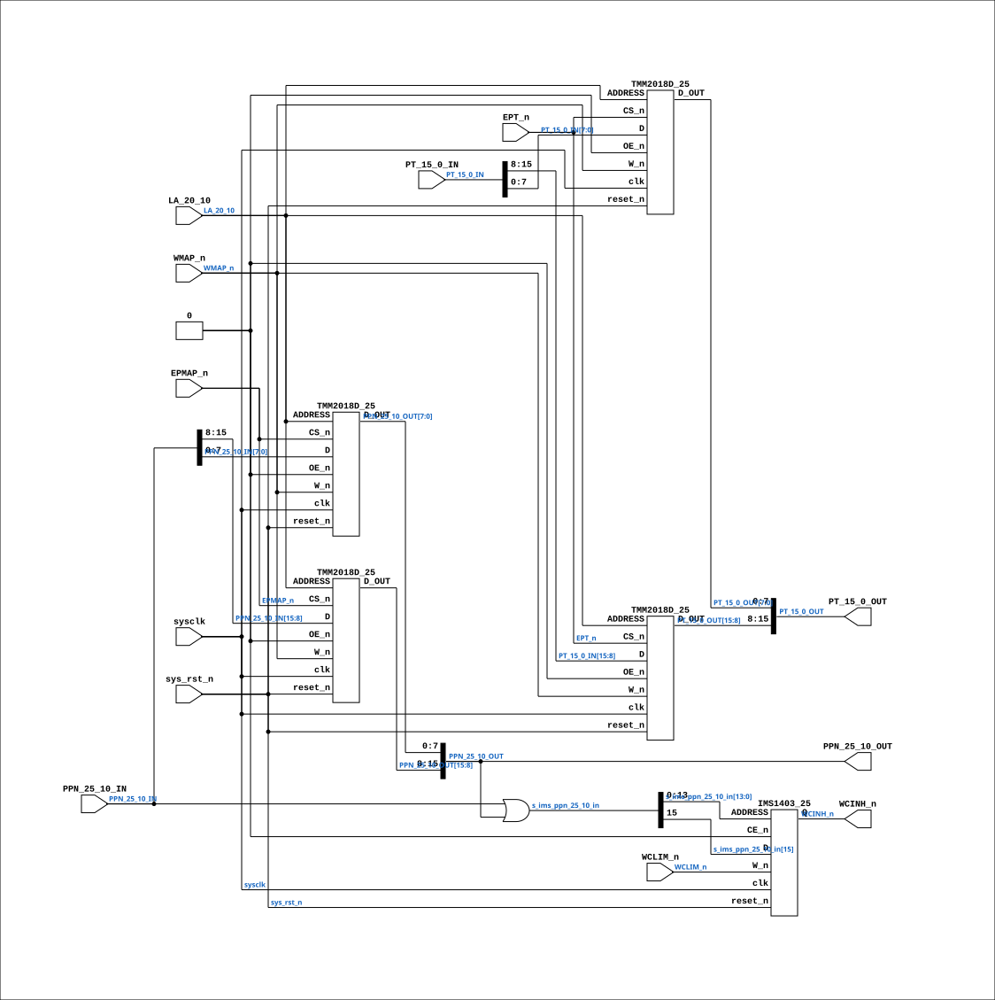

# CPU_MMU_PT_29

Source: `Verilog/CPU-BOARD-3202/circuit/CPU_MMU_PT_29.v`

<!-- Generated by Verilog/tests/module_doc.py from the //! comments in the source. Do not edit by hand - edit the RTL comments and regenerate. -->

<!-- HIERARCHY-NAV:BEGIN - written by Verilog/tests/gen_hierarchy.py, do not edit -->

**Where it sits** (Simulation): [ND120_TOP](../../../doc/ND120_TOP.md) > [ND120_CORE](../../../doc/ND120_CORE.md) > [ND3202D](ND3202D.md) > [CPU_15](CPU_15.md) > [CPU_MMU_24](CPU_MMU_24.md) > **CPU_MMU_PT_29**
- instance path: `CORE.CPU_BOARD.CPU.MMU.PT`

**Used in:** [CPU_MMU_24](CPU_MMU_24.md) (all tops)

**Contains:** [IMS1403_25](../../../Shared/support/doc/IMS1403_25.md), [TMM2018D_25](../../../Shared/support/doc/TMM2018D_25.md) x4

[Module hierarchy](../../../HIERARCHY.md) - [All modules](../../../MODULES.md)

<!-- HIERARCHY-NAV:END -->


<!-- SCHEMATIC:BEGIN - written by Verilog/tests/gen_schematics.py, do not edit -->

## Schematic

Drawn from the Verilog: the yosys netlist of the Simulation (Verilator) build, instance `CORE.CPU_BOARD.CPU.MMU.PT`. Sub-modules are boxes (click the picture to open it full size; there every sub-module box links to its page, and every wire shows its Verilog name).

[](CPU_MMU_PT_29.svg)

<!-- SCHEMATIC:END -->

## Description

ND120 CPU, MM&M
CPU/MMU/PT
CACHE
SHEET 29 of 50
Last reviewed: 2-FEB-2025
Ronny Hansen

## Ports

| Direction | Width | Name | Description |
|---|---|---|---|
| input | `1` | `sysclk` | System clock in FPGA |
| input | `1` | `sys_rst_n` *(active low)* | System reset in FPGA |
| input | `[10:0]` | `LA_20_10` | 11 bit addressing into PT chips |
| input | `1` | `EPMAP_n` *(active low)* | Enable EPMAP chips (Extended map?) |
| input | `1` | `EPT_n` *(active low)* | Enable PT chips (Chip select for PT chips). Combine with WMAP_n to write to PT chips (Chip 24G and Chip 25G) |
| input | `1` | `WCLIM_n` *(active low)* | Write to RAM chip with 1 bit Data being PPN hi bit (bit ppn 25) |
| input | `1` | `WMAP_n` *(active low)* | Write MAPPING signal |
| input | `[15:0]` | `PPN_25_10_IN` | Physical Page Number (PPN) Bidirectional PPN (in) (bit 23-10 in the calculated physical address) |
| output | `[15:0]` | `PPN_25_10_OUT` | Physical Page Number (PPN) Bidirectional PPN (out) (bit 23-10 in the calculated physical address) |
| input | `[15:0]` | `PT_15_0_IN` | Bidirectional PT (in) |
| output | `[15:0]` | `PT_15_0_OUT` | Bidirectional PT (out) |
| output | `1` | `WCINH_n` *(active low)* |  |

## Verilog source

[`Verilog/CPU-BOARD-3202/circuit/CPU_MMU_PT_29.v`](https://github.com/RetroCoreLabs/nd-120/blob/main/Verilog/CPU-BOARD-3202/circuit/CPU_MMU_PT_29.v) on GitHub.

<details markdown="1">
<summary>Show the Verilog of CPU_MMU_PT_29 (160 lines)</summary>

```verilog
/**************************************************************************
** ND120 CPU, MM&M                                                       **
** CPU/MMU/PT                                                            **
** CACHE                                                                 **
** SHEET 29 of 50                                                        **
**                                                                       **
** Last reviewed: 2-FEB-2025                                             **
** Ronny Hansen                                                          **
***************************************************************************/

module CPU_MMU_PT_29 (
    input sysclk,    //! System clock in FPGA
    input sys_rst_n, //! System reset in FPGA

    input [10:0] LA_20_10,  //! 11 bit addressing into PT chips

    input EPMAP_n,  //! Enable EPMAP chips (Extended map?)
    input EPT_n,    //! Enable PT chips (Chip select for PT chips). Combine with WMAP_n to write to PT chips (Chip 24G and Chip 25G)
    input WCLIM_n,  //! Write to RAM chip with 1 bit Data being PPN hi bit (bit ppn 25)
    input WMAP_n,   //! Write MAPPING signal

    input  [15:0] PPN_25_10_IN,  //! Physical Page Number (PPN) Bidirectional PPN (in) (bit 23-10 in the calculated physical address)
    output [15:0] PPN_25_10_OUT, //! Physical Page Number (PPN) Bidirectional PPN (out) (bit 23-10 in the calculated physical address)

    input  [15:0] PT_15_0_IN,  //! Bidirectional PT (in)
    output [15:0] PT_15_0_OUT, //! Bidirectional PT (out)

    output WCINH_n
);

  /*******************************************************************************
   ** The wires are defined here                                                 **
   *******************************************************************************/
  wire [10:0] s_la_20_10;
  wire [15:0] s_pt_15_0_in;
  wire [15:0] s_pt_15_0_out;
  wire [15:0] s_ppn_25_10_in;
  wire [15:0] s_ppn_25_10_out;

  wire [15:0] s_ims_ppn_25_10_in;  //PPN signal in to memory chip 20G (IMS1403_25)
  wire        s_wclim_n;
  wire        s_wcinh_n;
  wire        s_ept_n;
  wire        s_epmap_n;
  wire        s_wmap_n;
  wire        s_gnd;

  /*******************************************************************************
   ** The module functionality is described here                                 **
   *******************************************************************************/

  /*******************************************************************************
   ** Here all input connections are defined                                     **
   *******************************************************************************/
  assign s_la_20_10[10:0] = LA_20_10;
  assign s_wclim_n = WCLIM_n;
  assign s_ept_n = EPT_n;
  assign s_epmap_n = EPMAP_n;
  assign s_wmap_n = WMAP_n;

  assign s_ppn_25_10_in = PPN_25_10_IN;
  assign s_pt_15_0_in = PT_15_0_IN;

  /*******************************************************************************
   ** Here all output connections are defined                                    **
   *******************************************************************************/
  assign PPN_25_10_OUT = s_ppn_25_10_out[15:0];
  assign PT_15_0_OUT = s_pt_15_0_out[15:0];
  assign WCINH_n = s_wcinh_n;

  assign s_ims_ppn_25_10_in =  s_ppn_25_10_in | s_ppn_25_10_out; // maybe do a conditional expression here to select which PPN to write to RAM chip 20G

  // Code to make LINTER not complaing about bits _not_ read in s_ims_ppn_25_10_in bit 14
  (* keep = "true", DONT_TOUCH = "true" *) wire unused_IMS_PPN_bit;
  assign unused_IMS_PPN_bit = s_ims_ppn_25_10_in[14];


  /*******************************************************************************
   ** Here all in-lined components are defined                                   **
   *******************************************************************************/

  // Ground
  assign s_gnd = 1'b0;

  /*******************************************************************************
   ** Here all sub-circuits are defined                                          **
   *******************************************************************************/


  /**** Page Table - PT_25_10 ****/

  // PT_25_18 (hi part of PPN_25_10)
  TMM2018D_25 #(.INSTANCE_NAME("CHIP_24G")) CHIP_24G (
      .clk(sysclk),
      .reset_n(sys_rst_n),

      .ADDRESS(s_la_20_10[10:0]),
      .CS_n(s_ept_n),
      .D(s_pt_15_0_in[15:8]),
      .D_OUT(s_pt_15_0_out[15:8]),
      .OE_n(s_gnd),
      .W_n(s_wmap_n)
  );


  // PT_17_10 (lo part of PT_25_10)
  TMM2018D_25 #(.INSTANCE_NAME("CHIP_25G")) CHIP_25G (
      .clk(sysclk),
      .reset_n(sys_rst_n),

      .ADDRESS(s_la_20_10[10:0]),
      .CS_n(s_ept_n),
      .D(s_pt_15_0_in[7:0]),
      .D_OUT(s_pt_15_0_out[7:0]),
      .OE_n(s_gnd),
      .W_n(s_wmap_n)
  );

  /**** PPN table - PPN_25_10 ****/

  // PPN_25_18 (hi part of PPN_25_10)
  TMM2018D_25 #(.INSTANCE_NAME("CHIP_22G")) CHIP_22G (
      .clk(sysclk),
      .reset_n(sys_rst_n),

      .ADDRESS(s_la_20_10[10:0]),
      .CS_n(s_epmap_n),
      .D(s_ppn_25_10_in[15:8]),
      .D_OUT(s_ppn_25_10_out[15:8]),
      .OE_n(s_gnd),
      .W_n(s_wmap_n)
  );


  // PPN_17_10 (lo part of PPN_25_10)
  TMM2018D_25 #(.INSTANCE_NAME("CHIP_23G")) CHIP_23G (
      .clk(sysclk),
      .reset_n(sys_rst_n),

      .ADDRESS(s_la_20_10[10:0]),
      .CS_n(s_epmap_n),
      .D(s_ppn_25_10_in[7:0]),
      .D_OUT(s_ppn_25_10_out[7:0]),
      .OE_n(s_gnd),
      .W_n(s_wmap_n)
  );

  // PPN adressing into RAM chip with 1 bit Data being PPN hi bit (bit ppn 25). Write to RAM when WCLIM_n is low
  IMS1403_25 CHIP_20G (
      .clk(sysclk),
      .reset_n(sys_rst_n),
      .ADDRESS(s_ims_ppn_25_10_in[13:0]),  // Address bit ppn_25_10[14] not used.
      .CE_n(s_gnd),
      .D(s_ims_ppn_25_10_in[15]),
      .Q(s_wcinh_n),
      .W_n(s_wclim_n)
  );


endmodule
```

</details>
