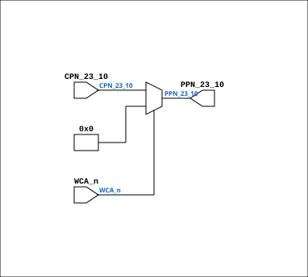

# CPU_MMU_WCA_31

Source: `Verilog/CPU-BOARD-3202/circuit/CPU_MMU_WCA_31.v`

<!-- Generated by Verilog/tests/module_doc.py from the //! comments in the source. Do not edit by hand - edit the RTL comments and regenerate. -->

<!-- HIERARCHY-NAV:BEGIN - written by Verilog/tests/gen_hierarchy.py, do not edit -->

**Hierarchy:** not instantiated by any of the 9 build tops (elaborated by yosys).

[Module hierarchy](../../../HIERARCHY.md) - [All modules](../../../MODULES.md)

<!-- HIERARCHY-NAV:END -->


<!-- SCHEMATIC:BEGIN - written by Verilog/tests/gen_schematics.py, do not edit -->

## Schematic

Drawn from the Verilog: no build top uses this module, so it was elaborated from its own file with no defines and default parameters. Sub-modules are boxes (click the picture to open it full size; there every sub-module box links to its page, and every wire shows its Verilog name).

[](CPU_MMU_WCA_31.svg)

<!-- SCHEMATIC:END -->

## Description

ND120 CPU, MM&M
CPU/MMU/WCA
PPN TO CPN
SHEET 31 of 50
Last reviewed: 10-FEB-2024
Ronny Hansen

## Ports

| Direction | Width | Name | Description |
|---|---|---|---|
| input | `[13:0]` | `CPN_23_10` |  |
| input | `1` | `WCA_n` *(active low)* |  |
| output | `[13:0]` | `PPN_23_10` |  |

## Verilog source

[`Verilog/CPU-BOARD-3202/circuit/CPU_MMU_WCA_31.v`](https://github.com/RetroCoreLabs/nd-120/blob/main/Verilog/CPU-BOARD-3202/circuit/CPU_MMU_WCA_31.v) on GitHub.

<details markdown="1">
<summary>Show the Verilog of CPU_MMU_WCA_31 (21 lines)</summary>

```verilog
/**************************************************************************
** ND120 CPU, MM&M                                                       **
** CPU/MMU/WCA                                                           **
** PPN TO CPN                                                            **
** SHEET 31 of 50                                                        **
**                                                                       ** 
** Last reviewed: 10-FEB-2024                                            **
** Ronny Hansen                                                          **
***************************************************************************/

module CPU_MMU_WCA_31 (
    input  [13:0] CPN_23_10,
    input         WCA_n,
    output [13:0] PPN_23_10
);

  // Refactored logic
  assign PPN_23_10 = WCA_n ? 14'b0 : CPN_23_10;


endmodule
```

</details>
