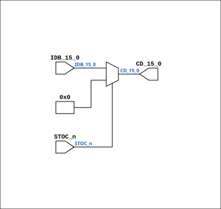

# CPU_STOC_35

Source: `Verilog/CPU-BOARD-3202/circuit/CPU_STOC_35.v`

<!-- Generated by Verilog/tests/module_doc.py from the //! comments in the source. Do not edit by hand - edit the RTL comments and regenerate. -->

<!-- HIERARCHY-NAV:BEGIN - written by Verilog/tests/gen_hierarchy.py, do not edit -->

**Hierarchy:** not instantiated by any of the 9 build tops (elaborated by yosys).

[Module hierarchy](../../../HIERARCHY.md) - [All modules](../../../MODULES.md)

<!-- HIERARCHY-NAV:END -->


<!-- SCHEMATIC:BEGIN - written by Verilog/tests/gen_schematics.py, do not edit -->

## Schematic

Drawn from the Verilog: no build top uses this module, so it was elaborated from its own file with no defines and default parameters. Sub-modules are boxes (click the picture to open it full size; there every sub-module box links to its page, and every wire shows its Verilog name).

[](CPU_STOC_35.svg)

<!-- SCHEMATIC:END -->

## Description

ND120 CPU, MM&M
CPU/STOC
IDB TO CD
SHEET 35 of 50
Last reviewed: 13-JAN-2024
Ronny Hansen

## Ports

| Direction | Width | Name | Description |
|---|---|---|---|
| input | `[15:0]` | `IDB_15_0` |  |
| output | `[15:0]` | `CD_15_0` |  |
| input | `1` | `STOC_n` *(active low)* |  |

## Verilog source

[`Verilog/CPU-BOARD-3202/circuit/CPU_STOC_35.v`](https://github.com/RetroCoreLabs/nd-120/blob/main/Verilog/CPU-BOARD-3202/circuit/CPU_STOC_35.v) on GitHub.

<details markdown="1">
<summary>Show the Verilog of CPU_STOC_35 (19 lines)</summary>

```verilog
/**************************************************************************
** ND120 CPU, MM&M                                                       **
** CPU/STOC                                                              **
** IDB TO CD                                                             **
** SHEET 35 of 50                                                        **
**                                                                       **
** Last reviewed: 13-JAN-2024                                            **
** Ronny Hansen                                                          **
***************************************************************************/

module CPU_STOC_35 (
    input wire [15:0] IDB_15_0,
    output wire [15:0] CD_15_0,
    input wire STOC_n
);

  assign CD_15_0 = STOC_n ? 16'b0 : IDB_15_0;  // If STOC_n is high, output is high-impedance

endmodule
```

</details>
