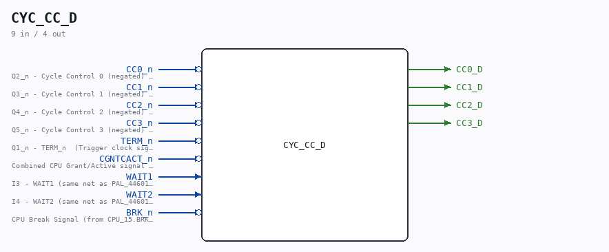
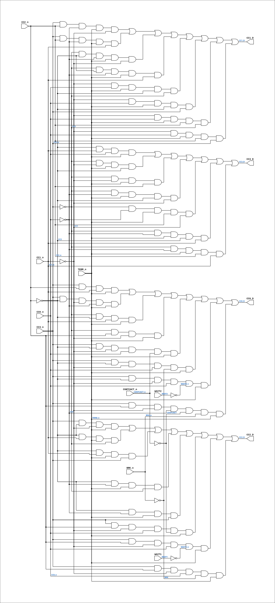

# CYC_CC_D

Source: `Verilog/CPU-BOARD-3202/circuit/CYC_CC_D.v`

<!-- Generated by Verilog/tests/module_doc.py from the //! comments in the source. Do not edit by hand - edit the RTL comments and regenerate. -->

<!-- HIERARCHY-NAV:BEGIN - written by Verilog/tests/gen_hierarchy.py, do not edit -->

**Where it sits** (Simulation): [ND120_TOP](../../../doc/ND120_TOP.md) > [ND120_CORE](../../../doc/ND120_CORE.md) > [ND3202D](ND3202D.md) > [CYC_36](CYC_36.md) > **CYC_CC_D**
- instance path: `CORE.CPU_BOARD.CYC.U_CC_D`

**Used in:** [CYC_36](CYC_36.md) (all tops)

**Contains:** no other modules.

[Module hierarchy](../../../HIERARCHY.md) - [All modules](../../../MODULES.md)

<!-- HIERARCHY-NAV:END -->



<!-- SCHEMATIC:BEGIN - written by Verilog/tests/gen_schematics.py, do not edit -->

## Schematic

Drawn from the Verilog: the yosys netlist of the Simulation (Verilator) build, instance `CORE.CPU_BOARD.CYC.U_CC_D`. Sub-modules are boxes (click the picture to open it full size; there every sub-module box links to its page, and every wire shows its Verilog name).

[](CYC_CC_D.svg)

<!-- SCHEMATIC:END -->

## Description

ND120 CPU, MM&M
CYC_CC_D
Combinational NEXT-state of the Cycle Controller CC3..CC0 counter.
MIRROR of the CC0_reg/CC1_reg/CC2_reg/CC3_reg next-state logic inside
PAL_44601B (the CYCFSM, sheet 36). PAL_44601B stays the golden
source; this module reproduces only its CC D-inputs so CYC_36 can
compute the NEXT cycle-control state and, via a second (combinational)
PAL_44307C fed that next-state, build phase-accurate sysclk enables
for MCLK / MACLK / UCLK. See docs/clock-enable-refactor.md.
The equations below are the "flat" product-term forms the PAL author
documented in comments (PAL_44601B.v CC3 132-138, CC2 159-166,
CC1 188-195, CC0 216-223), which equal the implemented if/else next-
state. DO NOT let this diverge from PAL_44601B: it is validated
EXHAUSTIVELY against the real PAL by CYC_CC_D_tb.v (all 16 CC states x
2 TERM x the CC-relevant input combos). Re-run if PAL_44601B changes.
Last reviewed: 5-JULY-2026
Ronny Hansen

## Ports

| Direction | Width | Name | Description |
|---|---|---|---|
| input | `1` | `CC0_n` *(active low)* | Q2_n - Cycle Control 0 (negated) (from PAL_44601B.CC0_n) |
| input | `1` | `CC1_n` *(active low)* | Q3_n - Cycle Control 1 (negated) (from PAL_44601B.CC1_n) |
| input | `1` | `CC2_n` *(active low)* | Q4_n - Cycle Control 2 (negated) (from PAL_44601B.CC2_n) |
| input | `1` | `CC3_n` *(active low)* | Q5_n - Cycle Control 3 (negated) (from PAL_44601B.CC3_n) |
| input | `1` | `TERM_n` *(active low)* | Q1_n - TERM_n  (Trigger clock signal that latches CS input signals and more) (from PAL_44601B.TERM_n) |
| input | `1` | `CGNTCACT_n` *(active low)* | Combined CPU Grant/Active signal (from BIF_5.CGNTCACT_n) |
| input | `1` | `WAIT1` | I3 - WAIT1 (same net as PAL_44601B.WAIT1) |
| input | `1` | `WAIT2` | I4 - WAIT2 (same net as PAL_44601B.WAIT2) |
| input | `1` | `BRK_n` *(active low)* | CPU Break Signal (from CPU_15.BRK_n) |
| output | `1` | `CC0_D` |  |
| output | `1` | `CC1_D` |  |
| output | `1` | `CC2_D` |  |
| output | `1` | `CC3_D` |  |

## Verilog source

[`Verilog/CPU-BOARD-3202/circuit/CYC_CC_D.v`](https://github.com/RetroCoreLabs/nd-120/blob/main/Verilog/CPU-BOARD-3202/circuit/CYC_CC_D.v) on GitHub.

<details markdown="1">
<summary>Show the Verilog of CYC_CC_D (107 lines)</summary>

```verilog
/**************************************************************************
** ND120 CPU, MM&M                                                       **
** CYC_CC_D                                                              **
** Combinational NEXT-state of the Cycle Controller CC3..CC0 counter.    **
**                                                                       **
** MIRROR of the CC0_reg/CC1_reg/CC2_reg/CC3_reg next-state logic inside **
** PAL_44601B (the CYCFSM, sheet 36). PAL_44601B stays the golden        **
** source; this module reproduces only its CC D-inputs so CYC_36 can     **
** compute the NEXT cycle-control state and, via a second (combinational)**
** PAL_44307C fed that next-state, build phase-accurate sysclk enables    **
** for MCLK / MACLK / UCLK. See docs/clock-enable-refactor.md.           **
**                                                                       **
** The equations below are the "flat" product-term forms the PAL author  **
** documented in comments (PAL_44601B.v CC3 132-138, CC2 159-166,        **
** CC1 188-195, CC0 216-223), which equal the implemented if/else next-  **
** state. DO NOT let this diverge from PAL_44601B: it is validated       **
** EXHAUSTIVELY against the real PAL by CYC_CC_D_tb.v (all 16 CC states x **
** 2 TERM x the CC-relevant input combos). Re-run if PAL_44601B changes. **
**                                                                       **
** Last reviewed: 5-JULY-2026                                            **
** Ronny Hansen                                                          **
***************************************************************************/

module CYC_CC_D (
    // Current cycle-control state + TERM, as the PAL's active-low outputs.
    input CC0_n,  //! Q2_n - Cycle Control 0 (negated) (from PAL_44601B.CC0_n)
    input CC1_n,  //! Q3_n - Cycle Control 1 (negated) (from PAL_44601B.CC1_n)
    input CC2_n,  //! Q4_n - Cycle Control 2 (negated) (from PAL_44601B.CC2_n)
    input CC3_n,  //! Q5_n - Cycle Control 3 (negated) (from PAL_44601B.CC3_n)
    input TERM_n,  //! Q1_n - TERM_n  (Trigger clock signal that latches CS input signals and more) (from PAL_44601B.TERM_n)

    // FSM inputs the CC equations depend on (same nets PAL_44601B receives).
    input CGNTCACT_n,  //! Combined CPU Grant/Active signal (from BIF_5.CGNTCACT_n)
    input WAIT1,  //! I3 - WAIT1 (same net as PAL_44601B.WAIT1)
    input WAIT2,  //! I4 - WAIT2 (same net as PAL_44601B.WAIT2)
    input BRK_n,  //! CPU Break Signal (from CPU_15.BRK_n)

    // Combinational next values of CC3..CC0 (active-high, = CCx_reg D inputs).
    output CC0_D,
    output CC1_D,
    output CC2_D,
    output CC3_D
);

  // Active-high current state and PAL internal negated wires.
  wire CC0 = ~CC0_n;
  wire CC1 = ~CC1_n;
  wire CC2 = ~CC2_n;
  wire CC3 = ~CC3_n;
  wire s_cc0_n_int = CC0_n;
  wire s_cc1_n_int = CC1_n;
  wire s_cc2_n_int = CC2_n;
  wire s_cc3_n_int = CC3_n;
  wire s_term_n_int = TERM_n;

  // Input polarities (match PAL_44601B).
  wire CGNTCACT = ~CGNTCACT_n;
  wire WAIT1_n  = ~WAIT1;
  wire WAIT2_n  = ~WAIT2;
  wire BRK      = ~BRK_n;

  // ==== MIRROR of PAL_44601B CC next-state (flat forms). ====

  // CC3 (PAL_44601B.v:132-138)
  assign CC3_D =
        (CC2 & s_cc1_n_int & s_cc0_n_int & s_term_n_int)
      | (CC3 & CC1 & s_term_n_int & CC2)
      | (CC3 & CC1 & s_term_n_int & s_cc2_n_int)
      | (CC3 & CC0 & s_term_n_int & CC2 & CC1)
      | (CC3 & CC0 & s_term_n_int & s_cc2_n_int & CC1)
      | (CC3 & CC0 & s_term_n_int & CC2 & s_cc1_n_int)
      | (CC3 & CC0 & s_term_n_int & s_cc2_n_int & s_cc1_n_int);

  // CC2 (PAL_44601B.v:159-166)
  assign CC2_D =
        (s_cc3_n_int & CC2 & CC1 & s_term_n_int)
      | (CC2 & s_cc1_n_int & s_term_n_int & CC3)
      | (CC2 & s_cc1_n_int & s_term_n_int & s_cc3_n_int)
      | (CC2 & CC0 & s_term_n_int & CC3)
      | (CC2 & CC0 & s_term_n_int & s_cc3_n_int)
      | (s_cc3_n_int & s_cc2_n_int & CC1 & s_cc0_n_int & CGNTCACT & s_term_n_int)
      | (s_cc3_n_int & s_cc2_n_int & CC1 & s_cc0_n_int & WAIT1_n & s_term_n_int)
      | (s_cc3_n_int & s_cc2_n_int & CC1 & s_cc0_n_int & BRK & s_term_n_int);

  // CC1 (PAL_44601B.v:188-195)
  assign CC1_D =
        (s_cc3_n_int & s_cc2_n_int & CC0 & s_term_n_int & CC1)
      | (s_cc3_n_int & s_cc2_n_int & CC0 & s_term_n_int & s_cc1_n_int)
      | (CC3 & CC2 & CC0 & s_term_n_int & CC1)
      | (CC3 & CC2 & CC0 & s_term_n_int & s_cc1_n_int)
      | (CC1 & s_cc0_n_int & s_term_n_int & CC2 & CC3)
      | (CC1 & s_cc0_n_int & s_term_n_int & CC2 & s_cc3_n_int)
      | (CC1 & s_cc0_n_int & s_term_n_int & s_cc2_n_int & CC3)
      | (CC1 & s_cc0_n_int & s_term_n_int & s_cc2_n_int & s_cc3_n_int);

  // CC0 (PAL_44601B.v:216-223)
  assign CC0_D =
        (s_cc3_n_int & s_cc2_n_int & s_cc1_n_int & s_term_n_int)
      | (s_cc3_n_int & CC2 & CC1 & CC0 & s_term_n_int)
      | (CC3 & CC2 & s_cc1_n_int & s_term_n_int)
      | (CC3 & s_cc2_n_int & CC1 & s_term_n_int)
      | (s_cc3_n_int & CC2 & CC1 & s_cc0_n_int & CGNTCACT_n & s_term_n_int)
      | (s_cc3_n_int & CC2 & CC1 & s_cc0_n_int & BRK & s_term_n_int)
      | (s_cc3_n_int & CC2 & CC1 & s_cc0_n_int & WAIT2_n & s_term_n_int)
      | (s_cc3_n_int & s_cc2_n_int & CC1 & CC0 & CGNTCACT & BRK_n & s_term_n_int);

endmodule
```

</details>
