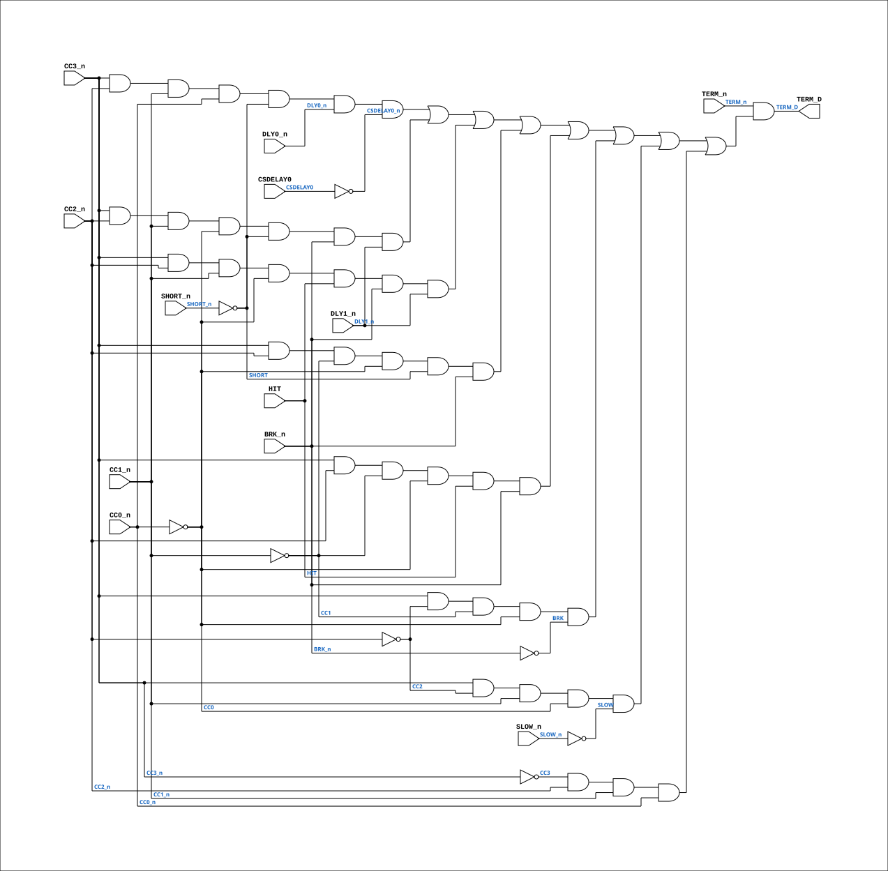

# CYC_TERM_D

Source: `Verilog/CPU-BOARD-3202/circuit/CYC_TERM_D.v`

<!-- Generated by Verilog/tests/module_doc.py from the //! comments in the source. Do not edit by hand - edit the RTL comments and regenerate. -->

<!-- HIERARCHY-NAV:BEGIN - written by Verilog/tests/gen_hierarchy.py, do not edit -->

**Where it sits** (Simulation): [ND120_TOP](../../../doc/ND120_TOP.md) > [ND120_CORE](../../../doc/ND120_CORE.md) > [ND3202D](ND3202D.md) > [CYC_36](CYC_36.md) > **CYC_TERM_D**
- instance path: `CORE.CPU_BOARD.CYC.U_TERM_D`

**Used in:** [CYC_36](CYC_36.md) (all tops)

**Contains:** no other modules.

[Module hierarchy](../../../HIERARCHY.md) - [All modules](../../../MODULES.md)

<!-- HIERARCHY-NAV:END -->


<!-- SCHEMATIC:BEGIN - written by Verilog/tests/gen_schematics.py, do not edit -->

## Schematic

Drawn from the Verilog: the yosys netlist of the Simulation (Verilator) build, instance `CORE.CPU_BOARD.CYC.U_TERM_D`. Sub-modules are boxes (click the picture to open it full size; there every sub-module box links to its page, and every wire shows its Verilog name).

[](CYC_TERM_D.svg)

<!-- SCHEMATIC:END -->

## Description

ND120 CPU, MM&M
CYC_TERM_D
Combinational NEXT-state of the Cycle Controller TERM register.
This is a MIRROR of the TERM_reg next-state logic inside PAL_44601B
(the CYCFSM, sheet 36). PAL_44601B stays the golden source; this
module reproduces only its TERM D-input so CYC_36 can build a
phase-accurate, sysclk-synchronous clock-enable that fires on the
SAME edge posedge ALUCLK (~(TERM_n|LCS)) would have, instead of one
sysclk late. See docs/clock-enable-refactor.md.
DO NOT let this diverge from PAL_44601B. It is validated EXHAUSTIVELY
against the real PAL by CYC_TERM_D_tb.v (all 16 CC states x all
terminate-input combinations). If PAL_44601B.v changes, re-run that
testbench.
Last reviewed: 5-JULY-2026
Ronny Hansen

## Ports

| Direction | Width | Name | Description |
|---|---|---|---|
| input | `1` | `CC0_n` *(active low)* | Q2_n - Cycle Control 0 (negated) (from PAL_44601B.CC0_n) |
| input | `1` | `CC1_n` *(active low)* | Q3_n - Cycle Control 1 (negated) (from PAL_44601B.CC1_n) |
| input | `1` | `CC2_n` *(active low)* | Q4_n - Cycle Control 2 (negated) (from PAL_44601B.CC2_n) |
| input | `1` | `CC3_n` *(active low)* | Q5_n - Cycle Control 3 (negated) (from PAL_44601B.CC3_n) |
| input | `1` | `TERM_n` *(active low)* | Q1_n - TERM_n  (Trigger clock signal that latches CS input signals and more) (from PAL_44601B.TERM_n) |
| input | `1` | `SHORT_n` *(active low)* | B1_n - SHORT_n  - SHORT Cycle (same net as PAL_44601B.SHORT_n) |
| input | `1` | `HIT` | Cache hit (from CPU_15.HIT) |
| input | `1` | `BRK_n` *(active low)* | CPU Break Signal (from CPU_15.BRK_n) |
| input | `1` | `SLOW_n` *(active low)* | B0_n - SLOW_n   - SLOW Cycle (same net as PAL_44601B.SLOW_n) |
| input | `1` | `DLY0_n` *(active low)* | I1 - DLY0_n    //! DLY0_ (Ouput from PAL 44403 DLY0_n (B0) (same net as PAL_44601B.DLY0_n) |
| input | `1` | `DLY1_n` *(active low)* | I0 - DLY1_n    //! DLY1_ (Ouput from PAL 44404 DLY1_n (B3) (same net as PAL_44601B.DLY1_n) |
| input | `1` | `CSDELAY0` | Top Control Store Bits - 64-bit microcode control signals (from CPU_15.TOPCSB[26]) |
| output | `1` | `TERM_D` |  |

## Verilog source

[`Verilog/CPU-BOARD-3202/circuit/CYC_TERM_D.v`](https://github.com/RetroCoreLabs/nd-120/blob/main/Verilog/CPU-BOARD-3202/circuit/CYC_TERM_D.v) on GitHub.

<details markdown="1">
<summary>Show the Verilog of CYC_TERM_D (77 lines)</summary>

```verilog
/**************************************************************************
** ND120 CPU, MM&M                                                       **
** CYC_TERM_D                                                            **
** Combinational NEXT-state of the Cycle Controller TERM register.       **
**                                                                       **
** This is a MIRROR of the TERM_reg next-state logic inside PAL_44601B   **
** (the CYCFSM, sheet 36). PAL_44601B stays the golden source; this      **
** module reproduces only its TERM D-input so CYC_36 can build a         **
** phase-accurate, sysclk-synchronous clock-enable that fires on the     **
** SAME edge posedge ALUCLK (~(TERM_n|LCS)) would have, instead of one   **
** sysclk late. See docs/clock-enable-refactor.md.                       **
**                                                                       **
** DO NOT let this diverge from PAL_44601B. It is validated EXHAUSTIVELY **
** against the real PAL by CYC_TERM_D_tb.v (all 16 CC states x all        **
** terminate-input combinations). If PAL_44601B.v changes, re-run that   **
** testbench.                                                            **
**                                                                       **
** Last reviewed: 5-JULY-2026                                            **
** Ronny Hansen                                                          **
***************************************************************************/

module CYC_TERM_D (
    // Current Cycle-Control state + TERM, taken as the PAL's active-low
    // outputs (CCx_n = ~CCx_reg, TERM_n = ~TERM_reg when OE_n=0). These are
    // exactly the nets CYC_36 already has.
    input CC0_n,  //! Q2_n - Cycle Control 0 (negated) (from PAL_44601B.CC0_n)
    input CC1_n,  //! Q3_n - Cycle Control 1 (negated) (from PAL_44601B.CC1_n)
    input CC2_n,  //! Q4_n - Cycle Control 2 (negated) (from PAL_44601B.CC2_n)
    input CC3_n,  //! Q5_n - Cycle Control 3 (negated) (from PAL_44601B.CC3_n)
    input TERM_n,  //! Q1_n - TERM_n  (Trigger clock signal that latches CS input signals and more) (from PAL_44601B.TERM_n)

    // Terminate-condition inputs - the same nets PAL_44601B receives.
    input SHORT_n,  //! B1_n - SHORT_n  - SHORT Cycle (same net as PAL_44601B.SHORT_n)
    input HIT,  //! Cache hit (from CPU_15.HIT)
    input BRK_n,  //! CPU Break Signal (from CPU_15.BRK_n)
    input SLOW_n,  //! B0_n - SLOW_n   - SLOW Cycle (same net as PAL_44601B.SLOW_n)
    input DLY0_n,  //! I1 - DLY0_n    //! DLY0_ (Ouput from PAL 44403 DLY0_n (B0) (same net as PAL_44601B.DLY0_n)
    input DLY1_n,  //! I0 - DLY1_n    //! DLY1_ (Ouput from PAL 44404 DLY1_n (B3) (same net as PAL_44601B.DLY1_n)
    input CSDELAY0,  //! Top Control Store Bits - 64-bit microcode control signals (from CPU_15.TOPCSB[26])

    // Combinational next value of TERM_reg (its D input, before the edge).
    output TERM_D
);

  // Active-high current state bits and the PAL's internal negated wires.
  wire CC0 = ~CC0_n;
  wire CC1 = ~CC1_n;
  wire CC2 = ~CC2_n;
  wire CC3 = ~CC3_n;
  wire s_cc0_n_int = CC0_n;  // = ~CC0_reg
  wire s_cc1_n_int = CC1_n;
  wire s_cc2_n_int = CC2_n;
  wire s_cc3_n_int = CC3_n;
  wire s_term_n_int = TERM_n; // = ~TERM_reg ; TERM_D asserts only when currently deasserted

  // PAL input polarities (match PAL_44601B.v)
  wire SHORT      = ~SHORT_n;
  wire SLOW       = ~SLOW_n;
  wire BRK        = ~BRK_n;
  wire CSDELAY0_n = ~CSDELAY0;

  // ====================================================================
  // MIRROR of PAL_44601B TERM_reg next-state (PAL_44601B.v lines 112-123):
  //   TERM_reg <= s_term_n_int ? (terminate OR-plane) : 1'b0;
  // = s_term_n_int & (OR-plane). Keep term-for-term identical to the PAL.
  // ====================================================================
  assign TERM_D = s_term_n_int & (
        (s_cc3_n_int & s_cc2_n_int & s_cc1_n_int & s_cc0_n_int & SHORT & DLY0_n & CSDELAY0_n)  // 50NS  a
      | (s_cc3_n_int & s_cc2_n_int & s_cc1_n_int & CC0 & SHORT & BRK_n & DLY1_n)               // 75NS  b
      | (s_cc3_n_int & s_cc2_n_int & s_cc1_n_int & CC0 & HIT   & BRK_n & DLY1_n)               // 75NS  b
      | (s_cc3_n_int & s_cc2_n_int & CC1 & CC0 & SHORT & BRK_n)                                // 100NS c
      | (s_cc3_n_int & s_cc2_n_int & CC1 & CC0 & HIT   & BRK_n)                                // 100NS c
      | (s_cc3_n_int & CC2 & CC1 & CC0 & BRK)                                                  // BRK   f
      | (s_cc3_n_int & CC2 & s_cc1_n_int & CC0 & SLOW)                                         // SLOW  g
      | (CC3 & s_cc2_n_int & s_cc1_n_int & s_cc0_n_int) );                                     // p (1000, unconditional)

endmodule
```

</details>
