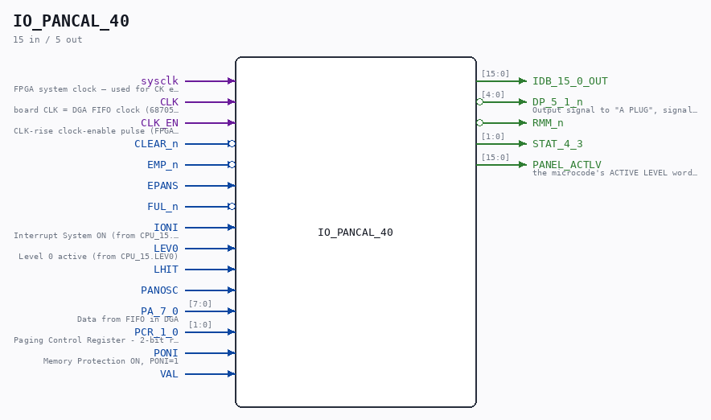

# IO_PANCAL_40

Source: `Verilog/CPU-BOARD-3202/circuit/IO_PANCAL_40.v`

<!-- Generated by Verilog/tests/module_doc.py from the //! comments in the source. Do not edit by hand - edit the RTL comments and regenerate. -->

<!-- HIERARCHY-NAV:BEGIN - written by Verilog/tests/gen_hierarchy.py, do not edit -->

**Where it sits** (Simulation): [ND120_TOP](../../../doc/ND120_TOP.md) > [ND120_CORE](../../../doc/ND120_CORE.md) > [ND3202D](ND3202D.md) > [IO_37](IO_37.md) > **IO_PANCAL_40**
- instance path: `CORE.CPU_BOARD.IO.PANCAL`

**Used in:** [IO_37](IO_37.md) (all tops)

**Contains:** [PANCAL_68705_CLOCK](PANCAL_68705_CLOCK.md) (only on Nexys, MiSTer, MEGA65 R6, MEGA65 R3, QMTECH), [TTL_74244](../../../Shared/support/doc/TTL_74244.md), [TTL_74374](../../../Shared/support/doc/TTL_74374.md)

[Module hierarchy](../../../HIERARCHY.md) - [All modules](../../../MODULES.md)

<!-- HIERARCHY-NAV:END -->

## Description

ND120 CPU, MM&M
IO/PANCAL
PANEL PROC & CALENDAR
SHEET 40 of 50
Last reviewed: 2-FEB-2025
Ronny Hansen

## Ports

| Direction | Width | Name | Description |
|---|---|---|---|
| input | `1` | `sysclk` | FPGA system clock — used for CK edge detection in CHIP_32B |
| input | `1` | `CLK` | board CLK = DGA FIFO clock (68705 emulation, latch mode) |
| input | `1` | `CLK_EN` | CLK-rise clock-enable pulse (FPGA_FF_MODE, else 0) |
| input | `1` | `CLEAR_n` *(active low)* |  |
| input | `1` | `EMP_n` *(active low)* |  |
| input | `1` | `EPANS` |  |
| input | `1` | `FUL_n` *(active low)* |  |
| input | `1` | `IONI` |  |
| input | `1` | `LEV0` |  |
| input | `1` | `LHIT` |  |
| input | `1` | `PANOSC` |  |
| input | `[7:0]` | `PA_7_0` | Data from FIFO in DGA |
| input | `[1:0]` | `PCR_1_0` |  |
| input | `1` | `PONI` | Memory Protection ON, PONI=1 |
| input | `1` | `VAL` |  |
| output | `[15:0]` | `IDB_15_0_OUT` |  |
| output | `[4:0]` | `DP_5_1_n` *(active low)* |  |
| output | `1` | `RMM_n` *(active low)* |  |
| output | `[1:0]` | `STAT_4_3` |  |
| output | `[15:0]` | `PANEL_ACTLV` | the microcode's ACTIVE LEVEL word (0 without ND120_PANEL_CLOCK) |
