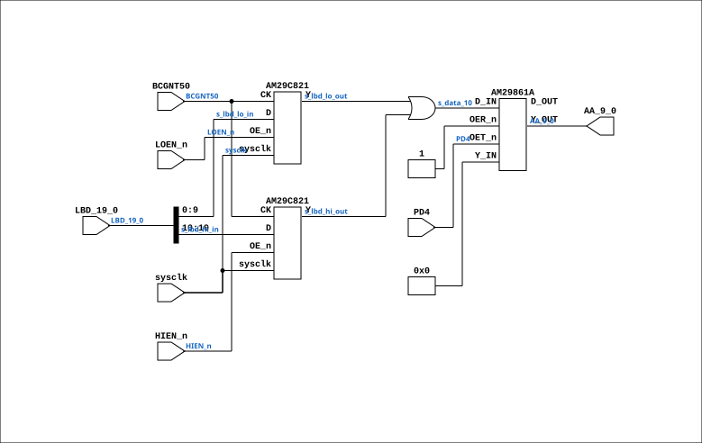

# MEM_ADDR_44

Source: `Verilog/CPU-BOARD-3202/circuit/MEM_ADDR_44.v`

<!-- Generated by Verilog/tests/module_doc.py from the //! comments in the source. Do not edit by hand - edit the RTL comments and regenerate. -->

<!-- HIERARCHY-NAV:BEGIN - written by Verilog/tests/gen_hierarchy.py, do not edit -->

**Where it sits** (Simulation): [ND120_TOP](../../../doc/ND120_TOP.md) > [ND120_CORE](../../../doc/ND120_CORE.md) > [ND3202D](ND3202D.md) > [MEM_43](MEM_43.md) > **MEM_ADDR_44**
- instance path: `CORE.CPU_BOARD.MEM.ADDR`

**Used in:** [MEM_43](MEM_43.md) (all tops)

**Contains:** [AM29861A](../../../Shared/support/doc/AM29861A.md), [AM29C821](../../../Shared/support/doc/AM29C821.md) x2

[Module hierarchy](../../../HIERARCHY.md) - [All modules](../../../MODULES.md)

<!-- HIERARCHY-NAV:END -->


<!-- SCHEMATIC:BEGIN - written by Verilog/tests/gen_schematics.py, do not edit -->

## Schematic

Drawn from the Verilog: the yosys netlist of the Simulation (Verilator) build, instance `CORE.CPU_BOARD.MEM.ADDR`. Sub-modules are boxes (click the picture to open it full size; there every sub-module box links to its page, and every wire shows its Verilog name).

[](MEM_ADDR_44.svg)

<!-- SCHEMATIC:END -->

## Description

ND120 CPU, MM&M
MEM/ADDR
MEM ADDR MUX
SHEET 44 of 50
Last reviewed: 2-FEB-2025
Ronny Hansen

## Ports

| Direction | Width | Name | Description |
|---|---|---|---|
| input | `1` | `sysclk` | System clock in FPGA (from MEM_43.sysclk) |
| input | `[19:0]` | `LBD_19_0` | Local Bus Address and Data - 20 bits (including parity 2 bits) |
| input | `1` | `BCGNT50` | Bus cycle grant 50ns delayed CLOCK signal to latch LOW or HIGH bits from memory to AA_9_0 |
| input | `1` | `LOEN_n` *(active low)* | Low address bits enable |
| input | `1` | `HIEN_n` *(active low)* | High address bits enable |
| input | `1` | `PD4` | Power down 4 |
| output | `[9:0]` | `AA_9_0` | 10 bits of LBD (including parity in bit 10)- 10 bit input to MEM/RAM |

## Verilog source

[`Verilog/CPU-BOARD-3202/circuit/MEM_ADDR_44.v`](https://github.com/RetroCoreLabs/nd-120/blob/main/Verilog/CPU-BOARD-3202/circuit/MEM_ADDR_44.v) on GitHub.

<details markdown="1">
<summary>Show the Verilog of MEM_ADDR_44 (115 lines)</summary>

```verilog
/**************************************************************************
** ND120 CPU, MM&M                                                       **
** MEM/ADDR                                                              **
** MEM ADDR MUX                                                          **
** SHEET 44 of 50                                                        **
**                                                                       **
** Last reviewed: 2-FEB-2025                                             **
** Ronny Hansen                                                          **
***************************************************************************/

module MEM_ADDR_44 (
    // Input
    input sysclk,           //! System clock in FPGA (from MEM_43.sysclk)
    input [19:0] LBD_19_0,  //! Local Bus Address and Data - 20 bits (including parity 2 bits)
    input BCGNT50,          //! Bus cycle grant 50ns delayed CLOCK signal to latch LOW or HIGH bits from memory to AA_9_0
    input LOEN_n,           //! Low address bits enable
    input HIEN_n,           //! High address bits enable
    input PD4,              //! Power down 4

    // Output signals
    output [9:0] AA_9_0     //! 10 bits of LBD (including parity in bit 10)- 10 bit input to MEM/RAM
);


  /*******************************************************************************
   ** The wires are defined here                                                 **
   *******************************************************************************/
  wire [9:0] s_aa_9_0_out;

  wire [9:0] s_lbd_lo_in;
  wire [9:0] s_lbd_lo_out;

  wire [9:0] s_lbd_hi_in;
  wire [9:0] s_lbd_hi_out;

  wire [9:0] s_data_10;  // or'ed together output values from 3H and 4H

  wire       s_bcgnt50;
  wire       s_hien_n;
  wire       s_loen_n;
  wire       s_pd4;
  wire       s_power;

  /*******************************************************************************
   ** Here all input connections are defined                                     **
   *******************************************************************************/
  assign s_bcgnt50   = BCGNT50;
  assign s_hien_n    = HIEN_n;
  assign s_loen_n    = LOEN_n;
  assign s_pd4       = PD4;

  // Original code did split the LBD a strang way on bit 18 and 19
  // Unknow why..
  //assign s_lbd_lo_in = {LBD_19_0[18], LBD_19_0[8:0]};
  //assign s_lbd_hi_in = {LBD_19_0[19], LBD_19_0[17:9]};

  // But here we use the 20-bit address as it is
  assign s_lbd_lo_in = LBD_19_0[9:0];
  assign s_lbd_hi_in = LBD_19_0[19:10];

  assign s_data_10   = s_lbd_lo_out | s_lbd_hi_out;

  /*******************************************************************************
   ** Here all output connections are defined                                    **
   *******************************************************************************/
  assign AA_9_0      = s_aa_9_0_out[9:0];


  /*******************************************************************************
   ** Here all in-lined components are defined                                   **
   *******************************************************************************/

  // Power
  assign s_power     = 1'b1;


  /*******************************************************************************
   ** Here all sub-circuits are defined                                          **
   *******************************************************************************/

  AM29861A CHIP_5H (
      .OER_n(s_power),  // Read tied to power through a 2.2Kohm resistor pulling it high.
      .OET_n(s_pd4),
      .D_IN(s_data_10),
      .D_OUT(),      // Not connected, as there is nevere read from Y output D
      .Y_IN(10'b0),  // Not connected, as there is nevere read from Y output D
      .Y_OUT(s_aa_9_0_out)
  );

  // USE_SYSCLK=2: BCGNT50 is a bus-grant CONTROL signal, not a clock. Clocking these
  // address latches on `posedge BCGNT50` (USE_SYSCLK=0) is the routed-net-as-clock
  // anti-pattern on FPGA. But USE_SYSCLK=1 (level enable) is WRONG here: BCGNT50
  // stays high across the whole grant window while LBD moves on from the ADDRESS
  // to the WRITE DATA, so the "address" registers ended up holding the data and
  // every memory WRITE landed at the wrong location (OPCOM deposit broken in sim
  // AND on the board, 8-JUL-2026). USE_SYSCLK=2 = sysclk-sampled RISING-EDGE
  // capture: address taken exactly once per grant, like the original chip, with
  // no routed clock net.
  AM29C821 #(.USE_SYSCLK(2)) CHIP_3H_ROW_ADDRESS (
      .sysclk(sysclk),
      .CK(s_bcgnt50),
      .D(s_lbd_lo_in),
      .OE_n(s_loen_n),
      .Y(s_lbd_lo_out)
  );

  AM29C821 #(.USE_SYSCLK(2)) CHIP_4H_COL_ADDRESS (
      .sysclk(sysclk),
      .CK(s_bcgnt50),
      .D(s_lbd_hi_in),
      .OE_n(s_hien_n),
      .Y(s_lbd_hi_out)
  );

endmodule
```

</details>
