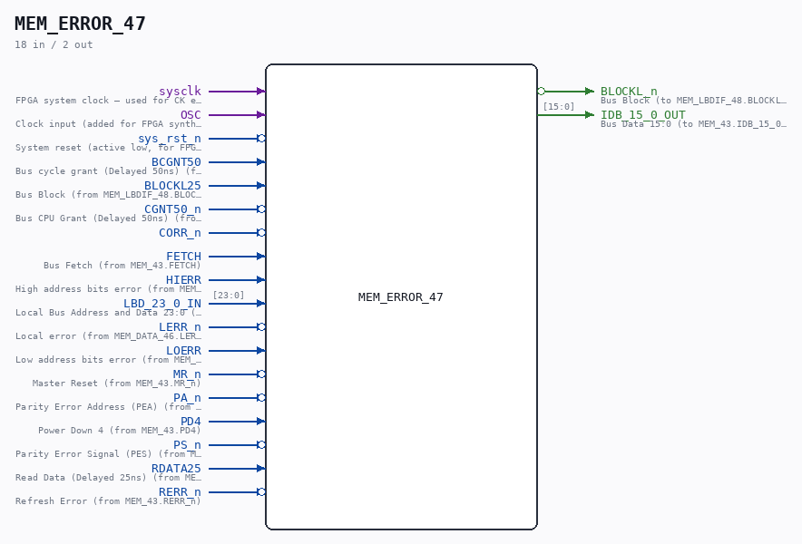
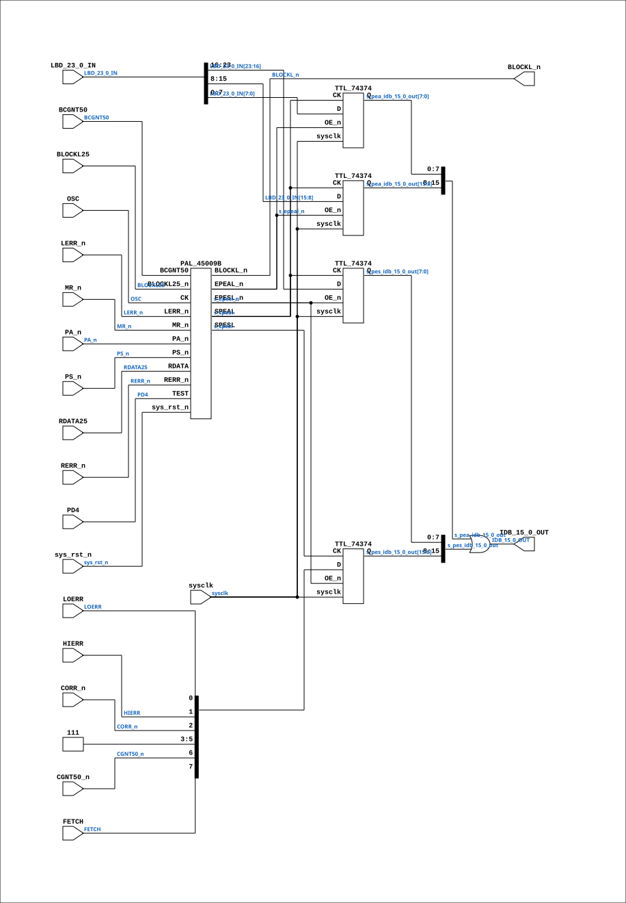

# MEM_ERROR_47

Source: `Verilog/CPU-BOARD-3202/circuit/MEM_ERROR_47.v`

<!-- Generated by Verilog/tests/module_doc.py from the //! comments in the source. Do not edit by hand - edit the RTL comments and regenerate. -->

<!-- HIERARCHY-NAV:BEGIN - written by Verilog/tests/gen_hierarchy.py, do not edit -->

**Where it sits** (Simulation): [ND120_TOP](../../../doc/ND120_TOP.md) > [ND120_CORE](../../../doc/ND120_CORE.md) > [ND3202D](ND3202D.md) > [MEM_43](MEM_43.md) > **MEM_ERROR_47**
- instance path: `CORE.CPU_BOARD.MEM.ERROR`

**Used in:** [MEM_43](MEM_43.md) (all tops)

**Contains:** [PAL_45009B](../../../PAL/doc/PAL_45009B.md), [TTL_74374](../../../Shared/support/doc/TTL_74374.md) x4

[Module hierarchy](../../../HIERARCHY.md) - [All modules](../../../MODULES.md)

<!-- HIERARCHY-NAV:END -->



<!-- SCHEMATIC:BEGIN - written by Verilog/tests/gen_schematics.py, do not edit -->

## Schematic

Drawn from the Verilog: the yosys netlist of the Simulation (Verilator) build, instance `CORE.CPU_BOARD.MEM.ERROR`. Sub-modules are boxes (click the picture to open it full size; there every sub-module box links to its page, and every wire shows its Verilog name).

[](MEM_ERROR_47.svg)

<!-- SCHEMATIC:END -->

## Description

ND120 CPU, MM&M
MEM/ERROR
LOCAL PES & PEA
SHEET 47 of 50
Last reviewed: 21-APRIL-2024
Ronny Hansen

## Ports

| Direction | Width | Name | Description |
|---|---|---|---|
| input | `1` | `sysclk` | FPGA system clock — used for CK edge detection |
| input | `1` | `OSC` | Clock input (added for FPGA synthesis) |
| input | `1` | `sys_rst_n` *(active low)* | System reset (active low, for FPGA synthesis) |
| input | `1` | `BCGNT50` | Bus cycle grant (Delayed 50ns) (from MEM_LBDIF_48.BCGNT50) |
| input | `1` | `BLOCKL25` | Bus Block (from MEM_LBDIF_48.BLOCKL25_n) |
| input | `1` | `CGNT50_n` *(active low)* | Bus CPU Grant (Delayed 50ns) (from MEM_LBDIF_48.CGNT50_n) |
| input | `1` | `CORR_n` *(active low)* |  |
| input | `1` | `FETCH` | Bus Fetch (from MEM_43.FETCH) |
| input | `1` | `HIERR` | High address bits error (from MEM_DATA_46.HIERR) |
| input | `[23:0]` | `LBD_23_0_IN` | Local Bus Address and Data 23:0 (IN) -  Address and Data for RAM (from MEM_43.LBD_23_0_IN) |
| input | `1` | `LERR_n` *(active low)* | Local error (from MEM_DATA_46.LERR_n) |
| input | `1` | `LOERR` | Low address bits error (from MEM_DATA_46.LOERR) |
| input | `1` | `MR_n` *(active low)* | Master Reset (from MEM_43.MR_n) |
| input | `1` | `PA_n` *(active low)* | Parity Error Address (PEA) (from MEM_43.PA_n) |
| input | `1` | `PD4` | Power Down 4 (from MEM_43.PD4) |
| input | `1` | `PS_n` *(active low)* | Parity Error Signal (PES) (from MEM_43.PS_n) |
| input | `1` | `RDATA25` | Read Data (Delayed 25ns) (from MEM_LBDIF_48.RDATA25) |
| input | `1` | `RERR_n` *(active low)* | Refresh Error (from MEM_43.RERR_n) |
| output | `1` | `BLOCKL_n` *(active low)* | Bus Block (to MEM_LBDIF_48.BLOCKL_n) |
| output | `[15:0]` | `IDB_15_0_OUT` | Bus Data 15:0 (to MEM_43.IDB_15_0_OUT) |

## Verilog source

[`Verilog/CPU-BOARD-3202/circuit/MEM_ERROR_47.v`](https://github.com/RetroCoreLabs/nd-120/blob/main/Verilog/CPU-BOARD-3202/circuit/MEM_ERROR_47.v) on GitHub.

<details markdown="1">
<summary>Show the Verilog of MEM_ERROR_47 (174 lines)</summary>

```verilog
/**************************************************************************
** ND120 CPU, MM&M                                                       **
** MEM/ERROR                                                             **
** LOCAL PES & PEA                                                       **
** SHEET 47 of 50                                                        **
**                                                                       **
** Last reviewed: 21-APRIL-2024                                          **
** Ronny Hansen                                                          **
***************************************************************************/

module MEM_ERROR_47 (

    // Input signals

    input        sysclk,     //! FPGA system clock — used for CK edge detection
    input        OSC,        // Clock input (added for FPGA synthesis)
    input        sys_rst_n,  // System reset (active low, for FPGA synthesis)

    input        BCGNT50,    //! Bus cycle grant (Delayed 50ns) (from MEM_LBDIF_48.BCGNT50)
    input        BLOCKL25,   //! Bus Block (from MEM_LBDIF_48.BLOCKL25_n)
    input        CGNT50_n,   //! Bus CPU Grant (Delayed 50ns) (from MEM_LBDIF_48.CGNT50_n)
    input        CORR_n,
    input        FETCH,      //! Bus Fetch (from MEM_43.FETCH)
    input        HIERR,      //! High address bits error (from MEM_DATA_46.HIERR)
    input [23:0] LBD_23_0_IN,  //! Local Bus Address and Data 23:0 (IN) -  Address and Data for RAM (from MEM_43.LBD_23_0_IN)
    input        LERR_n,     //! Local error (from MEM_DATA_46.LERR_n)
    input        LOERR,      //! Low address bits error (from MEM_DATA_46.LOERR)
    input        MR_n,       //! Master Reset (from MEM_43.MR_n)
    input        PA_n,       //! Parity Error Address (PEA) (from MEM_43.PA_n)
    input        PD4,        //! Power Down 4 (from MEM_43.PD4)
    input        PS_n,       //! Parity Error Signal (PES) (from MEM_43.PS_n)
    input        RDATA25,    //! Read Data (Delayed 25ns) (from MEM_LBDIF_48.RDATA25)
    input        RERR_n,     //! Refresh Error (from MEM_43.RERR_n)

    // Output signals

    output        BLOCKL_n,  //! Bus Block (to MEM_LBDIF_48.BLOCKL_n)
    output [15:0] IDB_15_0_OUT  //! Bus Data 15:0 (to MEM_43.IDB_15_0_OUT)
);


  /*******************************************************************************
   ** The wires are defined here                                                 **
   *******************************************************************************/
  wire [15:0] s_pea_idb_15_0_out;
  wire [23:0] s_lbd_23_0;
  wire [15:0] s_pes_idb_15_0_out;
  wire        s_osc;
  wire        s_ps_n;
  wire        s_spesl;
  wire        s_blockl25;
  wire        s_pa_n;
  wire        s_lerr_n;
  wire        s_mr_n;
  wire        s_speal;
  wire        s_epesl_n;
  wire        s_cgnt50_n;
  wire        s_corr_n;
  wire        s_loerr;
  wire        s_epeal_n;
  wire        s_pd4;
  wire        s_rdata25;
  wire        s_bcgnt50;
  wire        s_rerr_n;
  wire        s_blockl_n;
  wire        s_fetch;
  wire        s_hierr;
  wire        s_power;


  /*******************************************************************************
   ** Here all input connections are defined                                     **
   *******************************************************************************/
  assign s_osc            = OSC;
  assign s_lbd_23_0[23:0] = LBD_23_0_IN;
  assign s_ps_n           = PS_n;
  assign s_blockl25       = BLOCKL25;
  assign s_pa_n           = PA_n;
  assign s_lerr_n         = LERR_n;
  assign s_mr_n           = MR_n;
  assign s_cgnt50_n       = CGNT50_n;
  assign s_corr_n         = CORR_n;
  assign s_loerr          = LOERR;
  assign s_pd4            = PD4;
  assign s_rdata25        = RDATA25;
  assign s_bcgnt50        = BCGNT50;
  assign s_rerr_n         = RERR_n;
  assign s_fetch          = FETCH;
  assign s_hierr          = HIERR;

  /*******************************************************************************
   ** Here all output connections are defined                                    **
   *******************************************************************************/
  assign BLOCKL_n         = s_blockl_n;

  // OR together two 16-bit values (maybe use logic to detect which signal to use?)
  assign IDB_15_0_OUT     = s_pea_idb_15_0_out[15:0] | s_pes_idb_15_0_out[15:0];

  /*******************************************************************************
   ** Here all in-lined components are defined                                   **
   *******************************************************************************/

  // Power
  assign s_power          = 1'b1;

  /*******************************************************************************
   ** Here all sub-circuits are defined                                          **
   *******************************************************************************/

  // PESL register
  TTL_74374 CHIP_7C_PESL_HI (
      .sysclk(sysclk),
      .CK(s_spesl),
      .D({s_fetch, s_cgnt50_n, s_power, s_power, s_power, s_corr_n, s_hierr, s_loerr}),
      .OE_n(s_epesl_n),
      .Q(s_pes_idb_15_0_out[15:8])
  );

  TTL_74374 CHIP_3C_PESL_LO (
      .sysclk(sysclk),
      .CK(s_speal),
      .D(s_lbd_23_0[23:16]),
      .OE_n(s_epesl_n),
      .Q(s_pes_idb_15_0_out[7:0])
  );


  // PEAL register
  TTL_74374 CHIP_4C_PEAL_HI (
      .sysclk(sysclk),
      .CK(s_speal),
      .D(s_lbd_23_0[15:8]),
      .OE_n(s_epeal_n),
      .Q(s_pea_idb_15_0_out[15:8])
  );

  TTL_74374 CHIP_6D_PEAL_LO (
      .sysclk(sysclk),
      .CK(s_speal),
      .D(s_lbd_23_0[7:0]),
      .OE_n(s_epeal_n),
      .Q(s_pea_idb_15_0_out[7:0])
  );

  // Hardware patch via PAL 45009B

  PAL_45009B PAL_45009_UERROR (
      .CK      (s_osc),       // Clock (added for FPGA synthesis)
      .sys_rst_n(sys_rst_n),  // System reset (for FPGA synthesis)

      .EPESL_n (s_epesl_n),  // B0_n - EPESL_n (clock to PEAL register)
      .EPEAL_n (s_epeal_n),  // B1_n - EPEAL_n (/output enable to PEAL register)
      .BLOCKL_n(s_blockl_n), // B2_n - BLOCKL_n

      .RDATA     (s_rdata25),   // I0 - RDATA25 signal (doesnt match name)
      .BLOCKL25_n(s_blockl25),  // I1 - BLOCKL25_n
      .BCGNT50   (s_bcgnt50),   // I2 - BCGNT50
      .PS_n      (s_ps_n),      // I3 - PS_n
      .RERR_n    (s_rerr_n),    // I4 - RERR_n
      .PA_n      (s_pa_n),      // I5 - PA_n
      .TEST      (s_pd4),       // I6 - PD4
      .LERR_n    (s_lerr_n),    // I7 - LERR_n
      //.I8(1'b0),              // I8 - (not connected)
      .MR_n      (s_mr_n),      // I9 - MR_n

      .SPESL(s_spesl),  // Y0_n (OUT Only)
      .SPEAL(s_speal)   // Y1_n (OUT ONLY)
  );


endmodule
```

</details>
