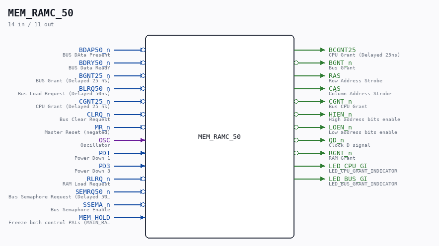
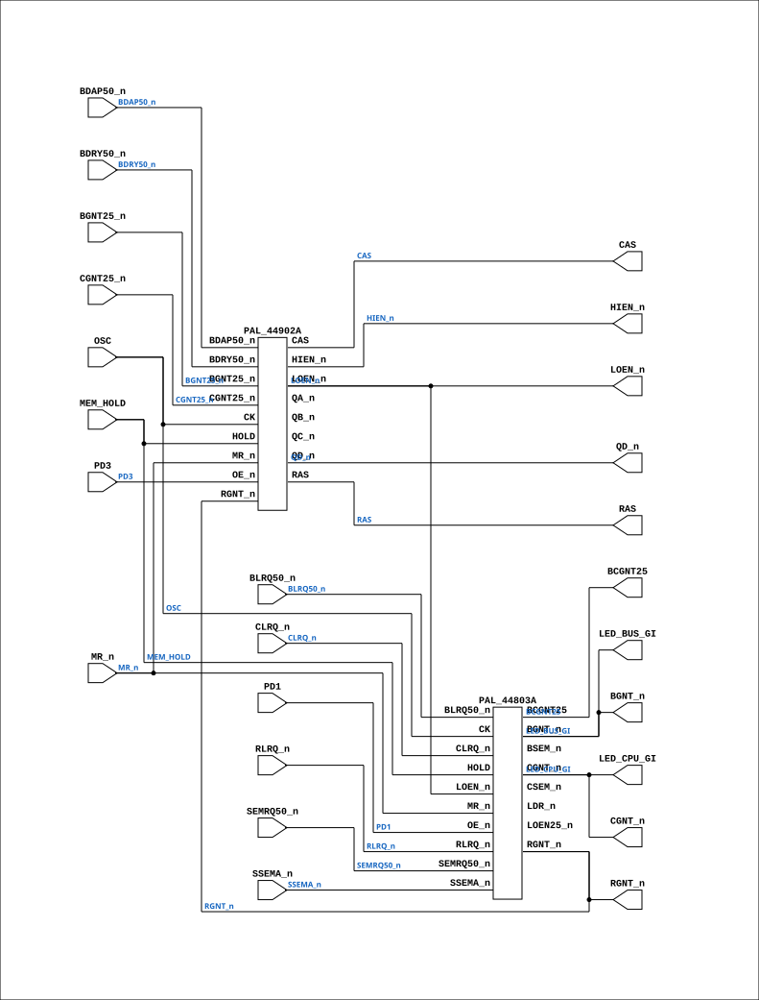

# MEM_RAMC_50

Source: `Verilog/CPU-BOARD-3202/circuit/MEM_RAMC_50.v`

<!-- Generated by Verilog/tests/module_doc.py from the //! comments in the source. Do not edit by hand - edit the RTL comments and regenerate. -->

<!-- HIERARCHY-NAV:BEGIN - written by Verilog/tests/gen_hierarchy.py, do not edit -->

**Where it sits** (Simulation): [ND120_TOP](../../../doc/ND120_TOP.md) > [ND120_CORE](../../../doc/ND120_CORE.md) > [ND3202D](ND3202D.md) > [MEM_43](MEM_43.md) > **MEM_RAMC_50**
- instance path: `CORE.CPU_BOARD.MEM.RAMC`

**Used in:** [MEM_43](MEM_43.md) (all tops)

**Contains:** [PAL_44803A](../../../PAL/doc/PAL_44803A.md), [PAL_44902A](../../../PAL/doc/PAL_44902A.md)

[Module hierarchy](../../../HIERARCHY.md) - [All modules](../../../MODULES.md)

<!-- HIERARCHY-NAV:END -->



<!-- SCHEMATIC:BEGIN - written by Verilog/tests/gen_schematics.py, do not edit -->

## Schematic

Drawn from the Verilog: the yosys netlist of the Simulation (Verilator) build, instance `CORE.CPU_BOARD.MEM.RAMC`. Sub-modules are boxes (click the picture to open it full size; there every sub-module box links to its page, and every wire shows its Verilog name).

[](MEM_RAMC_50.svg)

<!-- SCHEMATIC:END -->

## Description

ND120 CPU, MM&M
MEM/RAMC
LOCAL RAM CONTROL
SHEET 50 of 50
Last reviewed: 14-DEC-2024
Ronny Hansen

## Ports

| Direction | Width | Name | Description |
|---|---|---|---|
| input | `1` | `BDAP50_n` *(active low)* | BUS DAta Present |
| input | `1` | `BDRY50_n` *(active low)* | BUS Data ReadY |
| input | `1` | `BGNT25_n` *(active low)* | BUS Grant (Delayed 25 ns) |
| input | `1` | `BLRQ50_n` *(active low)* | Bus Load Request (Delayed 50ns) |
| input | `1` | `CGNT25_n` *(active low)* | CPU Grant (Delayed 25 ns) |
| input | `1` | `CLRQ_n` *(active low)* | Bus Clear Request |
| input | `1` | `MR_n` *(active low)* | Master Reset (negated) |
| input | `1` | `OSC` | Oscillator |
| input | `1` | `PD1` | Power Down 1 |
| input | `1` | `PD3` | Power Down 3 |
| input | `1` | `RLRQ_n` *(active low)* | RAM Load Request |
| input | `1` | `SEMRQ50_n` *(active low)* | Bus Semaphore Request (Delayed 50ns) |
| input | `1` | `SSEMA_n` *(active low)* | Bus Semaphore Enable |
| input | `1` | `MEM_HOLD` | Freeze both control PALs (MAIN_RAM_DDR2 cache-miss |
| output | `1` | `BCGNT25` | CPU Grant (Delayed 25ns) |
| output | `1` | `BGNT_n` *(active low)* | Bus Grant |
| output | `1` | `RAS` | Row Address Strobe |
| output | `1` | `CAS` | Column Address Strobe |
| output | `1` | `CGNT_n` *(active low)* | Bus CPU Grant |
| output | `1` | `HIEN_n` *(active low)* | High address bits enable |
| output | `1` | `LOEN_n` *(active low)* | Low address bits enable |
| output | `1` | `QD_n` *(active low)* | Clock D signal |
| output | `1` | `RGNT_n` *(active low)* | RAM Grant |
| output | `1` | `LED_CPU_GI` | LED_CPU_GRANT_INDICATOR |
| output | `1` | `LED_BUS_GI` | LED_BUS_GRANT_INDICATOR |

## Verilog source

[`Verilog/CPU-BOARD-3202/circuit/MEM_RAMC_50.v`](https://github.com/RetroCoreLabs/nd-120/blob/main/Verilog/CPU-BOARD-3202/circuit/MEM_RAMC_50.v) on GitHub.

<details markdown="1">
<summary>Show the Verilog of MEM_RAMC_50 (170 lines)</summary>

```verilog
/**************************************************************************
** ND120 CPU, MM&M                                                       **
** MEM/RAMC                                                              **
** LOCAL RAM CONTROL                                                     **
** SHEET 50 of 50                                                        **
**                                                                       **
** Last reviewed: 14-DEC-2024                                            **
** Ronny Hansen                                                          **
***************************************************************************/

module MEM_RAMC_50 (

    // Input signals
    input BDAP50_n,   //! BUS DAta Present
    input BDRY50_n,   //! BUS Data ReadY
    input BGNT25_n,   //! BUS Grant (Delayed 25 ns)
    input BLRQ50_n,   //! Bus Load Request (Delayed 50ns)
    input CGNT25_n,   //! CPU Grant (Delayed 25 ns)
    input CLRQ_n,     //! Bus Clear Request
    input MR_n,       //! Master Reset (negated)
    input OSC,        //! Oscillator
    input PD1,        //! Power Down 1
    input PD3,        //! Power Down 3
    input RLRQ_n,     //! RAM Load Request
    input SEMRQ50_n,  //! Bus Semaphore Request (Delayed 50ns)
    input SSEMA_n,    //! Bus Semaphore Enable
    input MEM_HOLD,   //! Freeze both control PALs (MAIN_RAM_DDR2 cache-miss
                      //! stretch; tie 0 for the original fixed-length cycle)

    // Output signals
    output BCGNT25,     //! CPU Grant (Delayed 25ns)
    output BGNT_n,      //! Bus Grant
    output RAS,         //! Row Address Strobe
    output CAS,         //! Column Address Strobe
    output CGNT_n,      //! Bus CPU Grant
    output HIEN_n,      //! High address bits enable
    output LOEN_n,      //! Low address bits enable
    output QD_n,        //! Clock D signal
    output RGNT_n,      //! RAM Grant
    output LED_CPU_GI,  //! LED_CPU_GRANT_INDICATOR
    output LED_BUS_GI   //! LED_BUS_GRANT_INDICATOR
);


  /*******************************************************************************
   ** The wires are defined here                                                 **
   *******************************************************************************/
  wire s_loen_n;
  wire s_bgnt_n;
  wire s_rgnt_n;
  wire s_mr_n;
  wire s_bcgnt25;
  wire s_hien_n;
  wire s_qd_n;
  wire s_ras;
  wire s_cas;
  wire s_ssema_n;
  wire s_semrq50_n;
  wire s_rlrq_n;
  wire s_bdap50_n;
  wire s_clrq_n;
  wire s_blrq50_n;
  wire s_pd1;
  wire s_cgnt_n;
  wire s_osc;
  wire s_cgnt25_n;
  wire s_bdry50_n;
  wire s_pd3;
  wire s_bgnt25_n;

  /*******************************************************************************
   ** The module functionality is described here                                 **
   *******************************************************************************/

  /*******************************************************************************
   ** Here all input connections are defined                                     **
   *******************************************************************************/
  assign s_mr_n      = MR_n;
  assign s_ssema_n   = SSEMA_n;
  assign s_semrq50_n = SEMRQ50_n;
  assign s_rlrq_n    = RLRQ_n;
  assign s_bdap50_n  = BDAP50_n;
  assign s_clrq_n    = CLRQ_n;
  assign s_blrq50_n  = BLRQ50_n;
  assign s_pd1       = PD1;
  assign s_osc       = OSC;
  assign s_cgnt25_n  = CGNT25_n;
  assign s_bdry50_n  = BDRY50_n;
  assign s_pd3       = PD3;
  assign s_bgnt25_n  = BGNT25_n;

  /*******************************************************************************
   ** Here all output connections are defined                                    **
   *******************************************************************************/
  assign BCGNT25     = s_bcgnt25;
  assign BGNT_n      = s_bgnt_n;
  assign CAS         = s_cas;
  assign CGNT_n      = s_cgnt_n;
  assign HIEN_n      = s_hien_n;
  assign LOEN_n      = s_loen_n;
  assign QD_n        = s_qd_n;
  assign RAS         = s_ras;
  assign RGNT_n      = s_rgnt_n;

  /*******************************************************************************
   ** Here all in-lined components are defined                                   **
   *******************************************************************************/

  // LED: CPU_GRANT_INDICATOR
  assign LED_CPU_GI  = s_cgnt_n;

  // LED: BUS_GRANT_INDICATOR
  assign LED_BUS_GI  = s_bgnt_n;

  /*******************************************************************************
   ** Here all sub-circuits are defined                                          **
   *******************************************************************************/


  PAL_44803A PAL_44803_URAMA (
      .CK  (s_osc),
      .OE_n(s_pd1),
      .HOLD(MEM_HOLD),

      .LOEN_n   (s_loen_n),    // I0 - LOEN_n
      .RLRQ_n   (s_rlrq_n),    // I1 - RLRQ_n
      .MR_n     (s_mr_n),      // I2 - MR_n
      .CLRQ_n   (s_clrq_n),    // I3 - CLRQ_n
      .BLRQ50_n (s_blrq50_n),  // I4 - BLRQ50_n
      .SSEMA_n  (s_ssema_n),   // I5 - SSEMA_n
      .SEMRQ50_n(s_semrq50_n), // I6 - SEMRQ50_n
      //.I7(1'b0),               // I7 - (not connected)

      .RGNT_n  (s_rgnt_n),  // Q0_n - RGNT_n
      .CGNT_n  (s_cgnt_n),  // Q1_n - CGNT_n
      .BGNT_n  (s_bgnt_n),  // Q2_n - BGNT_n
      .LOEN25_n(),          // Q3_n - LOEN25_n (n.c.)
      .LDR_n   (),          // Q4_n - LDR_n (n.c.)
      .CSEM_n  (),          // Q5_n - CSEM_n (n.c.)
      .BSEM_n  (),          // Q6_n - BSEM_n (n.c.)
      .BCGNT25 (s_bcgnt25)  // Q7_n - BCGNT25
  );

  PAL_44902A PAL_44902_URAMC (
      .CK  (s_osc),
      .OE_n(s_pd3),
      .HOLD(MEM_HOLD),

      .RGNT_n  (s_rgnt_n),    // I0 - RGNT_n (RAM Grant)
      //.CGNT_n(s_cgnt_n),    // I1 - CGNT_n (NOT USED EXTERN!!) (CPU Grant)
      //.BGNT_n(s_bgnt_n),    // I2 - BGNT_n (NOT USED EXTERN!!) (BUS Grant)
      .BDAP50_n(s_bdap50_n),  // I3 - BDAP50_n
      .MR_n    (s_mr_n),      // I4 - MR_n
      .BGNT25_n(s_bgnt25_n),  // I5 - BGNT25_n
      .CGNT25_n(s_cgnt25_n),  // I6 - CGNT25_n
      .BDRY50_n(s_bdry50_n),  // I7 - BDRY50_n

      .QA_n  (),          // QA_n - not connected
      .QB_n  (),          // QB_n - not connected
      .QC_n  (),          // QC_n - not connected
      .QD_n  (s_qd_n),    // Q3_n - QD_n
      .RAS   (s_ras),     // Q4_n - RAS
      .CAS   (s_cas),     // Q5_n - CAS
      .LOEN_n(s_loen_n),  // Q6_n - LOEN_n
      .HIEN_n(s_hien_n)   // Q7_n - HIEN_n
  );


endmodule
```

</details>
