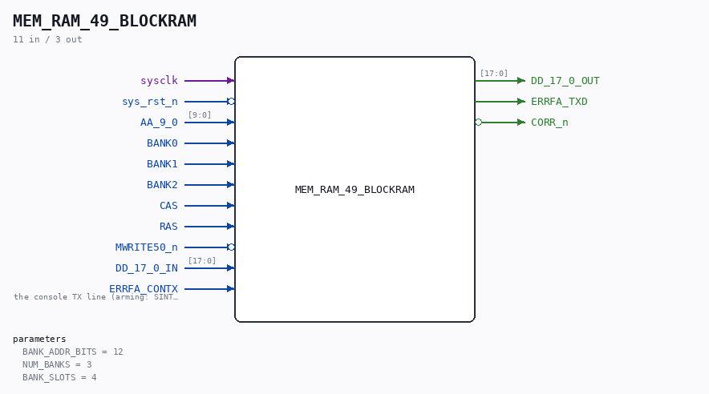

# MEM_RAM_49_BLOCKRAM

Source: `Verilog/CPU-BOARD-3202/circuit/MEM_RAM_49_BLOCKRAM.v`

<!-- Generated by Verilog/tests/module_doc.py from the //! comments in the source. Do not edit by hand - edit the RTL comments and regenerate. -->

<!-- HIERARCHY-NAV:BEGIN - written by Verilog/tests/gen_hierarchy.py, do not edit -->

**Where it sits** (Basys3): [ND120_TOP](../../../doc/ND120_TOP.md) > [ND120_CORE](../../../doc/ND120_CORE.md) > [ND3202D](ND3202D.md) > [MEM_43](MEM_43.md) > **MEM_RAM_49_BLOCKRAM**
- instance path: `CORE.CPU_BOARD.MEM.RAM`

**Used in:** [MEM_43](MEM_43.md) (Basys3, Cmod)

**Contains:** no other modules.

[Module hierarchy](../../../HIERARCHY.md) - [All modules](../../../MODULES.md)

<!-- HIERARCHY-NAV:END -->

## Description

ND120 CPU, MM&M
MEM/RAM - block-RAM backend (any FPGA)
Drop-in replacement for the sheet-49 RAM (MEM_RAM_49): one clean
synchronous BRAM instead of six emulated SIP1M9 DRAM chips.
Selected with `define MAIN_RAM_BLOCKRAM (see MEM_43.v).
Implements the MEASURED DRAM protocol (docs/nd120-dram-memory.md
section 4) with the hardware lessons of 8-JUL-2026 baked in:
- row captured at the RAS rising edge (not level)
- write data captured BEFORE CAS (the D bus is driven early and
released around CAS-fall on silicon)
- write executed ONCE, at the first RAS&CAS edge
- registered read, held while CAS is active, bank-gated output
Capacity: NUM_BANKS x 2^BANK_ADDR_BITS 18-bit words. Default 3 banks
x 4K words = 24 KB (Basys3 xc7a35t BRAM budget). Boards with more
BRAM raise BANK_ADDR_BITS (Nexys 4 DDR: ND120_BLOCKRAM_ADDR_BITS=15
in fpga/nexys4ddr/build.tcl). Linear word address = {row, col}: the
row captured at RAS is the HIGH CPU address half (PAL 44902A drives
HIEN during RAS, LOEN during CAS), so lin[BANK_ADDR_BITS-1:0] keeps
the CONTIGUOUS low CPU address bits - addresses inside a bank slot
are alias-free.
Last reviewed: 8-JUL-2026
Ronny Hansen

## Parameters

| Parameter | Default |
|---|---|
| `BANK_ADDR_BITS` | `12` |
| `NUM_BANKS` | `3` |
| `BANK_SLOTS` | `4` |

## Ports

| Direction | Width | Name | Description |
|---|---|---|---|
| input | `1` | `sysclk` |  |
| input | `1` | `sys_rst_n` *(active low)* |  |
| input | `[9:0]` | `AA_9_0` |  |
| input | `1` | `BANK0` |  |
| input | `1` | `BANK1` |  |
| input | `1` | `BANK2` |  |
| input | `1` | `CAS` |  |
| input | `1` | `RAS` |  |
| input | `1` | `MWRITE50_n` *(active low)* |  |
| input | `[17:0]` | `DD_17_0_IN` |  |
| output | `[17:0]` | `DD_17_0_OUT` |  |
| input | `1` | `ERRFA_CONTX` | the console TX line (arming: SINTRAN prints ERRFA) |
| output | `1` | `ERRFA_TXD` |  |
| output | `1` | `CORR_n` *(active low)* |  |
