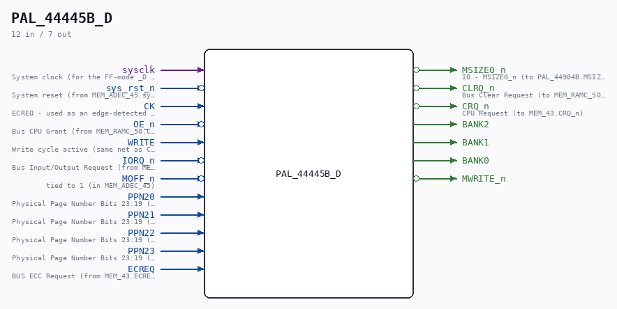
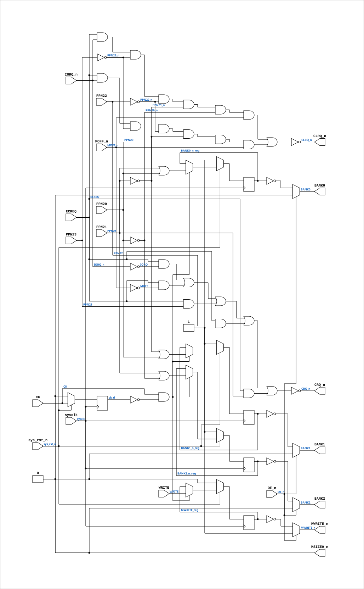

# PAL_44445B_D

Source: `Verilog/CPU-BOARD-3202/circuit/PAL_44445B_D.v`

<!-- Generated by Verilog/tests/module_doc.py from the //! comments in the source. Do not edit by hand - edit the RTL comments and regenerate. -->

<!-- HIERARCHY-NAV:BEGIN - written by Verilog/tests/gen_hierarchy.py, do not edit -->

**Where it sits** (Simulation): [ND120_TOP](../../../doc/ND120_TOP.md) > [ND120_CORE](../../../doc/ND120_CORE.md) > [ND3202D](ND3202D.md) > [MEM_43](MEM_43.md) > [MEM_ADEC_45](MEM_ADEC_45.md) > **PAL_44445B_D**
- instance path: `CORE.CPU_BOARD.MEM.ADEC.PAL_UCADEC`

**Used in:** [MEM_ADEC_45](MEM_ADEC_45.md) (all tops)

**Contains:** no other modules.

[Module hierarchy](../../../HIERARCHY.md) - [All modules](../../../MODULES.md)

<!-- HIERARCHY-NAV:END -->



<!-- SCHEMATIC:BEGIN - written by Verilog/tests/gen_schematics.py, do not edit -->

## Schematic

Drawn from the Verilog: the yosys netlist of the Simulation (Verilator) build, instance `CORE.CPU_BOARD.MEM.ADEC.PAL_UCADEC`. Sub-modules are boxes (click the picture to open it full size; there every sub-module box links to its page, and every wire shows its Verilog name).

[](PAL_44445B_D.svg)

<!-- SCHEMATIC:END -->

## Description

PAL_44445B_D - sysclk-domain mirror of PAL_44445B (UCADEC)
Same equations; registers sample on sysclk with a rising-edge ENABLE
on the original CK (ECREQ) instead of using it as a clock net.
PAL file itself untouched. Pattern: CYC_CC_D / CYC_TERM_D.
Last reviewed: 8-JUL-2026  Ronny Hansen

## Ports

| Direction | Width | Name | Description |
|---|---|---|---|
| input | `1` | `sysclk` | System clock (for the FF-mode _D PAL mirrors) (from MEM_ADEC_45.sysclk) |
| input | `1` | `sys_rst_n` *(active low)* | System reset (from MEM_ADEC_45.sys_rst_n) |
| input | `1` | `CK` | ECREQ - used as an edge-detected ENABLE here |
| input | `1` | `OE_n` *(active low)* | Bus CPU Grant (from MEM_RAMC_50.CGNT_n) |
| input | `1` | `WRITE` | Write cycle active (same net as CPU_15.WRITE) |
| input | `1` | `IORQ_n` *(active low)* | Bus Input/Output Request (from MEM_43.IORQ_n) |
| input | `1` | `MOFF_n` *(active low)* | tied to 1 (in MEM_ADEC_45) |
| input | `1` | `PPN20` | Physical Page Number Bits 23:19 (from MEM_43.PPN_23_19[1]) |
| input | `1` | `PPN21` | Physical Page Number Bits 23:19 (from MEM_43.PPN_23_19[2]) |
| input | `1` | `PPN22` | Physical Page Number Bits 23:19 (from MEM_43.PPN_23_19[3]) |
| input | `1` | `PPN23` | Physical Page Number Bits 23:19 (from MEM_43.PPN_23_19[4]) |
| output | `1` | `MSIZE0_n` *(active low)* | I0 - MSIZE0_n (to PAL_44904B.MSIZE0_n) |
| output | `1` | `CLRQ_n` *(active low)* | Bus Clear Request (to MEM_RAMC_50.CLRQ_n) |
| output | `1` | `CRQ_n` *(active low)* | CPU Request (to MEM_43.CRQ_n) |
| input | `1` | `ECREQ` | BUS ECC Request (from MEM_43.ECREQ) |
| output | `1` | `BANK2` |  |
| output | `1` | `BANK1` |  |
| output | `1` | `BANK0` |  |
| output | `1` | `MWRITE_n` *(active low)* |  |

## Verilog source

[`Verilog/CPU-BOARD-3202/circuit/PAL_44445B_D.v`](https://github.com/RetroCoreLabs/nd-120/blob/main/Verilog/CPU-BOARD-3202/circuit/PAL_44445B_D.v) on GitHub.

<details markdown="1">
<summary>Show the Verilog of PAL_44445B_D (67 lines)</summary>

```verilog
/**************************************************************************
** PAL_44445B_D - sysclk-domain mirror of PAL_44445B (UCADEC)            **
** Same equations; registers sample on sysclk with a rising-edge ENABLE  **
** on the original CK (ECREQ) instead of using it as a clock net.        **
** PAL file itself untouched. Pattern: CYC_CC_D / CYC_TERM_D.            **
** Last reviewed: 8-JUL-2026  Ronny Hansen                               **
***************************************************************************/
module PAL_44445B_D (
    input sysclk,   //! System clock (for the FF-mode _D PAL mirrors) (from MEM_ADEC_45.sysclk)
    input sys_rst_n,  //! System reset (from MEM_ADEC_45.sys_rst_n)
    input CK,       // ECREQ - used as an edge-detected ENABLE here
    input OE_n,     //! Bus CPU Grant (from MEM_RAMC_50.CGNT_n)
    input WRITE,    //! Write cycle active (same net as CPU_15.WRITE)
    input IORQ_n,   //! Bus Input/Output Request (from MEM_43.IORQ_n)
    input MOFF_n,   //! tied to 1 (in MEM_ADEC_45)
    input PPN20,    //! Physical Page Number Bits 23:19 (from MEM_43.PPN_23_19[1])
    input PPN21,    //! Physical Page Number Bits 23:19 (from MEM_43.PPN_23_19[2])
    input PPN22,    //! Physical Page Number Bits 23:19 (from MEM_43.PPN_23_19[3])
    input PPN23,    //! Physical Page Number Bits 23:19 (from MEM_43.PPN_23_19[4])
    output MSIZE0_n,  //! I0 - MSIZE0_n (to PAL_44904B.MSIZE0_n)
    output CLRQ_n,  //! Bus Clear Request (to MEM_RAMC_50.CLRQ_n)
    output CRQ_n,   //! CPU Request (to MEM_43.CRQ_n)
    input  ECREQ,   //! BUS ECC Request (from MEM_43.ECREQ)
    output BANK2,
    output BANK1,
    output BANK0,
    output MWRITE_n
);
  wire PPN20_n = ~PPN20;
  wire PPN21_n = ~PPN21;
  wire PPN22_n = ~PPN22;
  wire PPN23_n = ~PPN23;
  wire IORQ = ~IORQ_n;
  wire MOFF = ~MOFF_n;

  reg BANK0_n_reg, BANK1_n_reg, BANK2_n_reg, MWRITE_reg;
  reg ck_d;
  always @(posedge sysclk) begin
    if (!sys_rst_n) begin
      ck_d <= 0;
      BANK0_n_reg <= 1; BANK1_n_reg <= 1; BANK2_n_reg <= 1;
      MWRITE_reg <= 0;
    end else begin
      ck_d <= CK;
      if (CK && !ck_d) begin  // one capture per CK (ECREQ) rise
        BANK0_n_reg <= PPN21 | PPN20;
        BANK2_n_reg <= PPN21 | PPN20_n;
        BANK1_n_reg <= PPN21_n | PPN20;
        MWRITE_reg  <= WRITE;
      end
    end
  end

  assign BANK2 = OE_n ? 1'b0 : ~BANK2_n_reg;
  assign BANK1 = OE_n ? 1'b0 : ~BANK1_n_reg;
  assign BANK0 = OE_n ? 1'b0 : ~BANK0_n_reg;
  assign MWRITE_n = OE_n ? 1'b1 : ~MWRITE_reg;

  // Combinational equations copied VERBATIM from PAL_44445B.v
  assign CLRQ_n = ~(
      (ECREQ & IORQ_n & PPN23_n & PPN22_n & PPN21_n & PPN20_n & MOFF_n) |
      (ECREQ & IORQ_n & PPN23_n & PPN22_n & PPN21_n & PPN20 & MOFF_n)
      );
  assign CRQ_n = ~((ECREQ & IORQ) |
      (ECREQ & MOFF) | (ECREQ & PPN23) | (ECREQ & PPN22) | (ECREQ & PPN21));
  assign MSIZE0_n = 0;
endmodule
```

</details>
