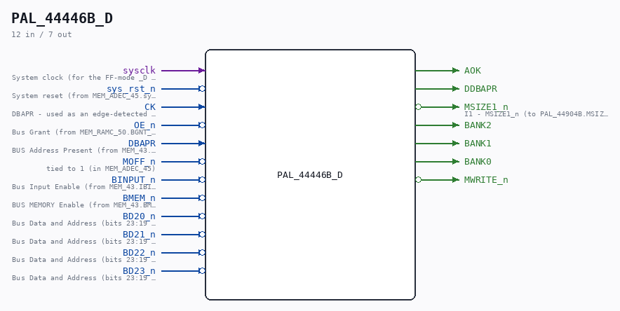
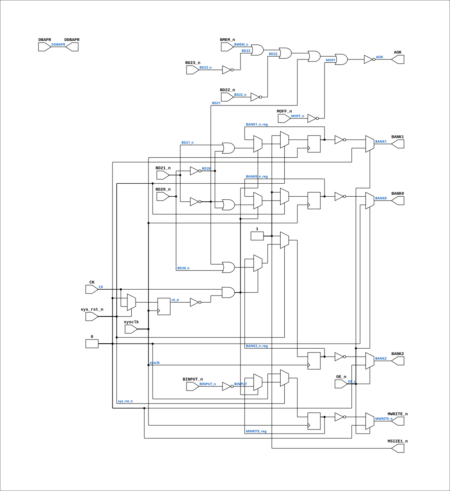

# PAL_44446B_D

Source: `Verilog/CPU-BOARD-3202/circuit/PAL_44446B_D.v`

<!-- Generated by Verilog/tests/module_doc.py from the //! comments in the source. Do not edit by hand - edit the RTL comments and regenerate. -->

<!-- HIERARCHY-NAV:BEGIN - written by Verilog/tests/gen_hierarchy.py, do not edit -->

**Where it sits** (Simulation): [ND120_TOP](../../../doc/ND120_TOP.md) > [ND120_CORE](../../../doc/ND120_CORE.md) > [ND3202D](ND3202D.md) > [MEM_43](MEM_43.md) > [MEM_ADEC_45](MEM_ADEC_45.md) > **PAL_44446B_D**
- instance path: `CORE.CPU_BOARD.MEM.ADEC.PAL_UBADEC`

**Used in:** [MEM_ADEC_45](MEM_ADEC_45.md) (all tops)

**Contains:** no other modules.

[Module hierarchy](../../../HIERARCHY.md) - [All modules](../../../MODULES.md)

<!-- HIERARCHY-NAV:END -->



<!-- SCHEMATIC:BEGIN - written by Verilog/tests/gen_schematics.py, do not edit -->

## Schematic

Drawn from the Verilog: the yosys netlist of the Simulation (Verilator) build, instance `CORE.CPU_BOARD.MEM.ADEC.PAL_UBADEC`. Sub-modules are boxes (click the picture to open it full size; there every sub-module box links to its page, and every wire shows its Verilog name).

[](PAL_44446B_D.svg)

<!-- SCHEMATIC:END -->

## Description

PAL_44446B_D - sysclk-domain mirror of PAL_44446B (UBADEC)
Same equations; the four registers sample on sysclk with a rising-
edge ENABLE on the original CK (DBAPR) instead of using it as a
clock net (routed-net-as-clock breaks the write phase on FPGA -
see docs/nd120-dram-memory.md section 5). PAL file itself untouched.
Pattern: CYC_CC_D / CYC_TERM_D.
Last reviewed: 8-JUL-2026  Ronny Hansen

## Ports

| Direction | Width | Name | Description |
|---|---|---|---|
| input | `1` | `sysclk` | System clock (for the FF-mode _D PAL mirrors) (from MEM_ADEC_45.sysclk) |
| input | `1` | `sys_rst_n` *(active low)* | System reset (from MEM_ADEC_45.sys_rst_n) |
| input | `1` | `CK` | DBAPR - used as an edge-detected ENABLE here |
| input | `1` | `OE_n` *(active low)* | Bus Grant (from MEM_RAMC_50.BGNT_n) |
| input | `1` | `DBAPR` | BUS Address Present (from MEM_43.DBAPR) |
| input | `1` | `MOFF_n` *(active low)* | tied to 1 (in MEM_ADEC_45) |
| input | `1` | `BINPUT_n` *(active low)* | Bus Input Enable (from MEM_43.IBINPUT_n) |
| input | `1` | `BMEM_n` *(active low)* | BUS MEMORY Enable (from MEM_43.BMEM_n) |
| input | `1` | `BD20_n` *(active low)* | Bus Data and Address (bits 23:19 negated) (from MEM_43.BD_23_19_n[1]) |
| input | `1` | `BD21_n` *(active low)* | Bus Data and Address (bits 23:19 negated) (from MEM_43.BD_23_19_n[2]) |
| input | `1` | `BD22_n` *(active low)* | Bus Data and Address (bits 23:19 negated) (from MEM_43.BD_23_19_n[3]) |
| input | `1` | `BD23_n` *(active low)* | Bus Data and Address (bits 23:19 negated) (from MEM_43.BD_23_19_n[4]) |
| output | `1` | `AOK` |  |
| output | `1` | `DDBAPR` |  |
| output | `1` | `MSIZE1_n` *(active low)* | I1 - MSIZE1_n (to PAL_44904B.MSIZE1_n) |
| output | `1` | `BANK2` |  |
| output | `1` | `BANK1` |  |
| output | `1` | `BANK0` |  |
| output | `1` | `MWRITE_n` *(active low)* |  |

## Verilog source

[`Verilog/CPU-BOARD-3202/circuit/PAL_44446B_D.v`](https://github.com/RetroCoreLabs/nd-120/blob/main/Verilog/CPU-BOARD-3202/circuit/PAL_44446B_D.v) on GitHub.

<details markdown="1">
<summary>Show the Verilog of PAL_44446B_D (64 lines)</summary>

```verilog
/**************************************************************************
** PAL_44446B_D - sysclk-domain mirror of PAL_44446B (UBADEC)            **
** Same equations; the four registers sample on sysclk with a rising-    **
** edge ENABLE on the original CK (DBAPR) instead of using it as a       **
** clock net (routed-net-as-clock breaks the write phase on FPGA -       **
** see docs/nd120-dram-memory.md section 5). PAL file itself untouched.  **
** Pattern: CYC_CC_D / CYC_TERM_D.                                       **
** Last reviewed: 8-JUL-2026  Ronny Hansen                               **
***************************************************************************/
module PAL_44446B_D (
    input sysclk,    //! System clock (for the FF-mode _D PAL mirrors) (from MEM_ADEC_45.sysclk)
    input sys_rst_n,  //! System reset (from MEM_ADEC_45.sys_rst_n)
    input CK,        // DBAPR - used as an edge-detected ENABLE here
    input OE_n,      //! Bus Grant (from MEM_RAMC_50.BGNT_n)
    input DBAPR,     //! BUS Address Present (from MEM_43.DBAPR)
    input MOFF_n,    //! tied to 1 (in MEM_ADEC_45)
    input BINPUT_n,  //! Bus Input Enable (from MEM_43.IBINPUT_n)
    input BMEM_n,    //! BUS MEMORY Enable (from MEM_43.BMEM_n)
    input BD20_n,    //! Bus Data and Address (bits 23:19 negated) (from MEM_43.BD_23_19_n[1])
    input BD21_n,    //! Bus Data and Address (bits 23:19 negated) (from MEM_43.BD_23_19_n[2])
    input BD22_n,    //! Bus Data and Address (bits 23:19 negated) (from MEM_43.BD_23_19_n[3])
    input BD23_n,    //! Bus Data and Address (bits 23:19 negated) (from MEM_43.BD_23_19_n[4])
    output AOK,
    output DDBAPR,
    output MSIZE1_n,  //! I1 - MSIZE1_n (to PAL_44904B.MSIZE1_n)
    output BANK2,
    output BANK1,
    output BANK0,
    output MWRITE_n
);
  wire BD20 = ~BD20_n;
  wire BD21 = ~BD21_n;
  wire BD22 = ~BD22_n;
  wire BD23 = ~BD23_n;
  wire MOFF = ~MOFF_n;
  wire BINPUT = ~BINPUT_n;

  reg BANK0_n_reg, BANK1_n_reg, BANK2_n_reg, MWRITE_reg;
  reg ck_d;
  always @(posedge sysclk) begin
    if (!sys_rst_n) begin
      ck_d <= 0;
      BANK0_n_reg <= 1; BANK1_n_reg <= 1; BANK2_n_reg <= 1;
      MWRITE_reg <= 0;
    end else begin
      ck_d <= CK;
      if (CK && !ck_d) begin  // one capture per CK (DBAPR) rise
        BANK0_n_reg <= BD21 | BD20;
        BANK2_n_reg <= BD21 | BD20_n;
        BANK1_n_reg <= BD21_n | BD20;
        MWRITE_reg  <= BINPUT;
      end
    end
  end

  assign BANK2 = OE_n ? 1'b0 : ~BANK2_n_reg;
  assign BANK1 = OE_n ? 1'b0 : ~BANK1_n_reg;
  assign BANK0 = OE_n ? 1'b0 : ~BANK0_n_reg;
  assign MWRITE_n = OE_n ? 1'b0 : ~MWRITE_reg;

  assign AOK = ~(BMEM_n | BD23 | BD22 | BD21 | MOFF);
  assign DDBAPR = DBAPR;
  assign MSIZE1_n = 1;
endmodule
```

</details>
