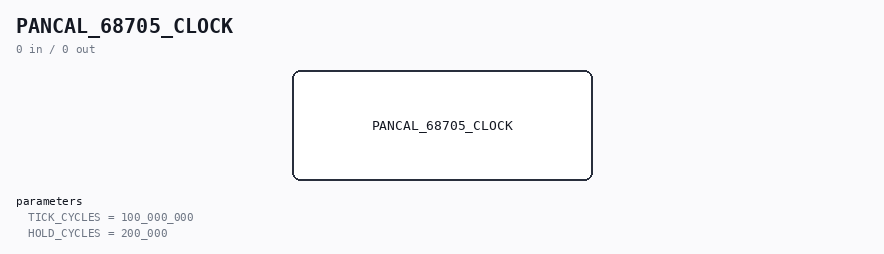

# PANCAL_68705_CLOCK

Source: `Verilog/CPU-BOARD-3202/circuit/PANCAL_68705_CLOCK.v`

<!-- Generated by Verilog/tests/module_doc.py from the //! comments in the source. Do not edit by hand - edit the RTL comments and regenerate. -->

<!-- HIERARCHY-NAV:BEGIN - written by Verilog/tests/gen_hierarchy.py, do not edit -->

**Where it sits** (Nexys): [nd120_nexys4ddr_top](../../../fpga/nexys4ddr/doc/nd120_nexys4ddr_top.md) > [ND120_CORE](../../../doc/ND120_CORE.md) > [ND3202D](ND3202D.md) > [IO_37](IO_37.md) > [IO_PANCAL_40](IO_PANCAL_40.md) > **PANCAL_68705_CLOCK**
- instance path: `CORE.CPU_BOARD.IO.PANCAL.CHIP_35C`

**Used in:** [IO_PANCAL_40](IO_PANCAL_40.md) (Nexys, MiSTer, MEGA65 R6, MEGA65 R3, QMTECH)

**Contains:** no other modules.

[Module hierarchy](../../../HIERARCHY.md) - [All modules](../../../MODULES.md)

<!-- HIERARCHY-NAV:END -->

## Description

ND120 CPU, MM&M
PANCAL_68705_CLOCK
Behavioural stand-in for the MC68705U3 panel processor (44A/35C) and
the MM58274 calendar chip (34A) on sheet 40 - CLOCK PATH ONLY.
Source of truth: the ROM dump Code/68705/MC68705U3_35C.BIN,
disassembled by hand (28-AUG-2026). Addresses below are ROM addresses.
Sheet 40 (Code/68705/3202D_PANCAL_SHEET40.png) gives the pin names.
WHAT THE REAL CHIP DOES (clock part)
Idle loop 0x014E: polls PD7 = EMP~ (DGA FIFO "not empty").
Read a FIFO byte 0x09BC: BCLR 3,PORTB (RMM~ low) ; LDA PORTA ;
BSET 3,PORTB. The DGA pops one byte per XCLK while RMM~ is low.
Command byte = high byte of the TRR PANC operand (microcode RPANC
o1045 does IDBS,SWAP + LDPANC twice: A[15:8] first, then A[7:0]):
bit 5 = PANC bit 13 "read request"
bit 3 = PANC bit 11, always 0 for the clock
bit 2:0 = PFUNC (PANC bits 10:8)
Dispatch 0x04D8: bit3=1 -> display/text commands (RAM only, never
answered). bit3=0 -> 0x06BE, the clock path:
PORTC[2:0] = PFUNC             (STAT2:0 -> PANS bits 10:8)
if PFUNC bit2 == 0: RTS         (PFUNC 0-3: no answer at all)
BCLR 5,PORTB                    (STAT4 low = busy)
idx = (PFUNC & 3) ^ 3           (RAM $47+idx)
bit5=0 (CPU WRITES the clock):
BCLR 6,PORTB (READ=0); byte = next FIFO byte (WPAN);
$47[idx] = byte; latch byte to the 74LS374 (WMM~ pulse, 0x09C5)
BSET 5,PORTB; if idx==0 (PFUNC 7, the last of the four):
convert $47..$4A -> calendar (0x0715) and write the MM58274.
bit5=1 (CPU READS the clock):
BSET 6,PORTB (READ=1); read and discard the WPAN byte;
if idx==3 (PFUNC 4, the first of the four): read the MM58274
and convert calendar -> $47..$4A (0x0AC0 / 0x0803);
latch $47[idx] to the 74LS374; BSET 5,PORTB.
Every command ends with the display pipeline (~ms) and then
BCLR 5,PORTB at 0x0195, so STAT4 is a millisecond-wide "answered"
level. At reset PORTB = 0x2F, i.e. STAT4 = 1 until the first
command has been processed.
THE 4-BYTE TIME (RAM $47..$4A, ND-100 hardware-clock format):
$47 = PFUNC 7 = half-days since 1979-01-01, high byte
$48 = PFUNC 6 = half-days, low byte
$49 = PFUNC 5 = seconds within the half-day (0..43199), high
$4A = PFUNC 4 = seconds, low byte
Proof in the ROM: constants at $80..$83 = 02DA (730 half-days/year),
0E10 (3600 s/hour), 07BB (1979); the year loop adds 2 for leap years;
the odd half-day sets hour=12. Same format as the ND-100 panel
(ND-06.014 ch. 4.3) and RetroCore's ControlPanel.cs.
WHAT THIS MODULE DOES
Keeps {half-days, seconds} as two 16-bit counters ticking at 1 Hz
(BOARD_CLK_FREQ sysclk cycles per second), and answers PFUNC 4-7
exactly the way the ROM does, without any calendar arithmetic: the
CPU only ever sees the four raw bytes, so a calendar is not needed.
The counters survive CLEAR_n like the battery-backed MM58274 does.
NOT MODELLED (display only, no effect on the CPU side):
DISP1-5 shift-register output, the Port D statistics (PCR/PONI/IONI/
LHIT/LEV0), the text commands' display effects. Text commands ARE
drained from the FIFO with the right byte counts so a text write
never leaves stray bytes behind to be mis-read as a command.
STAT3 (PB4) stays 0 - see the note in IO_37.v; the ROM pulses it
in the idle loop (0x0153) but that is a separate decision.
28-AUG-2026
Ronny Hansen

## Parameters

| Parameter | Default |
|---|---|
| `TICK_CYCLES` | `100_000_000` |
| `HOLD_CYCLES` | `200_000` |
