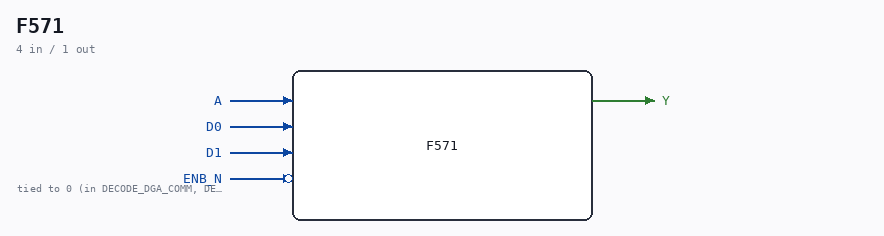

# F571

Source: `Verilog/DECODE-GateArray/DGA/circuit/F571.v`

<!-- Generated by Verilog/tests/module_doc.py from the //! comments in the source. Do not edit by hand - edit the RTL comments and regenerate. -->

<!-- HIERARCHY-NAV:BEGIN - written by Verilog/tests/gen_hierarchy.py, do not edit -->

**Where it sits** (Simulation): [ND120_TOP](../../../../doc/ND120_TOP.md) > [ND120_CORE](../../../../doc/ND120_CORE.md) > [ND3202D](../../../../CPU-BOARD-3202/circuit/doc/ND3202D.md) > [IO_37](../../../../CPU-BOARD-3202/circuit/doc/IO_37.md) > [IO_DCD_38](../../../../CPU-BOARD-3202/circuit/doc/IO_DCD_38.md) > [DECODE_DGA](DECODE_DGA.md) > [DECODE_DGA_POW](DECODE_DGA_POW.md) > **F571**
- instance path: `CORE.CPU_BOARD.IO.DCD.DGA.POW.A620`

**Used in:** [DECODE_DGA_COMM](DECODE_DGA_COMM.md) (all tops), [DECODE_DGA_POW](DECODE_DGA_POW.md) (all tops)

**Contains:** [Multiplexer_2_w_enable](../../../../Shared/logisim/doc/Multiplexer_2_w_enable.md)

[Module hierarchy](../../../../HIERARCHY.md) - [All modules](../../../../MODULES.md)

<!-- HIERARCHY-NAV:END -->

## Description

ND120 DGA (Decode Gate Array)
DECODE/DGA
NEC F571 - 2 TO 1 MULTIPLEXER
Last reviewed: 20-MAY-2024
Ronny Hansen

## Ports

| Direction | Width | Name | Description |
|---|---|---|---|
| input | `1` | `A` |  |
| input | `1` | `D0` |  |
| input | `1` | `D1` |  |
| input | `1` | `ENB_N` *(active low)* |  |
| output | `1` | `Y` |  |
