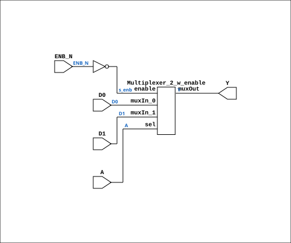

# F571

Source: `Verilog/DECODE-GateArray/DGA/circuit/F571.v`

<!-- Generated by Verilog/tests/module_doc.py from the //! comments in the source. Do not edit by hand - edit the RTL comments and regenerate. -->

<!-- HIERARCHY-NAV:BEGIN - written by Verilog/tests/gen_hierarchy.py, do not edit -->

**Where it sits** (Simulation): [ND120_TOP](../../../../doc/ND120_TOP.md) > [ND120_CORE](../../../../doc/ND120_CORE.md) > [ND3202D](../../../../CPU-BOARD-3202/circuit/doc/ND3202D.md) > [IO_37](../../../../CPU-BOARD-3202/circuit/doc/IO_37.md) > [IO_DCD_38](../../../../CPU-BOARD-3202/circuit/doc/IO_DCD_38.md) > [DECODE_DGA](DECODE_DGA.md) > [DECODE_DGA_POW](DECODE_DGA_POW.md) > **F571**
- instance path: `CORE.CPU_BOARD.IO.DCD.DGA.POW.A620`

**Used in:** [DECODE_DGA_COMM](DECODE_DGA_COMM.md) (all tops), [DECODE_DGA_POW](DECODE_DGA_POW.md) (all tops)

**Contains:** [Multiplexer_2_w_enable](../../../../Shared/logisim/doc/Multiplexer_2_w_enable.md)

[Module hierarchy](../../../../HIERARCHY.md) - [All modules](../../../../MODULES.md)

<!-- HIERARCHY-NAV:END -->


<!-- SCHEMATIC:BEGIN - written by Verilog/tests/gen_schematics.py, do not edit -->

## Schematic

Drawn from the Verilog: the yosys netlist of the Simulation (Verilator) build, instance `CORE.CPU_BOARD.IO.DCD.DGA.POW.A620`. Sub-modules are boxes (click the picture to open it full size; there every sub-module box links to its page, and every wire shows its Verilog name).

[](F571.svg)

<!-- SCHEMATIC:END -->

## Description

ND120 DGA (Decode Gate Array)
DECODE/DGA
NEC F571 - 2 TO 1 MULTIPLEXER
Last reviewed: 20-MAY-2024
Ronny Hansen

## Ports

| Direction | Width | Name | Description |
|---|---|---|---|
| input | `1` | `A` |  |
| input | `1` | `D0` |  |
| input | `1` | `D1` |  |
| input | `1` | `ENB_N` *(active low)* | tied to 0 (in DECODE_DGA_COMM, DECODE_DGA_POW) |
| output | `1` | `Y` |  |

## Verilog source

[`Verilog/DECODE-GateArray/DGA/circuit/F571.v`](https://github.com/RetroCoreLabs/nd-120/blob/main/Verilog/DECODE-GateArray/DGA/circuit/F571.v) on GitHub.

<details markdown="1">
<summary>Show the Verilog of F571 (49 lines)</summary>

```verilog
/**************************************************************************
** ND120 DGA (Decode Gate Array)                                         **
** DECODE/DGA                                                            **
**                                                                       **
** NEC F571 - 2 TO 1 MULTIPLEXER                                         **
**                                                                       **
** Last reviewed: 20-MAY-2024                                            **
** Ronny Hansen                                                          **
***************************************************************************/

module F571 (
    input A,
    input D0,
    input D1,
    input ENB_N,  //! tied to 0 (in DECODE_DGA_COMM, DECODE_DGA_POW)

    output Y
);

  wire s_enb_n;
  wire s_A;
  wire s_enb;
  wire s_d0;
  wire s_d1;
  wire s_y;


  // Assign inputs
  assign s_enb_n = ENB_N;
  assign s_A     = A;
  assign s_d0    = D0;
  assign s_d1    = D1;

  // Assign outputs
  assign Y       = s_y;

  // Implementation
  assign s_enb   = ~s_enb_n;

  Multiplexer_2_w_enable PLEXERS_1 (
      .enable(s_enb),
      .muxIn_0(s_d0),
      .muxIn_1(s_d1),
      .muxOut(s_y),
      .sel(s_A)
  );


endmodule
```

</details>
