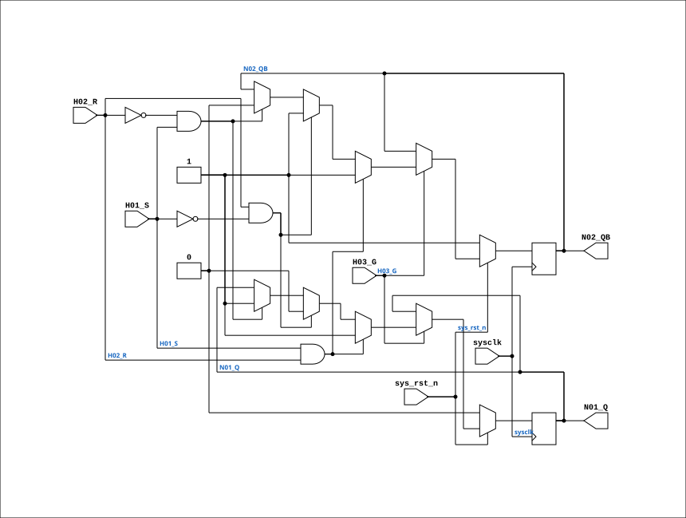

# F595

Source: `Verilog/DECODE-GateArray/DGA/circuit/F595.v`

<!-- Generated by Verilog/tests/module_doc.py from the //! comments in the source. Do not edit by hand - edit the RTL comments and regenerate. -->

<!-- HIERARCHY-NAV:BEGIN - written by Verilog/tests/gen_hierarchy.py, do not edit -->

**Where it sits** (Simulation): [ND120_TOP](../../../../doc/ND120_TOP.md) > [ND120_CORE](../../../../doc/ND120_CORE.md) > [ND3202D](../../../../CPU-BOARD-3202/circuit/doc/ND3202D.md) > [IO_37](../../../../CPU-BOARD-3202/circuit/doc/IO_37.md) > [IO_DCD_38](../../../../CPU-BOARD-3202/circuit/doc/IO_DCD_38.md) > [DECODE_DGA](DECODE_DGA.md) > [DECODE_DGA_POW](DECODE_DGA_POW.md) > **F595**
- instance path: `CORE.CPU_BOARD.IO.DCD.DGA.POW.A570`

**Used in:** [DECODE_DGA_COMM](DECODE_DGA_COMM.md) (all tops), [DECODE_DGA_POW](DECODE_DGA_POW.md) (all tops)

**Contains:** no other modules.

[Module hierarchy](../../../../HIERARCHY.md) - [All modules](../../../../MODULES.md)

<!-- HIERARCHY-NAV:END -->


<!-- SCHEMATIC:BEGIN - written by Verilog/tests/gen_schematics.py, do not edit -->

## Schematic

Drawn from the Verilog: the yosys netlist of the Simulation (Verilator) build, instance `CORE.CPU_BOARD.IO.DCD.DGA.POW.A570`. Sub-modules are boxes (click the picture to open it full size; there every sub-module box links to its page, and every wire shows its Verilog name).

[](F595.svg)

<!-- SCHEMATIC:END -->

## Description

ND120 DGA (Decode Gate Array)
DECODE/DGA
NEC F595 - R/S Latch with Gated input
Truth table from REN_A12213XJ5V1UM00_OTH_19980801.pdf
Page 6-214. Function RS-LATCH
Last reviewed: 20-MAY-2024
Ronny Hansen

## Ports

| Direction | Width | Name | Description |
|---|---|---|---|
| input | `1` | `sysclk` | System clock (FPGA: used to sample S/R synchronously) |
| input | `1` | `sys_rst_n` *(active low)* | FPGA system reset (active-low): forces latch to idle state (Q=0, Qn=1) |
| input | `1` | `H01_S` | Set |
| input | `1` | `H02_R` | Reset |
| input | `1` | `H03_G` | Gate Enable |
| output | `1` | `N01_Q` | Q |
| output | `1` | `N02_QB` | Qn |

## Verilog source

[`Verilog/DECODE-GateArray/DGA/circuit/F595.v`](https://github.com/RetroCoreLabs/nd-120/blob/main/Verilog/DECODE-GateArray/DGA/circuit/F595.v) on GitHub.

<details markdown="1">
<summary>Show the Verilog of F595 (75 lines)</summary>

```verilog
/**************************************************************************
** ND120 DGA (Decode Gate Array)                                         **
** DECODE/DGA                                                            **
**                                                                       **
** NEC F595 - R/S Latch with Gated input                                 **
**                                                                       **
** Truth table from REN_A12213XJ5V1UM00_OTH_19980801.pdf                 **
** Page 6-214. Function RS-LATCH                                         **
**                                                                       **
** Last reviewed: 20-MAY-2024                                            **
** Ronny Hansen                                                          **
***************************************************************************/


module F595 (
    input sysclk,     // System clock (FPGA: used to sample S/R synchronously)
    input sys_rst_n,  // FPGA system reset (active-low): forces latch to idle state (Q=0, Qn=1)
    input H01_S,  // Set
    input H02_R,  // Reset
    input H03_G,  // Gate Enable

    output N01_Q,  // Q
    output N02_QB  // Qn
);

  /* verilator lint_off UNOPTFLAT */

  // Start in idle/reset state: Q=0 (not set), Qn=1 (not set).
  // Vivado maps these initial values to FF INIT attributes (respected after GSR).
  reg regQ  = 1'b0;
  reg regQn = 1'b1;

  // ONE implementation for simulation and silicon (18-AUG-2026).
  //
  // This module used to select a TRANSPARENT gated latch under VERILATOR_SIM and
  // a synchronous RS flip-flop otherwise. That is a genuine behavioural
  // difference, not a modelling detail, and it sat in the TRAP VECTOR path: the
  // deleted comment noted the transparency was "required so combinatorial events
  // (s_continue -> s_conn_n -> PAN_n -> TVEC=016) propagate within the same clock
  // cycle", and that a 1-cycle posedge delay "would cause TVEC=016 to miss the
  // first FETCH step after COMM.CONTINUE, producing a wrong CSA jump".
  //
  // So simulation was getting zero-delay trap-vector propagation that the FPGA
  // never had - which means the simulator could not reproduce, and actively
  // masked, whatever the silicon does here. Sim and silicon now run the same
  // logic; if that exposes a failure, the failure is real and was always there.
  //
  // The synchronous version is the one kept because it is what the FPGA
  // synthesises today. Making the TRANSPARENT version universal is NOT a safe
  // alternative: it was tried and reverted as a board-killer - it closed a
  // combinational loop through the DGA.
  //
  // sys_rst_n=0 forces idle (Q=0, Qn=1) so all latches start deasserted after reset.
  always @(posedge sysclk) begin
    if (!sys_rst_n) begin
      regQ  <= 1'b0;
      regQn <= 1'b1;
    end else if (H03_G) begin
      if (H01_S & H02_R) begin
        regQ  <= 1'b1;
        regQn <= 1'b1;
      end else if (H02_R & !H01_S) begin
        regQ  <= 1'b0;
        regQn <= 1'b1;
      end else if (!H02_R & H01_S) begin
        regQ  <= 1'b1;
        regQn <= 1'b0;
      end
    end
  end

  assign N01_Q  = regQ;
  assign N02_QB = regQn;

endmodule
```

</details>
