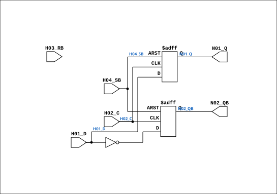

# F617

Source: `Verilog/DECODE-GateArray/DGA/circuit/F617.v`

<!-- Generated by Verilog/tests/module_doc.py from the //! comments in the source. Do not edit by hand - edit the RTL comments and regenerate. -->

<!-- HIERARCHY-NAV:BEGIN - written by Verilog/tests/gen_hierarchy.py, do not edit -->

**Hierarchy:** not instantiated by any of the 9 build tops (elaborated by yosys).

[Module hierarchy](../../../../HIERARCHY.md) - [All modules](../../../../MODULES.md)

<!-- HIERARCHY-NAV:END -->


<!-- SCHEMATIC:BEGIN - written by Verilog/tests/gen_schematics.py, do not edit -->

## Schematic

Drawn from the Verilog: no build top uses this module, so it was elaborated from its own file with no defines and default parameters. Sub-modules are boxes (click the picture to open it full size; there every sub-module box links to its page, and every wire shows its Verilog name).

[](F617.svg)

<!-- SCHEMATIC:END -->

## Description

ND120 DGA (Decode Gate Array)
DECODE/DGA
NEC F617 - D Flip-Flop with RB, SB
ACTIVE_ASYNC=0 (default): Only async set (reset tied to VCC).
ACTIVE_ASYNC=1: Both async set and reset (original NEC behavior).
Last reviewed: 30-MAR-2026
Ronny Hansen

## Parameters

| Parameter | Default |
|---|---|
| `ACTIVE_ASYNC` | `0  // 0=set only (reset tied VCC` |

## Ports

| Direction | Width | Name | Description |
|---|---|---|---|
| input | `1` | `H01_D` | Data |
| input | `1` | `H02_C` | Clock |
| input | `1` | `H03_RB` | Reset (negated, active low) |
| input | `1` | `H04_SB` | Set (negated, active low) |
| output | `1` | `N01_Q` |  |
| output | `1` | `N02_QB` |  |

## Verilog source

[`Verilog/DECODE-GateArray/DGA/circuit/F617.v`](https://github.com/RetroCoreLabs/nd-120/blob/main/Verilog/DECODE-GateArray/DGA/circuit/F617.v) on GitHub.

<details markdown="1">
<summary>Show the Verilog of F617 (79 lines)</summary>

```verilog
/**************************************************************************
** ND120 DGA (Decode Gate Array)                                         **
** DECODE/DGA                                                            **
**                                                                       **
** NEC F617 - D Flip-Flop with RB, SB                                    **
**                                                                       **
** ACTIVE_ASYNC=0 (default): Only async set (reset tied to VCC).         **
** ACTIVE_ASYNC=1: Both async set and reset (original NEC behavior).     **
**                                                                       **
** Last reviewed: 30-MAR-2026                                            **
** Ronny Hansen                                                          **
***************************************************************************/

module F617 #(
    parameter ACTIVE_ASYNC = 0  // 0=set only (reset tied VCC), 1=both set+reset
)(
    input H01_D,   // Data
    input H02_C,   // Clock
    input H03_RB,  // Reset (negated, active low)
    input H04_SB,  // Set (negated, active low)

    output reg N01_Q,
    output reg N02_QB
);

  wire s_d     = H01_D;
  wire s_set   = ~H04_SB;
  wire s_reset = ~H03_RB;

  generate
    if (ACTIVE_ASYNC == 1) begin : gen_dual_async
      // Both async set and reset (original NEC F617)
      always @(posedge H02_C or posedge s_set or posedge s_reset)
      begin
        if (s_reset) begin
          N01_Q  <= 1'b0;
          N02_QB <= 1'b1;
        end else if (s_set) begin
          N01_Q  <= 1'b1;
          N02_QB <= 1'b0;
        end else begin
          N01_Q  <= s_d;
          N02_QB <= ~s_d;
        end
      end
    end else begin : gen_set_only
      // Only async set -- clean for FPGA when reset is tied to VCC
      always @(posedge H02_C or posedge s_set)
      begin
        if (s_set) begin
          N01_Q  <= 1'b1;
          N02_QB <= 1'b0;
        end else begin
          N01_Q  <= s_d;
          N02_QB <= ~s_d;
        end
      end
    end
  endgenerate

endmodule

/*

TRUTH TABLE
===========

| D | C       |RB | SB| Q | QB |
|---|---------|---|---|---|----|
| 0 | posedge | 1 | 1 | 0 | 1  |
| 1 | posedge | 1 | 1 | 1 | 0  |
| X | negedge | 1 | 1 |  Hold  |
| X |   X     | 0 | 1 | 0 | 1  |
| X |   X     | 1 | 0 | 1 | 0  |
| X |   X     | 0 | 0 | 0 | 0  |  <= prohibition

X=irrelevant

*/
```

</details>
