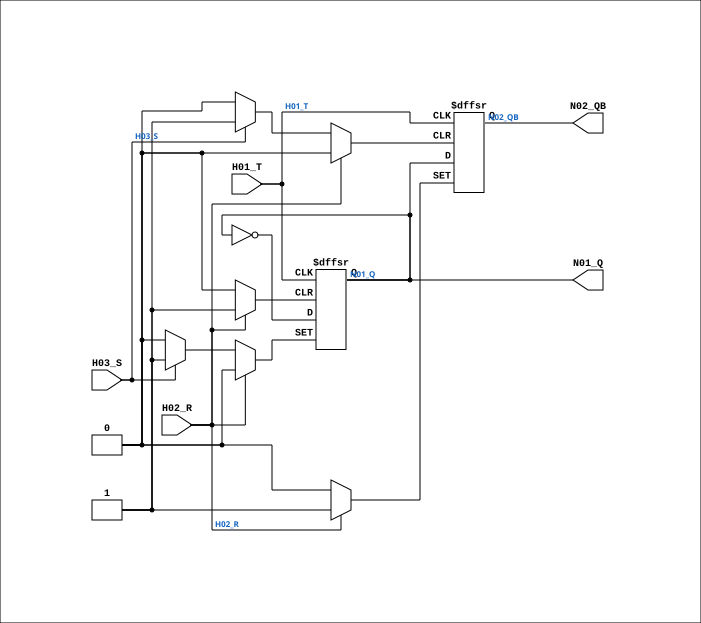

# F714

Source: `Verilog/DECODE-GateArray/DGA/circuit/F714.v`

<!-- Generated by Verilog/tests/module_doc.py from the //! comments in the source. Do not edit by hand - edit the RTL comments and regenerate. -->

<!-- HIERARCHY-NAV:BEGIN - written by Verilog/tests/gen_hierarchy.py, do not edit -->

**Where it sits** (Simulation): [ND120_TOP](../../../../doc/ND120_TOP.md) > [ND120_CORE](../../../../doc/ND120_CORE.md) > [ND3202D](../../../../CPU-BOARD-3202/circuit/doc/ND3202D.md) > [IO_37](../../../../CPU-BOARD-3202/circuit/doc/IO_37.md) > [IO_DCD_38](../../../../CPU-BOARD-3202/circuit/doc/IO_DCD_38.md) > [DECODE_DGA](DECODE_DGA.md) > [DECODE_DGA_POW](DECODE_DGA_POW.md) > **F714**
- instance path: `CORE.CPU_BOARD.IO.DCD.DGA.POW.A627`

**Used in:** [DECODE_DGA_POW](DECODE_DGA_POW.md) (all tops)

**Contains:** no other modules.

[Module hierarchy](../../../../HIERARCHY.md) - [All modules](../../../../MODULES.md)

<!-- HIERARCHY-NAV:END -->


<!-- SCHEMATIC:BEGIN - written by Verilog/tests/gen_schematics.py, do not edit -->

## Schematic

Drawn from the Verilog: the yosys netlist of the Simulation (Verilator) build, instance `CORE.CPU_BOARD.IO.DCD.DGA.POW.A627`. Sub-modules are boxes (click the picture to open it full size; there every sub-module box links to its page, and every wire shows its Verilog name).

[](F714.svg)

<!-- SCHEMATIC:END -->

## Description

ND120 DGA (Decode Gate Array)
DECODE/DGA
NEC F714 - T Flip-Flop with R, S
Last reviewed: 2-FEB-2024
Ronny Hansen

## Ports

| Direction | Width | Name | Description |
|---|---|---|---|
| input | `1` | `H01_T` | Toggle |
| input | `1` | `H02_R` | Reset |
| input | `1` | `H03_S` | Set |
| output | `1` | `N01_Q` |  |
| output | `1` | `N02_QB` |  |

## Verilog source

[`Verilog/DECODE-GateArray/DGA/circuit/F714.v`](https://github.com/RetroCoreLabs/nd-120/blob/main/Verilog/DECODE-GateArray/DGA/circuit/F714.v) on GitHub.

<details markdown="1">
<summary>Show the Verilog of F714 (76 lines)</summary>

```verilog
/**************************************************************************
** ND120 DGA (Decode Gate Array)                                         **
** DECODE/DGA                                                            **
**                                                                       **
** NEC F714 - T Flip-Flop with R, S                                      **
**                                                                       **
** Last reviewed: 2-FEB-2024                                             **
** Ronny Hansen                                                          **
***************************************************************************/

module F714 (
    input H01_T,  // Toggle
    input H02_R,  // Reset
    input H03_S,  // Set

    output N01_Q,
    output N02_QB
);


  reg  regQ;
  reg  reqQ_n;

  // Wires
  wire s_t;
  wire s_reset;
  wire s_set;


  // Assign inputs
  assign s_t    = H01_T;
  assign s_reset    = H02_R;
  assign s_set    = H03_S;


  // Assign outputs
  assign N01_Q  = regQ;
  assign N02_QB = reqQ_n;


  always @(posedge s_t or posedge s_reset or posedge s_set) begin
    // Prioritized: RESET has priority over SET to avoid synthesis warning
    if (s_reset) begin
      // Reset has highest priority
      regQ   <= 1'b0;
      reqQ_n <= 1'b1;
    end else if (s_set) begin
      // Set has second priority
      regQ   <= 1'b1;
      reqQ_n <= 1'b0;
    end else begin
      // Toggle on posedge s_t (s_t is guaranteed high here)
      reqQ_n <= regQ;
      regQ   <= ~regQ;
    end
  end

endmodule


/*

TRUTH TABLE
===========

| T       | R | S | Q | QB |
|---------|---|---|---|----|
| posedge | 0 | 0 | Invert |
| negedge | 0 | 0 |  Hold  |
|   X     | 1 | 0 | 0 | 1  |
|   X     | 0 | 1 | 1 | 0  |
|   X     | 1 | 1 | 1 | 1  |  <= prohibition

X=irrelevant

*/
```

</details>
