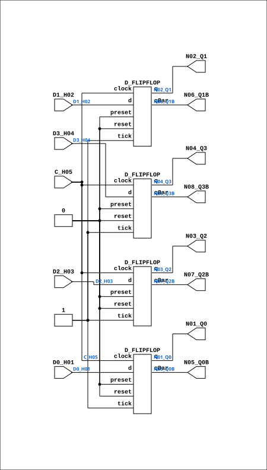

# F924

Source: `Verilog/DECODE-GateArray/DGA/circuit/F924.v`

<!-- Generated by Verilog/tests/module_doc.py from the //! comments in the source. Do not edit by hand - edit the RTL comments and regenerate. -->

<!-- HIERARCHY-NAV:BEGIN - written by Verilog/tests/gen_hierarchy.py, do not edit -->

**Hierarchy:** not instantiated by any of the 9 build tops (elaborated by yosys).

[Module hierarchy](../../../../HIERARCHY.md) - [All modules](../../../../MODULES.md)

<!-- HIERARCHY-NAV:END -->


<!-- SCHEMATIC:BEGIN - written by Verilog/tests/gen_schematics.py, do not edit -->

## Schematic

Drawn from the Verilog: no build top uses this module, so it was elaborated from its own file with no defines and default parameters. Sub-modules are boxes (click the picture to open it full size; there every sub-module box links to its page, and every wire shows its Verilog name).

[](F924.svg)

<!-- SCHEMATIC:END -->

## Description

ND120 DGA (Decode Gate Array)
DECODE/DGA
NEC F924 - 4-BIT D-TYPE FLIP-FLOP
Last reviewed: 9-NOV-2024
Ronny Hansen

## Ports

| Direction | Width | Name | Description |
|---|---|---|---|
| input | `1` | `C_H05` |  |
| input | `1` | `D0_H01` |  |
| input | `1` | `D1_H02` |  |
| input | `1` | `D2_H03` |  |
| input | `1` | `D3_H04` |  |
| output | `1` | `N01_Q0` |  |
| output | `1` | `N02_Q1` |  |
| output | `1` | `N03_Q2` |  |
| output | `1` | `N04_Q3` |  |
| output | `1` | `N05_Q0B` |  |
| output | `1` | `N06_Q1B` |  |
| output | `1` | `N07_Q2B` |  |
| output | `1` | `N08_Q3B` |  |

## Verilog source

[`Verilog/DECODE-GateArray/DGA/circuit/F924.v`](https://github.com/RetroCoreLabs/nd-120/blob/main/Verilog/DECODE-GateArray/DGA/circuit/F924.v) on GitHub.

<details markdown="1">
<summary>Show the Verilog of F924 (117 lines)</summary>

```verilog
/**************************************************************************
** ND120 DGA (Decode Gate Array)                                         **
** DECODE/DGA                                                            **
**                                                                       **
** NEC F924 - 4-BIT D-TYPE FLIP-FLOP                                     **
**                                                                       **
** Last reviewed: 9-NOV-2024                                             **
** Ronny Hansen                                                          **
***************************************************************************/

module F924 (
    // Clock
    input C_H05,

    // Data inputs
    input D0_H01,
    input D1_H02,
    input D2_H03,
    input D3_H04,

    // Normal outputs
    output N01_Q0,
    output N02_Q1,
    output N03_Q2,
    output N04_Q3,

    // Negated outputs
    output N05_Q0B,
    output N06_Q1B,
    output N07_Q2B,
    output N08_Q3B

);

  wire s_clock;
  wire s_d0;
  wire s_d1;
  wire s_d2;
  wire s_d3;
  wire s_q0_n;
  wire s_q0;
  wire s_q1_n;
  wire s_q1;
  wire s_q2_n;
  wire s_q2;
  wire s_q3_n;
  wire s_q3;

  // Assign inputs
  assign s_clock = C_H05;

  assign s_d0 = D0_H01;
  assign s_d1 = D1_H02;
  assign s_d2 = D2_H03;
  assign s_d3 = D3_H04;

  // Assign outputs
  assign N01_Q0 = s_q0;
  assign N02_Q1 = s_q1;
  assign N03_Q2 = s_q2;
  assign N04_Q3 = s_q3;
  assign N05_Q0B = s_q0_n;
  assign N06_Q1B = s_q1_n;
  assign N07_Q2B = s_q2_n;
  assign N08_Q3B = s_q3_n;

  // Implementation
  D_FLIPFLOP #(
      .InvertClockEnable(0)
  ) MEMORY_1 (
      .clock(s_clock),
      .d(s_d0),
      .preset(1'b0),
      .q(s_q0),
      .qBar(s_q0_n),
      .reset(1'b0),
      .tick(1'b1)
  );

  D_FLIPFLOP #(
      .InvertClockEnable(0)
  ) MEMORY_2 (
      .clock(s_clock),
      .d(s_d1),
      .preset(1'b0),
      .q(s_q1),
      .qBar(s_q1_n),
      .reset(1'b0),
      .tick(1'b1)
  );

  D_FLIPFLOP #(
      .InvertClockEnable(0)
  ) MEMORY_3 (
      .clock(s_clock),
      .d(s_d2),
      .preset(1'b0),
      .q(s_q2),
      .qBar(s_q2_n),
      .reset(1'b0),
      .tick(1'b1)
  );

  D_FLIPFLOP #(
      .InvertClockEnable(0)
  ) MEMORY_4 (
      .clock(s_clock),
      .d(s_d3),
      .preset(1'b0),
      .q(s_q3),
      .qBar(s_q3_n),
      .reset(1'b0),
      .tick(1'b1)
  );


endmodule
```

</details>
