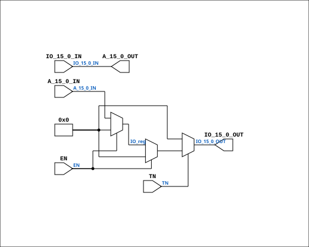

# BusDriver16

Source: `Verilog/DELILAH-CPU/CGA/circuit/BusDriver16.v`

<!-- Generated by Verilog/tests/module_doc.py from the //! comments in the source. Do not edit by hand - edit the RTL comments and regenerate. -->

<!-- HIERARCHY-NAV:BEGIN - written by Verilog/tests/gen_hierarchy.py, do not edit -->

**Where it sits** (Simulation): [ND120_TOP](../../../../doc/ND120_TOP.md) > [ND120_CORE](../../../../doc/ND120_CORE.md) > [ND3202D](../../../../CPU-BOARD-3202/circuit/doc/ND3202D.md) > [CPU_15](../../../../CPU-BOARD-3202/circuit/doc/CPU_15.md) > [CPU_PROC_32](../../../../CPU-BOARD-3202/circuit/doc/CPU_PROC_32.md) > [CPU_PROC_CGA_33](../../../../CPU-BOARD-3202/circuit/doc/CPU_PROC_CGA_33.md) > [CGA](CGA.md) > **BusDriver16**
- instance path: `CORE.CPU_BOARD.CPU.PROC.CGA.DELILAH.BD_FIDBO`

**Used in:** [CGA](CGA.md) (all tops)

**Contains:** no other modules.

[Module hierarchy](../../../../HIERARCHY.md) - [All modules](../../../../MODULES.md)

<!-- HIERARCHY-NAV:END -->


<!-- SCHEMATIC:BEGIN - written by Verilog/tests/gen_schematics.py, do not edit -->

## Schematic

Drawn from the Verilog: the yosys netlist of the Simulation (Verilator) build, instance `CORE.CPU_BOARD.CPU.PROC.CGA.DELILAH.BD_FIDBO`. Sub-modules are boxes (click the picture to open it full size; there every sub-module box links to its page, and every wire shows its Verilog name).

[](BusDriver16.svg)

<!-- SCHEMATIC:END -->

## Description

ND120 CPU, MM&M
CPU/PROC/CGA
BusDriver16
SHEET 4 of 8 (Page 5 in PDF)
Last reviewed: 6-FEB-2025
Ronny Hansen

## Ports

| Direction | Width | Name | Description |
|---|---|---|---|
| input | `1` | `EN` | Enable = FALSE => A to IO, Enable=TRUE => IO to A |
| input | `1` | `TN` | Test enable |
| input | `[15:0]` | `A_15_0_IN` | Data inputA (Connect to internal FIDBO data bus)) |
| output | `[15:0]` | `A_15_0_OUT` | A output  (Connect to internal XFIDBI data bus) |
| input | `1` | `wire` | IN and OUT to XFIDB data bus (Connect to EXTERNAL _XFIDB_ data bus) |
| output | `[15:0]` | `IO_15_0_OUT` | FIDB output bus (to CPU_PROC_CGA_33.FIDB_15_0_OUT) |

## Verilog source

[`Verilog/DELILAH-CPU/CGA/circuit/BusDriver16.v`](https://github.com/RetroCoreLabs/nd-120/blob/main/Verilog/DELILAH-CPU/CGA/circuit/BusDriver16.v) on GitHub.

<details markdown="1">
<summary>Show the Verilog of BusDriver16 (51 lines)</summary>

```verilog

/**************************************************************************
** ND120 CPU, MM&M                                                       **
** CPU/PROC/CGA                                                          **
**  BusDriver16                                                          **
**                                                                       **
** SHEET 4 of 8 (Page 5 in PDF)                                          **
**                                                                       **
** Last reviewed: 6-FEB-2025                                             **
** Ronny Hansen                                                          **
***************************************************************************/


module BusDriver16 (
    input wire EN,  // Enable = FALSE => A to IO, Enable=TRUE => IO to A
    input wire TN,  // Test enable

    input  wire [15:0] A_15_0_IN,  // Data inputA (Connect to internal FIDBO data bus))
    output wire [15:0] A_15_0_OUT, // A output  (Connect to internal XFIDBI data bus)

    input wire[15:0]   IO_15_0_IN,    // IN and OUT to XFIDB data bus (Connect to EXTERNAL _XFIDB_ data bus)
    output wire [15:0] IO_15_0_OUT  //! FIDB output bus (to CPU_PROC_CGA_33.FIDB_15_0_OUT)
);

  reg [15:0] IO_reg;  // Internal data register
  reg [15:0] A_reg;  // Internal data register

  //assign ZI_15_0 = TN ?  IO_15_0 : 16'b0; // Probably the correct implementation ? In test moode we should be isolated ?
  //assign ZI_15_0 = TN ?  internalData : 16'b0; // Probably the correct implementation ? In test moode we should be isolated ?

  // Fixed: Use blocking assignments and ensure all signals assigned in all paths to prevent latch inference
  always @(*) begin
    // Default assignments to prevent latch inference
    IO_reg = 16'b0;
    A_reg = 16'b0;

    if (!EN) begin
      // Write A to IO
      IO_reg = A_15_0_IN;
    end else begin
      // Read IO to A
      A_reg = IO_15_0_IN;
    end
  end

  // Bidirectional data operation
  assign IO_15_0_OUT = TN ? ((!EN) ? IO_reg : 16'b0) : 16'b0;
  assign A_15_0_OUT  = IO_15_0_IN; //A_reg; // A is always read from IO

endmodule
```

</details>
