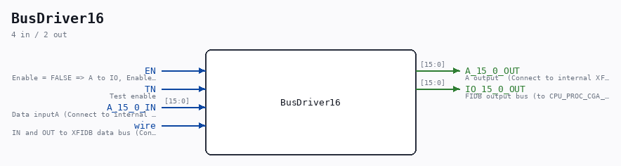

# BusDriver16

Source: `Verilog/DELILAH-CPU/CGA/circuit/BusDriver16.v`

> Generated by `Verilog/tests/module_doc.py` from the `//!`
> comments in the source. Do not edit by hand - edit the RTL comments and regenerate.

<!-- HIERARCHY-NAV:BEGIN - written by Verilog/tests/gen_hierarchy.py, do not edit -->

**Where it sits** (Simulation): [ND120_TOP](../../../../doc/ND120_TOP.md) > [ND120_CORE](../../../../doc/ND120_CORE.md) > [ND3202D](../../../../CPU-BOARD-3202/circuit/doc/ND3202D.md) > [CPU_15](../../../../CPU-BOARD-3202/circuit/doc/CPU_15.md) > [CPU_PROC_32](../../../../CPU-BOARD-3202/circuit/doc/CPU_PROC_32.md) > [CPU_PROC_CGA_33](../../../../CPU-BOARD-3202/circuit/doc/CPU_PROC_CGA_33.md) > [CGA](CGA.md) > **BusDriver16**
- instance path: `CORE.CPU_BOARD.CPU.PROC.CGA.DELILAH.BD_FIDBO`

**Used in:** [CGA](CGA.md) (all tops)

**Contains:** no other modules.

[Module hierarchy](../../../../HIERARCHY.md) - [All modules](../../../../MODULES.md)

<!-- HIERARCHY-NAV:END -->

## Description

ND120 CPU, MM&M
CPU/PROC/CGA
BusDriver16
SHEET 4 of 8 (Page 5 in PDF)
Last reviewed: 6-FEB-2025
Ronny Hansen

## Ports

| Direction | Width | Name | Description |
|---|---|---|---|
| input | `1` | `EN` | Enable = FALSE => A to IO, Enable=TRUE => IO to A |
| input | `1` | `TN` | Test enable |
| input | `[15:0]` | `A_15_0_IN` | Data inputA (Connect to internal FIDBO data bus)) |
| output | `[15:0]` | `A_15_0_OUT` | A output  (Connect to internal XFIDBI data bus) |
| input | `1` | `wire` | IN and OUT to XFIDB data bus (Connect to EXTERNAL _XFIDB_ data bus) |
| output | `[15:0]` | `IO_15_0_OUT` |  |
