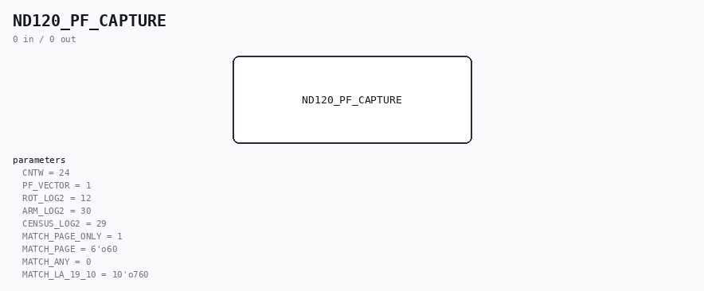

# ND120_PF_CAPTURE

Source: `Verilog/DELILAH-CPU/CGA/circuit/ND120_PF_CAPTURE.v`

> Generated by `Verilog/tests/module_doc.py` from the `//!`
> comments in the source. Do not edit by hand - edit the RTL comments and regenerate.

<!-- HIERARCHY-NAV:BEGIN - written by Verilog/tests/gen_hierarchy.py, do not edit -->

**Hierarchy:** not instantiated by any of the 9 build tops (elaborated by yosys).

[Module hierarchy](../../../../HIERARCHY.md) - [All modules](../../../../MODULES.md)

<!-- HIERARCHY-NAV:END -->

## Description

ND120 - FIRST PAGE-FAULT FREEZE REGISTER
WHAT THIS IS FOR
On the Tang, SINTRAN halts in ERRFATAL reporting IIC 3 (page fault).
Nobody knows whether that page fault is REAL. This block captures the
inputs to the trap logic at the exact TCLK edge that latched the
vector, then LOCKS, so the evidence survives the rest of the boot and
can be read out afterwards.
It answers one question with no inference:
PT valid, permission bits genuinely clear   -> a REAL page fault
PT all zero while the page-table RAM is
mid-read                                  -> SPURIOUS
PT valid and GRANTING                       -> something other than
PGF raised the trap
WHY A FREEZE REGISTER AND NOT A TRACE BUFFER
The event is one-shot and self-announcing: the machine halts moments
after it. One frozen sample of the right cycle is worth more than a
rolling window that may not be centred on it, and it costs ~80 flip-
flops instead of BSRAM this design has none to spare.
THE TIMING SUBTLETY THAT DECIDES WHETHER THIS BLOCK IS USEFUL AT ALL
TVEC_3_0 is REGISTERED on TCLK. So by the time TVEC reads "page fault",
the inputs that caused it have already moved on. Sampling the inputs
at the same moment TVEC is observed would capture the WRONG CYCLE and
produce a confident, wrong answer.
Therefore: the inputs are snapshotted on EVERY capturing edge into a
one-deep "previous edge" register, and when TVEC then shows a page
fault, it is that PREVIOUS snapshot which is frozen. The testbench
CGA_PF_CAPTURE_tb.v exists specifically to prove this lands on the
right cycle - do not trust the block without it.
LATCH MODE vs FF MODE
In FPGA_FF_MODE the vector flip-flops are clocked by sysclk qualified
with a TCLK_EN pulse. In the default build they are clocked by TCLK
directly. This block follows whichever is in use, so the captured
cycle means the same thing in both.
Verilog/DELILAH-CPU/CGA/circuit/ND120_PF_CAPTURE.v
21-AUG-2026
Ronny Hansen

## Parameters

| Parameter | Default |
|---|---|
| `CNTW` | `24` |
| `PF_VECTOR` | `1` |
| `ROT_LOG2` | `12` |
| `ARM_LOG2` | `30` |
| `CENSUS_LOG2` | `29` |
| `MATCH_PAGE_ONLY` | `1` |
| `MATCH_PAGE` | `6'o60` |
| `MATCH_ANY` | `0` |
| `MATCH_LA_19_10` | `10'o760` |
