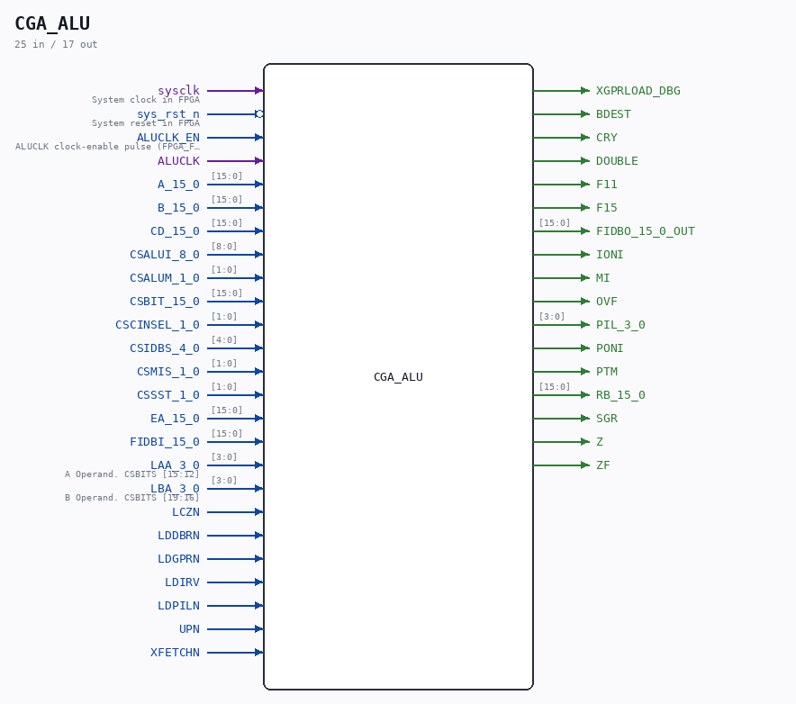

# CGA_ALU

Source: `Verilog/DELILAH-CPU/CGA_ALU/circuit/CGA_ALU.v`

<!-- Generated by Verilog/tests/module_doc.py from the //! comments in the source. Do not edit by hand - edit the RTL comments and regenerate. -->

<!-- HIERARCHY-NAV:BEGIN - written by Verilog/tests/gen_hierarchy.py, do not edit -->

**Where it sits** (Simulation): [ND120_TOP](../../../../doc/ND120_TOP.md) > [ND120_CORE](../../../../doc/ND120_CORE.md) > [ND3202D](../../../../CPU-BOARD-3202/circuit/doc/ND3202D.md) > [CPU_15](../../../../CPU-BOARD-3202/circuit/doc/CPU_15.md) > [CPU_PROC_32](../../../../CPU-BOARD-3202/circuit/doc/CPU_PROC_32.md) > [CPU_PROC_CGA_33](../../../../CPU-BOARD-3202/circuit/doc/CPU_PROC_CGA_33.md) > [CGA](../../../CGA/circuit/doc/CGA.md) > **CGA_ALU**
- instance path: `CORE.CPU_BOARD.CPU.PROC.CGA.DELILAH.ALU`

**Used in:** [CGA](../../../CGA/circuit/doc/CGA.md) (all tops)

**Contains:** [CGA_ALU_ARG](CGA_ALU_ARG.md), [CGA_ALU_DBR](CGA_ALU_DBR.md), [CGA_ALU_GPR](CGA_ALU_GPR.md), [CGA_ALU_OUTMUX](CGA_ALU_OUTMUX.md), [CGA_ALU_QREG](CGA_ALU_QREG.md), [CGA_ALU_SHIFT](CGA_ALU_SHIFT.md), [CGA_ALU_SMUX](CGA_ALU_SMUX.md), [CGA_ALU_STS](CGA_ALU_STS.md), [CGA_ALU_SWAP](CGA_ALU_SWAP.md), [CGA_CPU_ALU_CONTR](CGA_CPU_ALU_CONTR.md), [CGA_CPU_ALU_RALU](CGA_CPU_ALU_RALU.md), [CGA_CPU_ALU_RMUX](CGA_CPU_ALU_RMUX.md), [D_FLIPFLOP_EN](../../../../Shared/ndlib/doc/D_FLIPFLOP_EN.md), [MUX21LP](../../../../Shared/ndlib/doc/MUX21LP.md)

[Module hierarchy](../../../../HIERARCHY.md) - [All modules](../../../../MODULES.md)

<!-- HIERARCHY-NAV:END -->

## Description

ND120 CGA (CPU Gate Array / DELILAH)
/CGA/ALU/OUTMUX
OUT MUX
Page 41
SHEET 1 of 1
Last reviewed: 29-JAN-2025
Ronny Hansen

## Ports

| Direction | Width | Name | Description |
|---|---|---|---|
| input | `1` | `sysclk` | System clock in FPGA |
| input | `1` | `sys_rst_n` *(active low)* | System reset in FPGA |
| input | `1` | `ALUCLK_EN` | ALUCLK clock-enable pulse (FPGA_FF_MODE, else 0) |
| input | `1` | `ALUCLK` |  |
| input | `[15:0]` | `A_15_0` |  |
| input | `[15:0]` | `B_15_0` |  |
| input | `[15:0]` | `CD_15_0` |  |
| input | `[8:0]` | `CSALUI_8_0` |  |
| input | `[1:0]` | `CSALUM_1_0` |  |
| input | `[15:0]` | `CSBIT_15_0` |  |
| input | `[1:0]` | `CSCINSEL_1_0` |  |
| input | `[4:0]` | `CSIDBS_4_0` |  |
| input | `[1:0]` | `CSMIS_1_0` |  |
| input | `[1:0]` | `CSSST_1_0` |  |
| input | `[15:0]` | `EA_15_0` |  |
| input | `[15:0]` | `FIDBI_15_0` |  |
| input | `[3:0]` | `LAA_3_0` | A Operand. CSBITS [15:12] |
| input | `[3:0]` | `LBA_3_0` | B Operand. CSBITS [19:16] |
| input | `1` | `LCZN` |  |
| input | `1` | `LDDBRN` |  |
| input | `1` | `LDGPRN` |  |
| input | `1` | `LDIRV` |  |
| input | `1` | `LDPILN` |  |
| input | `1` | `UPN` |  |
| input | `1` | `XFETCHN` |  |
| output | `1` | `XGPRLOAD_DBG` |  |
| output | `1` | `BDEST` |  |
| output | `1` | `CRY` |  |
| output | `1` | `DOUBLE` |  |
| output | `1` | `F11` |  |
| output | `1` | `F15` |  |
| output | `[15:0]` | `FIDBO_15_0_OUT` |  |
| output | `1` | `IONI` |  |
| output | `1` | `MI` |  |
| output | `1` | `OVF` |  |
| output | `[3:0]` | `PIL_3_0` |  |
| output | `1` | `PONI` |  |
| output | `1` | `PTM` |  |
| output | `[15:0]` | `RB_15_0` |  |
| output | `1` | `SGR` |  |
| output | `1` | `Z` |  |
| output | `1` | `ZF` |  |
