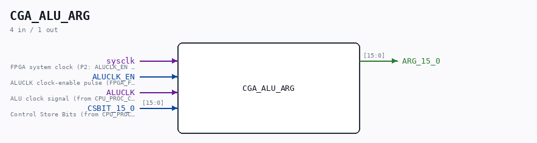
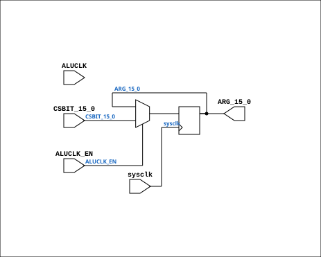

# CGA_ALU_ARG

Source: `Verilog/DELILAH-CPU/CGA_ALU/circuit/CGA_ALU_ARG.v`

<!-- Generated by Verilog/tests/module_doc.py from the //! comments in the source. Do not edit by hand - edit the RTL comments and regenerate. -->

<!-- HIERARCHY-NAV:BEGIN - written by Verilog/tests/gen_hierarchy.py, do not edit -->

**Where it sits** (Simulation): [ND120_TOP](../../../../doc/ND120_TOP.md) > [ND120_CORE](../../../../doc/ND120_CORE.md) > [ND3202D](../../../../CPU-BOARD-3202/circuit/doc/ND3202D.md) > [CPU_15](../../../../CPU-BOARD-3202/circuit/doc/CPU_15.md) > [CPU_PROC_32](../../../../CPU-BOARD-3202/circuit/doc/CPU_PROC_32.md) > [CPU_PROC_CGA_33](../../../../CPU-BOARD-3202/circuit/doc/CPU_PROC_CGA_33.md) > [CGA](../../../CGA/circuit/doc/CGA.md) > [CGA_ALU](CGA_ALU.md) > **CGA_ALU_ARG**
- instance path: `CORE.CPU_BOARD.CPU.PROC.CGA.DELILAH.ALU.ALU_ARG`

**Used in:** [CGA_ALU](CGA_ALU.md) (all tops)

**Contains:** no other modules.

[Module hierarchy](../../../../HIERARCHY.md) - [All modules](../../../../MODULES.md)

<!-- HIERARCHY-NAV:END -->



<!-- SCHEMATIC:BEGIN - written by Verilog/tests/gen_schematics.py, do not edit -->

## Schematic

Drawn from the Verilog: the yosys netlist of the Simulation (Verilator) build, instance `CORE.CPU_BOARD.CPU.PROC.CGA.DELILAH.ALU.ALU_ARG`. Sub-modules are boxes (click the picture to open it full size; there every sub-module box links to its page, and every wire shows its Verilog name).

[](CGA_ALU_ARG.svg)

<!-- SCHEMATIC:END -->

## Description

ND120 CGA (CPU Gate Array / DELILAH)
/CGA/ALU/ARG
ARG REGISTER
Page 53
SHEET 1 of 1
Last reviewed: 30-JAN-2025
Ronny Hansen

## Ports

| Direction | Width | Name | Description |
|---|---|---|---|
| input | `1` | `sysclk` | FPGA system clock (P2: ALUCLK_EN capture) |
| input | `1` | `ALUCLK_EN` | ALUCLK clock-enable pulse (FPGA_FF_MODE, else 0) |
| input | `1` | `ALUCLK` | ALU clock signal (from CPU_PROC_CGA_33.ALUCLK) |
| input | `[15:0]` | `CSBIT_15_0` | Control Store Bits (from CPU_PROC_CGA_33.CSBITS[15:0]) |
| output | `[15:0]` | `ARG_15_0` |  |

## Verilog source

[`Verilog/DELILAH-CPU/CGA_ALU/circuit/CGA_ALU_ARG.v`](https://github.com/RetroCoreLabs/nd-120/blob/main/Verilog/DELILAH-CPU/CGA_ALU/circuit/CGA_ALU_ARG.v) on GitHub.

<details markdown="1">
<summary>Show the Verilog of CGA_ALU_ARG (66 lines)</summary>

```verilog

/**************************************************************************
** ND120 CGA (CPU Gate Array / DELILAH)                                  **
** /CGA/ALU/ARG                                                          **
** ARG REGISTER                                                          **
**                                                                       **
** Page 53                                                               **
** SHEET 1 of 1                                                          **
**                                                                       **
** Last reviewed: 30-JAN-2025                                            **
** Ronny Hansen                                                          **
***************************************************************************/

module CGA_ALU_ARG (
    input        sysclk,     //! FPGA system clock (P2: ALUCLK_EN capture)
    input        ALUCLK_EN,  //! ALUCLK clock-enable pulse (FPGA_FF_MODE, else 0)
    input        ALUCLK,     //! ALU clock signal (from CPU_PROC_CGA_33.ALUCLK)
    input [15:0] CSBIT_15_0,  //! Control Store Bits (from CPU_PROC_CGA_33.CSBITS[15:0])

    output [15:0] ARG_15_0
);

  /*******************************************************************************
   ** The wires are defined here                                                 **
   *******************************************************************************/
  wire [15:0] s_csbits_15_0;
  wire        s_aluclk;

  reg [15:0] regArg;

  /*******************************************************************************
   ** Here all input connections are defined                                     **
   *******************************************************************************/
  assign s_csbits_15_0[15:0] = CSBIT_15_0;
  assign s_aluclk            = ALUCLK;

  /*******************************************************************************
   ** Here all output connections are defined                                    **
   *******************************************************************************/
   assign ARG_15_0            = regArg;

  /*******************************************************************************
   ** Here all sub-circuits are defined                                          **
   *******************************************************************************/

  // P2b (docs/plan-fix-unconstrained-clocks.md): in FF mode capture on
  // posedge sysclk gated by ALUCLK_EN (aligned to the ALUCLK rise)
  // instead of clocking on the routed net.
`ifdef FPGA_FF_MODE
  /* verilator lint_off UNUSEDSIGNAL */
  wire unused_aluclk = s_aluclk;
  /* verilator lint_on UNUSEDSIGNAL */
  always @(posedge sysclk) begin
    if (ALUCLK_EN) regArg <= s_csbits_15_0;
  end
`else
  /* verilator lint_off UNUSEDSIGNAL */
  wire unused_en = sysclk & ALUCLK_EN;
  /* verilator lint_on UNUSEDSIGNAL */
  always @(posedge s_aluclk) begin
    regArg <= s_csbits_15_0;
  end
`endif


endmodule
```

</details>
