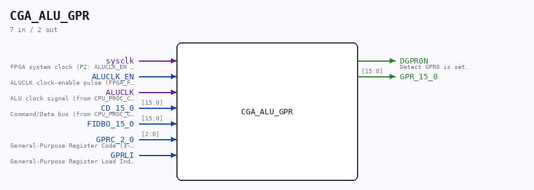

# CGA_ALU_GPR

Source: `Verilog/DELILAH-CPU/CGA_ALU/circuit/CGA_ALU_GPR.v`

> Generated by `Verilog/tests/module_doc.py` from the `//!`
> comments in the source. Do not edit by hand - edit the RTL comments and regenerate.

<!-- HIERARCHY-NAV:BEGIN - written by Verilog/tests/gen_hierarchy.py, do not edit -->

**Where it sits** (Simulation): [ND120_TOP](../../../../doc/ND120_TOP.md) > [ND120_CORE](../../../../doc/ND120_CORE.md) > [ND3202D](../../../../CPU-BOARD-3202/circuit/doc/ND3202D.md) > [CPU_15](../../../../CPU-BOARD-3202/circuit/doc/CPU_15.md) > [CPU_PROC_32](../../../../CPU-BOARD-3202/circuit/doc/CPU_PROC_32.md) > [CPU_PROC_CGA_33](../../../../CPU-BOARD-3202/circuit/doc/CPU_PROC_CGA_33.md) > [CGA](../../../CGA/circuit/doc/CGA.md) > [CGA_ALU](CGA_ALU.md) > **CGA_ALU_GPR**
- instance path: `CORE.CPU_BOARD.CPU.PROC.CGA.DELILAH.ALU.ALU_GPR`

**Used in:** [CGA_ALU](CGA_ALU.md) (all tops)

**Contains:** [D_FLIPFLOP_EN](../../../../Shared/ndlib/doc/D_FLIPFLOP_EN.md), [MUX21LP](../../../../Shared/ndlib/doc/MUX21LP.md), [MUX41P](../../../../Shared/ndlib/doc/MUX41P.md) x16, [SCAN_FF_EN](../../../../Shared/ndlib/doc/SCAN_FF_EN.md) x15

[Module hierarchy](../../../../HIERARCHY.md) - [All modules](../../../../MODULES.md)

<!-- HIERARCHY-NAV:END -->

## Description

ND120 CGA (CPU Gate Array / DELILAH)
/CGA/ALU/GPR
Page 50
SHEET 1 of 1
Last reviewed: 20-DEC-2024
Ronny Hansen

## Ports

| Direction | Width | Name | Description |
|---|---|---|---|
| input | `1` | `sysclk` | FPGA system clock (P2: ALUCLK_EN capture) |
| input | `1` | `ALUCLK_EN` | ALUCLK clock-enable pulse (FPGA_FF_MODE, else 0) |
| input | `1` | `ALUCLK` |  |
| input | `[15:0]` | `CD_15_0` |  |
| input | `[15:0]` | `FIDBO_15_0` |  |
| input | `[2:0]` | `GPRC_2_0` |  |
| input | `1` | `GPRLI` |  |
| output | `1` | `DGPR0N` | Detect GPR0 is set. |
| output | `[15:0]` | `GPR_15_0` |  |
