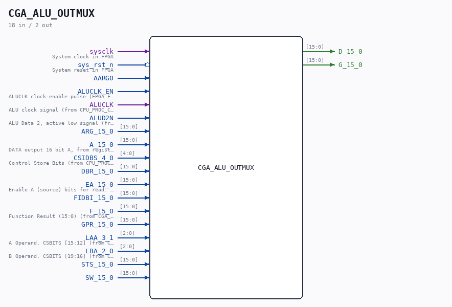

# CGA_ALU_OUTMUX

Source: `Verilog/DELILAH-CPU/CGA_ALU/circuit/CGA_ALU_OUTMUX.v`

<!-- Generated by Verilog/tests/module_doc.py from the //! comments in the source. Do not edit by hand - edit the RTL comments and regenerate. -->

<!-- HIERARCHY-NAV:BEGIN - written by Verilog/tests/gen_hierarchy.py, do not edit -->

**Where it sits** (Simulation): [ND120_TOP](../../../../doc/ND120_TOP.md) > [ND120_CORE](../../../../doc/ND120_CORE.md) > [ND3202D](../../../../CPU-BOARD-3202/circuit/doc/ND3202D.md) > [CPU_15](../../../../CPU-BOARD-3202/circuit/doc/CPU_15.md) > [CPU_PROC_32](../../../../CPU-BOARD-3202/circuit/doc/CPU_PROC_32.md) > [CPU_PROC_CGA_33](../../../../CPU-BOARD-3202/circuit/doc/CPU_PROC_CGA_33.md) > [CGA](../../../CGA/circuit/doc/CGA.md) > [CGA_ALU](CGA_ALU.md) > **CGA_ALU_OUTMUX**
- instance path: `CORE.CPU_BOARD.CPU.PROC.CGA.DELILAH.ALU.ALU_OUTMUX`

**Used in:** [CGA_ALU](CGA_ALU.md) (all tops)

**Contains:** [CGA_ALU_OUTMUX_IDBS](CGA_ALU_OUTMUX_IDBS.md), [CGA_ALU_OUTMUX_SEL8](CGA_ALU_OUTMUX_SEL8.md) x15, [CGA_CPU_ALU_OUTMUX_SEL7](CGA_CPU_ALU_OUTMUX_SEL7.md), [MUX31LP](../../../../Shared/ndlib/doc/MUX31LP.md) x16

[Module hierarchy](../../../../HIERARCHY.md) - [All modules](../../../../MODULES.md)

<!-- HIERARCHY-NAV:END -->

## Description

ND120 CGA (CPU Gate Array / DELILAH)
/CGA/ALU/OUTMUX
OUT MUX
Page 55
SHEET 1 of 1
Last reviewed: 29-JAN-2025
Ronny Hansen

## Ports

| Direction | Width | Name | Description |
|---|---|---|---|
| input | `1` | `sysclk` | System clock in FPGA |
| input | `1` | `sys_rst_n` *(active low)* | System reset in FPGA |
| input | `1` | `AARG0` |  |
| input | `1` | `ALUCLK_EN` | ALUCLK clock-enable pulse (FPGA_FF_MODE, else 0) |
| input | `1` | `ALUCLK` |  |
| input | `1` | `ALUD2N` |  |
| input | `[15:0]` | `ARG_15_0` |  |
| input | `[15:0]` | `A_15_0` |  |
| input | `[4:0]` | `CSIDBS_4_0` |  |
| input | `[15:0]` | `DBR_15_0` |  |
| input | `[15:0]` | `EA_15_0` |  |
| input | `[15:0]` | `FIDBI_15_0` |  |
| input | `[15:0]` | `F_15_0` |  |
| input | `[15:0]` | `GPR_15_0` |  |
| input | `[2:0]` | `LAA_3_1` |  |
| input | `[2:0]` | `LBA_2_0` |  |
| input | `[15:0]` | `STS_15_0` |  |
| input | `[15:0]` | `SW_15_0` |  |
| output | `[15:0]` | `D_15_0` |  |
| output | `[15:0]` | `G_15_0` |  |
