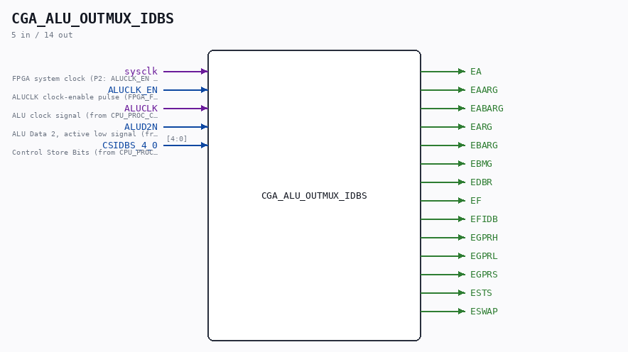

# CGA_ALU_OUTMUX_IDBS

Source: `Verilog/DELILAH-CPU/CGA_ALU/circuit/CGA_ALU_OUTMUX_IDBS.v`

<!-- Generated by Verilog/tests/module_doc.py from the //! comments in the source. Do not edit by hand - edit the RTL comments and regenerate. -->

<!-- HIERARCHY-NAV:BEGIN - written by Verilog/tests/gen_hierarchy.py, do not edit -->

**Where it sits** (Simulation): [ND120_TOP](../../../../doc/ND120_TOP.md) > [ND120_CORE](../../../../doc/ND120_CORE.md) > [ND3202D](../../../../CPU-BOARD-3202/circuit/doc/ND3202D.md) > [CPU_15](../../../../CPU-BOARD-3202/circuit/doc/CPU_15.md) > [CPU_PROC_32](../../../../CPU-BOARD-3202/circuit/doc/CPU_PROC_32.md) > [CPU_PROC_CGA_33](../../../../CPU-BOARD-3202/circuit/doc/CPU_PROC_CGA_33.md) > [CGA](../../../CGA/circuit/doc/CGA.md) > [CGA_ALU](CGA_ALU.md) > [CGA_ALU_OUTMUX](CGA_ALU_OUTMUX.md) > **CGA_ALU_OUTMUX_IDBS**
- instance path: `CORE.CPU_BOARD.CPU.PROC.CGA.DELILAH.ALU.ALU_OUTMUX.OUTMUX_IDBS`

**Used in:** [CGA_ALU_OUTMUX](CGA_ALU_OUTMUX.md) (all tops)

**Contains:** [AND_GATE](../../../../Shared/logisim/doc/AND_GATE.md) x2, [NAND_GATE](../../../../Shared/logisim/doc/NAND_GATE.md) x4, [NAND_GATE_5_INPUTS](../../../../Shared/logisim/doc/NAND_GATE_5_INPUTS.md), [NAND_GATE_8_INPUTS](../../../../Shared/logisim/doc/NAND_GATE_8_INPUTS.md), [ND38GLP](../../../../Shared/ndlib/doc/ND38GLP.md) x2, [R81_EN](../../../../Shared/ndlib/doc/R81_EN.md) x2

[Module hierarchy](../../../../HIERARCHY.md) - [All modules](../../../../MODULES.md)

<!-- HIERARCHY-NAV:END -->

## Description

ND120 CGA (CPU Gate Array / DELILAH)
/CGA/ALU/OUTMUX/IDBS
IDBS MUX
Page 55
SHEET 1 of 1
Last reviewed: 9-FEB-2025
Ronny Hansen

## Ports

| Direction | Width | Name | Description |
|---|---|---|---|
| input | `1` | `sysclk` | FPGA system clock (P2: ALUCLK_EN capture) |
| input | `1` | `ALUCLK_EN` | ALUCLK clock-enable pulse (FPGA_FF_MODE, else 0) |
| input | `1` | `ALUCLK` |  |
| input | `1` | `ALUD2N` |  |
| input | `[4:0]` | `CSIDBS_4_0` |  |
| output | `1` | `EA` |  |
| output | `1` | `EAARG` |  |
| output | `1` | `EABARG` |  |
| output | `1` | `EARG` |  |
| output | `1` | `EBARG` |  |
| output | `1` | `EBMG` |  |
| output | `1` | `EDBR` |  |
| output | `1` | `EF` |  |
| output | `1` | `EFIDB` |  |
| output | `1` | `EGPRH` |  |
| output | `1` | `EGPRL` |  |
| output | `1` | `EGPRS` |  |
| output | `1` | `ESTS` |  |
| output | `1` | `ESWAP` |  |
