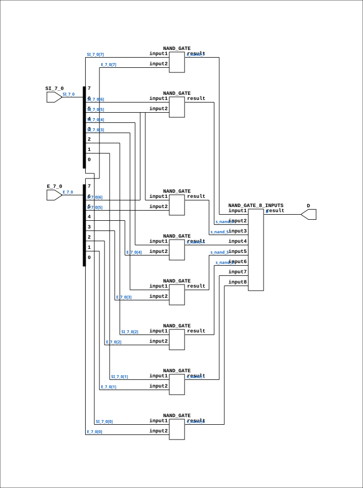

# CGA_ALU_OUTMUX_SEL8

Source: `Verilog/DELILAH-CPU/CGA_ALU/circuit/CGA_ALU_OUTMUX_SEL8.v`

<!-- Generated by Verilog/tests/module_doc.py from the //! comments in the source. Do not edit by hand - edit the RTL comments and regenerate. -->

<!-- HIERARCHY-NAV:BEGIN - written by Verilog/tests/gen_hierarchy.py, do not edit -->

**Where it sits** (Simulation): [ND120_TOP](../../../../doc/ND120_TOP.md) > [ND120_CORE](../../../../doc/ND120_CORE.md) > [ND3202D](../../../../CPU-BOARD-3202/circuit/doc/ND3202D.md) > [CPU_15](../../../../CPU-BOARD-3202/circuit/doc/CPU_15.md) > [CPU_PROC_32](../../../../CPU-BOARD-3202/circuit/doc/CPU_PROC_32.md) > [CPU_PROC_CGA_33](../../../../CPU-BOARD-3202/circuit/doc/CPU_PROC_CGA_33.md) > [CGA](../../../CGA/circuit/doc/CGA.md) > [CGA_ALU](CGA_ALU.md) > [CGA_ALU_OUTMUX](CGA_ALU_OUTMUX.md) > **CGA_ALU_OUTMUX_SEL8**
- instance path: `CORE.CPU_BOARD.CPU.PROC.CGA.DELILAH.ALU.ALU_OUTMUX.DMUX15`

**Used in:** [CGA_ALU_OUTMUX](CGA_ALU_OUTMUX.md) (all tops)

**Contains:** [NAND_GATE](../../../../Shared/logisim/doc/NAND_GATE.md) x8, [NAND_GATE_8_INPUTS](../../../../Shared/logisim/doc/NAND_GATE_8_INPUTS.md)

[Module hierarchy](../../../../HIERARCHY.md) - [All modules](../../../../MODULES.md)

<!-- HIERARCHY-NAV:END -->


<!-- SCHEMATIC:BEGIN - written by Verilog/tests/gen_schematics.py, do not edit -->

## Schematic

Drawn from the Verilog: the yosys netlist of the Simulation (Verilator) build, instance `CORE.CPU_BOARD.CPU.PROC.CGA.DELILAH.ALU.ALU_OUTMUX.DMUX15`. Sub-modules are boxes (click the picture to open it full size; there every sub-module box links to its page, and every wire shows its Verilog name).

[](CGA_ALU_OUTMUX_SEL8.svg)

<!-- SCHEMATIC:END -->

## Description

ND120 CGA (CPU Gate Array / DELILAH)
/CGA/ALU/OUTMUX/SEL8
SEL8
Page 56
SHEET 1 of 1
Last reviewed: 10-NOV-2024
Ronny Hansen

## Ports

| Direction | Width | Name | Description |
|---|---|---|---|
| input | `[7:0]` | `E_7_0` |  |
| input | `[7:0]` | `SI_7_0` |  |
| output | `1` | `D` |  |

## Verilog source

[`Verilog/DELILAH-CPU/CGA_ALU/circuit/CGA_ALU_OUTMUX_SEL8.v`](https://github.com/RetroCoreLabs/nd-120/blob/main/Verilog/DELILAH-CPU/CGA_ALU/circuit/CGA_ALU_OUTMUX_SEL8.v) on GitHub.

<details markdown="1">
<summary>Show the Verilog of CGA_ALU_OUTMUX_SEL8 (129 lines)</summary>

```verilog

/**************************************************************************
** ND120 CGA (CPU Gate Array / DELILAH)                                  **
** /CGA/ALU/OUTMUX/SEL8                                                  **
** SEL8                                                                  **
**                                                                       **
** Page 56                                                               **
** SHEET 1 of 1                                                          **
**                                                                       **
** Last reviewed: 10-NOV-2024                                            **
** Ronny Hansen                                                          **
**************************************************************************/

module CGA_ALU_OUTMUX_SEL8 (
    input [7:0] E_7_0,
    input [7:0] SI_7_0,

    output D
);

  /*******************************************************************************
   ** The wires are defined here                                                 **
   *******************************************************************************/
  wire [7:0] s_si_7_0;
  wire [7:0] s_e_7_0;
  wire       s_d_out;
  wire       s_nand_0;
  wire       s_nand_1;
  wire       s_nand_2;
  wire       s_nand_3;
  wire       s_nand_4;
  wire       s_nand_5;
  wire       s_nand_6;
  wire       s_nand_7;

  /*******************************************************************************
   ** Here all input connections are defined                                     **
   *******************************************************************************/
  assign s_si_7_0[7:0] = SI_7_0;
  assign s_e_7_0[7:0] = E_7_0;

  /*******************************************************************************
   ** Here all output connections are defined                                    **
   *******************************************************************************/
  assign D = s_d_out;

  /*******************************************************************************
   ** Here all normal components are defined                                     **
   *******************************************************************************/
  NAND_GATE #(
      .BubblesMask(2'b00)
  ) GATES_1 (
      .input1(s_si_7_0[7]),
      .input2(s_e_7_0[7]),
      .result(s_nand_7)
  );

  NAND_GATE #(
      .BubblesMask(2'b00)
  ) GATES_2 (
      .input1(s_si_7_0[6]),
      .input2(s_e_7_0[6]),
      .result(s_nand_6)
  );

  NAND_GATE #(
      .BubblesMask(2'b00)
  ) GATES_3 (
      .input1(s_si_7_0[5]),
      .input2(s_e_7_0[5]),
      .result(s_nand_5)
  );

  NAND_GATE #(
      .BubblesMask(2'b00)
  ) GATES_4 (
      .input1(s_si_7_0[4]),
      .input2(s_e_7_0[4]),
      .result(s_nand_4)
  );

  NAND_GATE #(
      .BubblesMask(2'b00)
  ) GATES_5 (
      .input1(s_si_7_0[3]),
      .input2(s_e_7_0[3]),
      .result(s_nand_3)
  );

  NAND_GATE #(
      .BubblesMask(2'b00)
  ) GATES_6 (
      .input1(s_si_7_0[2]),
      .input2(s_e_7_0[2]),
      .result(s_nand_2)
  );

  NAND_GATE #(
      .BubblesMask(2'b00)
  ) GATES_7 (
      .input1(s_si_7_0[1]),
      .input2(s_e_7_0[1]),
      .result(s_nand_1)
  );

  NAND_GATE #(
      .BubblesMask(2'b00)
  ) GATES_8 (
      .input1(s_si_7_0[0]),
      .input2(s_e_7_0[0]),
      .result(s_nand_0)
  );

  NAND_GATE_8_INPUTS #(
      .BubblesMask(8'h00)
  ) GATES_9 (
      .input1(s_nand_7),
      .input2(s_nand_6),
      .input3(s_nand_5),
      .input4(s_nand_4),
      .input5(s_nand_3),
      .input6(s_nand_2),
      .input7(s_nand_1),
      .input8(s_nand_0),
      .result(s_d_out)
  );


endmodule
```

</details>
