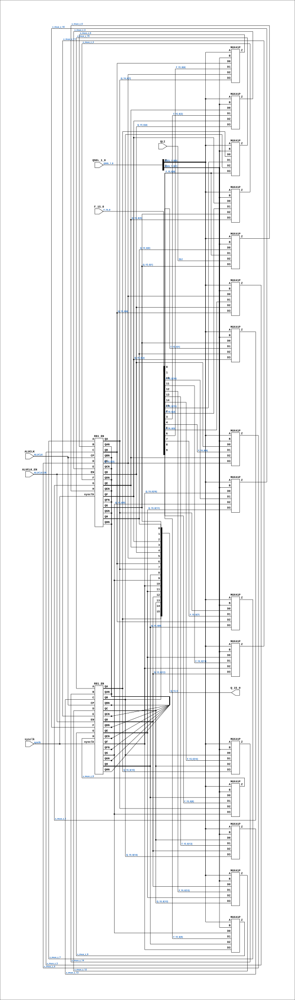

# CGA_ALU_QREG

Source: `Verilog/DELILAH-CPU/CGA_ALU/circuit/CGA_ALU_QREG.v`

<!-- Generated by Verilog/tests/module_doc.py from the //! comments in the source. Do not edit by hand - edit the RTL comments and regenerate. -->

<!-- HIERARCHY-NAV:BEGIN - written by Verilog/tests/gen_hierarchy.py, do not edit -->

**Where it sits** (Simulation): [ND120_TOP](../../../../doc/ND120_TOP.md) > [ND120_CORE](../../../../doc/ND120_CORE.md) > [ND3202D](../../../../CPU-BOARD-3202/circuit/doc/ND3202D.md) > [CPU_15](../../../../CPU-BOARD-3202/circuit/doc/CPU_15.md) > [CPU_PROC_32](../../../../CPU-BOARD-3202/circuit/doc/CPU_PROC_32.md) > [CPU_PROC_CGA_33](../../../../CPU-BOARD-3202/circuit/doc/CPU_PROC_CGA_33.md) > [CGA](../../../CGA/circuit/doc/CGA.md) > [CGA_ALU](CGA_ALU.md) > **CGA_ALU_QREG**
- instance path: `CORE.CPU_BOARD.CPU.PROC.CGA.DELILAH.ALU.ALU_QREG`

**Used in:** [CGA_ALU](CGA_ALU.md) (all tops)

**Contains:** [MUX41P](../../../../Shared/ndlib/doc/MUX41P.md) x16, [R81_EN](../../../../Shared/ndlib/doc/R81_EN.md) x2

[Module hierarchy](../../../../HIERARCHY.md) - [All modules](../../../../MODULES.md)

<!-- HIERARCHY-NAV:END -->


<!-- SCHEMATIC:BEGIN - written by Verilog/tests/gen_schematics.py, do not edit -->

## Schematic

Drawn from the Verilog: the yosys netlist of the Simulation (Verilator) build, instance `CORE.CPU_BOARD.CPU.PROC.CGA.DELILAH.ALU.ALU_QREG`. Sub-modules are boxes (click the picture to open it full size; there every sub-module box links to its page, and every wire shows its Verilog name).

[](CGA_ALU_QREG.svg)

<!-- SCHEMATIC:END -->

## Description

ND120 CGA (CPU Gate Array / DELILAH)
/CGA/ALU/QREG
Q REGISTER
Page 43
SHEET 1 of 1
Last reviewed: 1-DEC-2024
Ronny Hansen

## Ports

| Direction | Width | Name | Description |
|---|---|---|---|
| input | `1` | `sysclk` | FPGA system clock (P2: ALUCLK_EN capture) |
| input | `1` | `ALUCLK_EN` | ALUCLK clock-enable pulse (FPGA_FF_MODE, else 0) |
| input | `1` | `ALUCLK` | ALU clock signal (from CPU_PROC_CGA_33.ALUCLK) |
| input | `[15:0]` | `F_15_0` | Function Result (15:0) (from CGA_CPU_ALU_RALU.F_15_0) |
| input | `1` | `QLI` | Q Register Load Indicator (from CGA_CPU_ALU_CONTR.QLI) |
| input | `[1:0]` | `QSEL_1_0` | Q Register Select control signals (2-bit) (from CGA_CPU_ALU_CONTR.QSEL_1_0) |
| output | `[15:0]` | `Q_15_0` |  |

## Verilog source

[`Verilog/DELILAH-CPU/CGA_ALU/circuit/CGA_ALU_QREG.v`](https://github.com/RetroCoreLabs/nd-120/blob/main/Verilog/DELILAH-CPU/CGA_ALU/circuit/CGA_ALU_QREG.v) on GitHub.

<details markdown="1">
<summary>Show the Verilog of CGA_ALU_QREG (325 lines)</summary>

```verilog
/**************************************************************************
** ND120 CGA (CPU Gate Array / DELILAH)                                  **
** /CGA/ALU/QREG                                                         **
** Q REGISTER                                                            **
**                                                                       **
** Page 43                                                               **
** SHEET 1 of 1                                                          **
**                                                                       **
** Last reviewed: 1-DEC-2024                                             **
** Ronny Hansen                                                          **
***************************************************************************/

module CGA_ALU_QREG (
    input        sysclk,     //! FPGA system clock (P2: ALUCLK_EN capture)
    input        ALUCLK_EN,  //! ALUCLK clock-enable pulse (FPGA_FF_MODE, else 0)
    input        ALUCLK,     //! ALU clock signal (from CPU_PROC_CGA_33.ALUCLK)
    input [15:0] F_15_0,     //! Function Result (15:0) (from CGA_CPU_ALU_RALU.F_15_0)
    input        QLI,        //! Q Register Load Indicator (from CGA_CPU_ALU_CONTR.QLI)
    input [ 1:0] QSEL_1_0,   //! Q Register Select control signals (2-bit) (from CGA_CPU_ALU_CONTR.QSEL_1_0)

    output [15:0] Q_15_0
);

  /*******************************************************************************
   ** The wires are defined here                                                 **
   *******************************************************************************/
  wire [15:0] s_q_15_0_out;
  wire [ 1:0] s_qsel_1_0;
  wire [15:0] s_f_15_0;
  wire        s_aluclk;
  wire        s_mux_z_0;
  wire        s_mux_z_1;
  wire        s_mux_z_2;
  wire        s_mux_z_3;
  wire        s_mux_z_4;
  wire        s_mux_z_5;
  wire        s_mux_z_6;
  wire        s_mux_z_7;
  wire        s_mux_z_8;
  wire        s_mux_z_9;
  wire        s_mux_z_10;
  wire        s_mux_z_11;
  wire        s_mux_z_12;
  wire        s_mux_z_13;
  wire        s_mux_z_14;
  wire        s_mux_z_15;
  wire        s_qli;

  /*******************************************************************************
   ** The module functionality is described here                                 **
   *******************************************************************************/

  /*******************************************************************************
   ** Here all input connections are defined                                     **
   *******************************************************************************/
  assign s_qsel_1_0[1:0] = QSEL_1_0;
  assign s_f_15_0[15:0]  = F_15_0;
  assign s_aluclk        = ALUCLK;

  // P2b (docs/plan-fix-unconstrained-clocks.md): in FF mode the ALUCLK-
  // clocked registers capture on posedge sysclk gated by ALUCLK_EN
  // (aligned to the ALUCLK rise) instead of clocking on the routed net.
`ifdef FPGA_FF_MODE
  localparam ALUCLK_CE = 1;
`else
  localparam ALUCLK_CE = 0;
`endif

  assign s_qli           = QLI;

  /*******************************************************************************
   ** Here all output connections are defined                                    **
   *******************************************************************************/
  assign Q_15_0          = s_q_15_0_out[15:0];

  /*******************************************************************************
   ** Here all sub-circuits are defined                                          **
   *******************************************************************************/

  MUX41P MUXQ15 (
      .A (s_qsel_1_0[0]),
      .B (s_qsel_1_0[1]),

      .D0(s_q_15_0_out[15]),
      .D1(s_f_15_0[15]),
      .D2(s_q_15_0_out[14]),
      // Shift-right-double serial input: Q15 must receive the bit leaving
      // the R-side shifter (F[0]), so MPY/FMU streams the product's low
      // bits from R5 into Q. Was Q[0] (a rotate), which left Q stuck at 0
      // through the whole multiply loop.
      .D3(s_f_15_0[0]),
      .Z (s_mux_z_15)
  );

  MUX41P MUXQ14 (
      .A (s_qsel_1_0[0]),
      .B (s_qsel_1_0[1]),

      .D0(s_q_15_0_out[14]),
      .D1(s_f_15_0[14]),
      .D2(s_q_15_0_out[13]),
      .D3(s_q_15_0_out[15]),
      .Z (s_mux_z_14)
  );
  MUX41P MUXQ13 (
      .A (s_qsel_1_0[0]),
      .B (s_qsel_1_0[1]),

      .D0(s_q_15_0_out[13]),
      .D1(s_f_15_0[13]),
      .D2(s_q_15_0_out[12]),
      .D3(s_q_15_0_out[14]),
      .Z (s_mux_z_13)
  );

  MUX41P MUXQ12 (
      .A (s_qsel_1_0[0]),
      .B (s_qsel_1_0[1]),
      .D0(s_q_15_0_out[12]),
      .D1(s_f_15_0[12]),
      .D2(s_q_15_0_out[11]),
      .D3(s_q_15_0_out[13]),
      .Z (s_mux_z_12)
  );

  MUX41P MUXQ11 (
      .A (s_qsel_1_0[0]),
      .B (s_qsel_1_0[1]),

      .D0(s_q_15_0_out[11]),
      .D1(s_f_15_0[11]),
      .D2(s_q_15_0_out[10]),
      .D3(s_q_15_0_out[12]),
      .Z (s_mux_z_11)
  );

  MUX41P MUXQ10 (
      .A (s_qsel_1_0[0]),
      .B (s_qsel_1_0[1]),

      .D0(s_q_15_0_out[10]),
      .D1(s_f_15_0[10]),
      .D2(s_q_15_0_out[9]),
      .D3(s_q_15_0_out[11]),
      .Z (s_mux_z_10)
  );

  MUX41P MUXQ9 (
      .A (s_qsel_1_0[0]),
      .B (s_qsel_1_0[1]),

      .D0(s_q_15_0_out[9]),
      .D1(s_f_15_0[9]),
      .D2(s_q_15_0_out[8]),
      .D3(s_q_15_0_out[10]),
      .Z (s_mux_z_9)
  );

  MUX41P MUXQ8 (
      .A (s_qsel_1_0[0]),
      .B (s_qsel_1_0[1]),

      .D0(s_q_15_0_out[8]),
      .D1(s_f_15_0[8]),
      .D2(s_q_15_0_out[7]),
      .D3(s_q_15_0_out[9]),
      .Z (s_mux_z_8)
  );

  MUX41P MUXQ7 (
      .A (s_qsel_1_0[0]),
      .B (s_qsel_1_0[1]),

      .D0(s_q_15_0_out[7]),
      .D1(s_f_15_0[7]),
      .D2(s_q_15_0_out[6]),
      .D3(s_q_15_0_out[8]),
      .Z (s_mux_z_7)
  );

  MUX41P MUXQ6 (
      .A (s_qsel_1_0[0]),
      .B (s_qsel_1_0[1]),

      .D0(s_q_15_0_out[6]),
      .D1(s_f_15_0[6]),
      .D2(s_q_15_0_out[5]),
      .D3(s_q_15_0_out[7]),
      .Z (s_mux_z_6)
  );

  MUX41P MUXQ5 (
      .A (s_qsel_1_0[0]),
      .B (s_qsel_1_0[1]),

      .D0(s_q_15_0_out[5]),
      .D1(s_f_15_0[5]),
      .D2(s_q_15_0_out[4]),
      .D3(s_q_15_0_out[6]),
      .Z (s_mux_z_5)
  );

  MUX41P MUXQ4 (
      .A (s_qsel_1_0[0]),
      .B (s_qsel_1_0[1]),

      .D0(s_q_15_0_out[4]),
      .D1(s_f_15_0[4]),
      .D2(s_q_15_0_out[3]),
      .D3(s_q_15_0_out[5]),
      .Z (s_mux_z_4)
  );

  MUX41P MUXQ3 (
      .A (s_qsel_1_0[0]),
      .B (s_qsel_1_0[1]),

      .D0(s_q_15_0_out[3]),
      .D1(s_f_15_0[3]),
      .D2(s_q_15_0_out[2]),
      .D3(s_q_15_0_out[4]),
      .Z (s_mux_z_3)
  );

  MUX41P MUXQ2 (
      .A (s_qsel_1_0[0]),
      .B (s_qsel_1_0[1]),

      .D0(s_q_15_0_out[2]),
      .D1(s_f_15_0[2]),
      .D2(s_q_15_0_out[1]),
      .D3(s_q_15_0_out[3]),
      .Z (s_mux_z_2)
  );

  MUX41P MUXQ1 (
      .A (s_qsel_1_0[0]),
      .B (s_qsel_1_0[1]),

      .D0(s_q_15_0_out[1]),
      .D1(s_f_15_0[1]),
      .D2(s_q_15_0_out[0]),
      .D3(s_q_15_0_out[2]),
      .Z (s_mux_z_1)
  );


  MUX41P MUXQ0 (
      .A (s_qsel_1_0[0]),
      .B (s_qsel_1_0[1]),
      .D0(s_q_15_0_out[0]),
      .D1(s_f_15_0[0]),
      .D2(s_qli),
      .D3(s_q_15_0_out[1]),
      .Z (s_mux_z_0)
  );


  R81_EN #(.USE_ENABLE(ALUCLK_CE)) REG_Q_HI (
      .sysclk(sysclk),
      .EN(ALUCLK_EN),
      .CP(s_aluclk),

      .A(s_mux_z_15),
      .B(s_mux_z_14),
      .C(s_mux_z_13),
      .D(s_mux_z_12),
      .E(s_mux_z_11),
      .F(s_mux_z_10),
      .G(s_mux_z_9),
      .H(s_mux_z_8),

      .QA (s_q_15_0_out[15]),
      .QAN(),
      .QB (s_q_15_0_out[14]),
      .QBN(),
      .QC (s_q_15_0_out[13]),
      .QCN(),
      .QD (s_q_15_0_out[12]),
      .QDN(),
      .QE (s_q_15_0_out[11]),
      .QEN(),
      .QF (s_q_15_0_out[10]),
      .QFN(),
      .QG (s_q_15_0_out[9]),
      .QGN(),
      .QH (s_q_15_0_out[8]),
      .QHN()
  );

  R81_EN #(.USE_ENABLE(ALUCLK_CE)) REG_Q_LO (
      .sysclk(sysclk),
      .EN(ALUCLK_EN),
      .CP(s_aluclk),

      .A(s_mux_z_7),
      .B(s_mux_z_6),
      .C(s_mux_z_5),
      .D(s_mux_z_4),
      .E(s_mux_z_3),
      .F(s_mux_z_2),
      .G(s_mux_z_1),
      .H(s_mux_z_0),

      .QA (s_q_15_0_out[7]),
      .QAN(),
      .QB (s_q_15_0_out[6]),
      .QBN(),
      .QC (s_q_15_0_out[5]),
      .QCN(),
      .QD (s_q_15_0_out[4]),
      .QDN(),
      .QE (s_q_15_0_out[3]),
      .QEN(),
      .QF (s_q_15_0_out[2]),
      .QFN(),
      .QG (s_q_15_0_out[1]),
      .QGN(),
      .QH (s_q_15_0_out[0]),
      .QHN()
  );

endmodule
```

</details>
