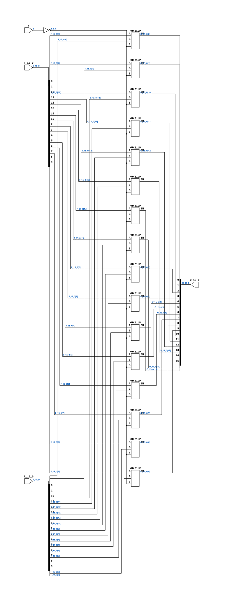

# CGA_ALU_RALU_MUX216L

Source: `Verilog/DELILAH-CPU/CGA_ALU/circuit/CGA_ALU_RALU_MUX216L.v`

<!-- Generated by Verilog/tests/module_doc.py from the //! comments in the source. Do not edit by hand - edit the RTL comments and regenerate. -->

<!-- HIERARCHY-NAV:BEGIN - written by Verilog/tests/gen_hierarchy.py, do not edit -->

**Where it sits** (Simulation): [ND120_TOP](../../../../doc/ND120_TOP.md) > [ND120_CORE](../../../../doc/ND120_CORE.md) > [ND3202D](../../../../CPU-BOARD-3202/circuit/doc/ND3202D.md) > [CPU_15](../../../../CPU-BOARD-3202/circuit/doc/CPU_15.md) > [CPU_PROC_32](../../../../CPU-BOARD-3202/circuit/doc/CPU_PROC_32.md) > [CPU_PROC_CGA_33](../../../../CPU-BOARD-3202/circuit/doc/CPU_PROC_CGA_33.md) > [CGA](../../../CGA/circuit/doc/CGA.md) > [CGA_ALU](CGA_ALU.md) > [CGA_CPU_ALU_RALU](CGA_CPU_ALU_RALU.md) > **CGA_ALU_RALU_MUX216L**
- instance path: `CORE.CPU_BOARD.CPU.PROC.CGA.DELILAH.ALU.ALU_RALU.RN_R_MUX`

**Used in:** [CGA_CPU_ALU_RALU](CGA_CPU_ALU_RALU.md) (all tops)

**Contains:** [MUX21LP](../../../../Shared/ndlib/doc/MUX21LP.md) x16

[Module hierarchy](../../../../HIERARCHY.md) - [All modules](../../../../MODULES.md)

<!-- HIERARCHY-NAV:END -->


<!-- SCHEMATIC:BEGIN - written by Verilog/tests/gen_schematics.py, do not edit -->

## Schematic

Drawn from the Verilog: the yosys netlist of the Simulation (Verilator) build, instance `CORE.CPU_BOARD.CPU.PROC.CGA.DELILAH.ALU.ALU_RALU.RN_R_MUX`. Sub-modules are boxes (click the picture to open it full size; there every sub-module box links to its page, and every wire shows its Verilog name).

[](CGA_ALU_RALU_MUX216L.svg)

<!-- SCHEMATIC:END -->

## Description

ND120 CGA (CPU Gate Array / DELILAH)
/CGA/ALU/RALU/MUX216L
LOGOP
Page 47
SHEET 1 of 1
Last reviewed: 10-NOV-2024
Ronny Hansen

## Ports

| Direction | Width | Name | Description |
|---|---|---|---|
| input | `[15:0]` | `F_15_0` |  |
| input | `1` | `S` |  |
| input | `[15:0]` | `T_15_0` |  |
| output | `[15:0]` | `O_15_0` |  |

## Verilog source

[`Verilog/DELILAH-CPU/CGA_ALU/circuit/CGA_ALU_RALU_MUX216L.v`](https://github.com/RetroCoreLabs/nd-120/blob/main/Verilog/DELILAH-CPU/CGA_ALU/circuit/CGA_ALU_RALU_MUX216L.v) on GitHub.

<details markdown="1">
<summary>Show the Verilog of CGA_ALU_RALU_MUX216L (169 lines)</summary>

```verilog
/**************************************************************************
** ND120 CGA (CPU Gate Array / DELILAH)                                  **
** /CGA/ALU/RALU/MUX216L                                                 **
** LOGOP                                                                 **
**                                                                       **
** Page 47                                                               **
** SHEET 1 of 1                                                          **
**                                                                       **
** Last reviewed: 10-NOV-2024                                            **
** Ronny Hansen                                                          **
**************************************************************************/

module CGA_ALU_RALU_MUX216L (
    input [15:0] F_15_0,
    input        S,
    input [15:0] T_15_0,

    output [15:0] O_15_0
);

  /*******************************************************************************
   ** The wires are defined here                                                 **
   *******************************************************************************/
  wire [15:0] s_o_15_0_out;
  wire [15:0] s_t_15_0;
  wire [15:0] s_f_15_0;
  wire        s_s_n;
  wire        s_s;

  /*******************************************************************************
   ** The module functionality is described here                                 **
   *******************************************************************************/

  /*******************************************************************************
   ** Here all input connections are defined                                     **
   *******************************************************************************/
  assign s_t_15_0[15:0] = T_15_0;
  assign s_f_15_0[15:0] = F_15_0;
  assign s_s            = S;

  /*******************************************************************************
   ** Here all output connections are defined                                    **
   *******************************************************************************/
  assign O_15_0         = s_o_15_0_out[15:0];

  /*******************************************************************************
   ** Here all in-lined components are defined                                   **
   *******************************************************************************/

  // NOT Gate
  assign s_s_n          = ~s_s;

  /*******************************************************************************
   ** Here all sub-circuits are defined                                          **
   *******************************************************************************/

  MUX21LP MUXQ15 (
      .A (s_f_15_0[15]),
      .B (s_t_15_0[15]),
      .S (s_s_n),
      .ZN(s_o_15_0_out[15])
  );

  MUX21LP MUXQ14 (
      .A (s_f_15_0[14]),
      .B (s_t_15_0[14]),
      .S (s_s_n),
      .ZN(s_o_15_0_out[14])
  );

  MUX21LP MUXQ13 (
      .A (s_f_15_0[13]),
      .B (s_t_15_0[13]),
      .S (s_s_n),
      .ZN(s_o_15_0_out[13])
  );

  MUX21LP MUXQ12 (
      .A (s_f_15_0[12]),
      .B (s_t_15_0[12]),
      .S (s_s_n),
      .ZN(s_o_15_0_out[12])
  );

  MUX21LP MUXQ11 (
      .A (s_f_15_0[11]),
      .B (s_t_15_0[11]),
      .S (s_s_n),
      .ZN(s_o_15_0_out[11])
  );

  MUX21LP MUXQ10 (
      .A (s_f_15_0[10]),
      .B (s_t_15_0[10]),
      .S (s_s_n),
      .ZN(s_o_15_0_out[10])
  );

  MUX21LP MUXQ9 (
      .A (s_f_15_0[9]),
      .B (s_t_15_0[9]),
      .S (s_s_n),
      .ZN(s_o_15_0_out[9])
  );

  MUX21LP MUXQ8 (
      .A (s_f_15_0[8]),
      .B (s_t_15_0[8]),
      .S (s_s_n),
      .ZN(s_o_15_0_out[8])
  );

  MUX21LP MUXQ7 (
      .A (s_f_15_0[7]),
      .B (s_t_15_0[7]),
      .S (s_s_n),
      .ZN(s_o_15_0_out[7])
  );

  MUX21LP MUXQ6 (
      .A (s_f_15_0[6]),
      .B (s_t_15_0[6]),
      .S (s_s_n),
      .ZN(s_o_15_0_out[6])
  );

  MUX21LP MUXQ5 (
      .A (s_f_15_0[5]),
      .B (s_t_15_0[5]),
      .S (s_s_n),
      .ZN(s_o_15_0_out[5])
  );

  MUX21LP MUXQ4 (
      .A (s_f_15_0[4]),
      .B (s_t_15_0[4]),
      .S (s_s_n),
      .ZN(s_o_15_0_out[4])
  );

  MUX21LP MUXQ3 (
      .A (s_f_15_0[3]),
      .B (s_t_15_0[3]),
      .S (s_s_n),
      .ZN(s_o_15_0_out[3])
  );

  MUX21LP MUXQ2 (
      .A (s_f_15_0[2]),
      .B (s_t_15_0[2]),
      .S (s_s_n),
      .ZN(s_o_15_0_out[2])
  );

  MUX21LP MUXQ1 (
      .A (s_f_15_0[1]),
      .B (s_t_15_0[1]),
      .S (s_s_n),
      .ZN(s_o_15_0_out[1])
  );

  MUX21LP MUXQ0 (
      .A (s_f_15_0[0]),
      .B (s_t_15_0[0]),
      .S (s_s_n),
      .ZN(s_o_15_0_out[0])
  );

endmodule
```

</details>
