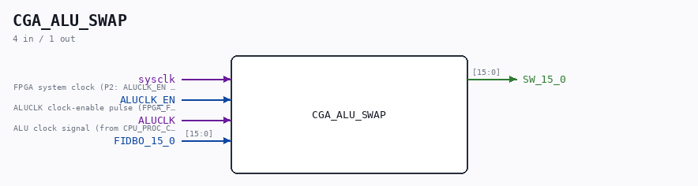
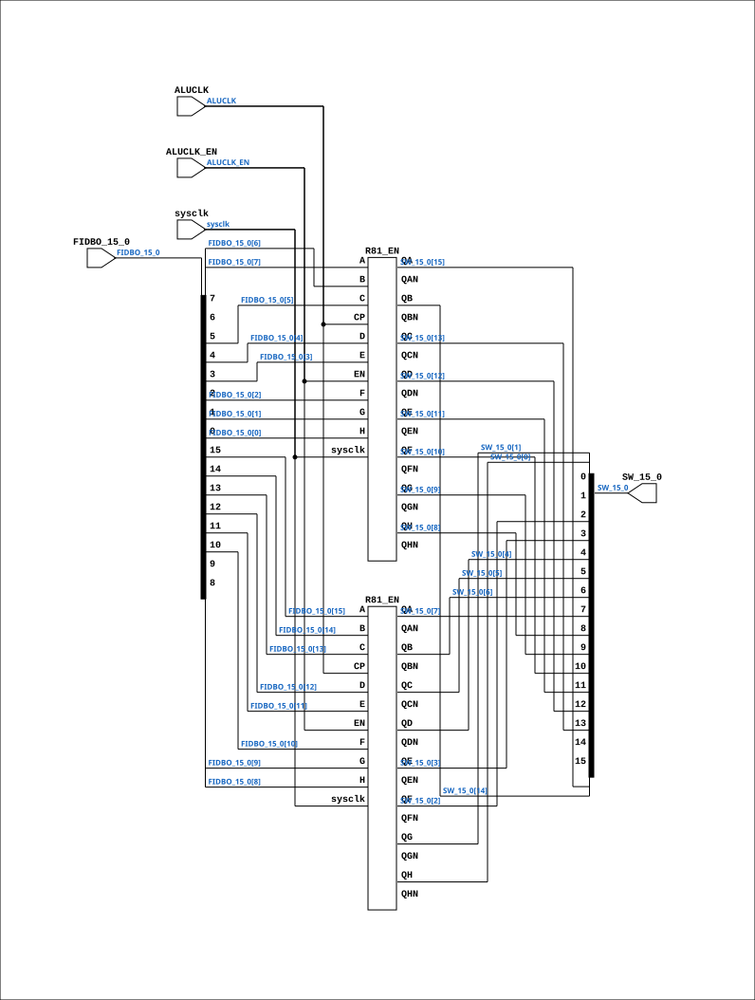

# CGA_ALU_SWAP

Source: `Verilog/DELILAH-CPU/CGA_ALU/circuit/CGA_ALU_SWAP.v`

<!-- Generated by Verilog/tests/module_doc.py from the //! comments in the source. Do not edit by hand - edit the RTL comments and regenerate. -->

<!-- HIERARCHY-NAV:BEGIN - written by Verilog/tests/gen_hierarchy.py, do not edit -->

**Where it sits** (Simulation): [ND120_TOP](../../../../doc/ND120_TOP.md) > [ND120_CORE](../../../../doc/ND120_CORE.md) > [ND3202D](../../../../CPU-BOARD-3202/circuit/doc/ND3202D.md) > [CPU_15](../../../../CPU-BOARD-3202/circuit/doc/CPU_15.md) > [CPU_PROC_32](../../../../CPU-BOARD-3202/circuit/doc/CPU_PROC_32.md) > [CPU_PROC_CGA_33](../../../../CPU-BOARD-3202/circuit/doc/CPU_PROC_CGA_33.md) > [CGA](../../../CGA/circuit/doc/CGA.md) > [CGA_ALU](CGA_ALU.md) > **CGA_ALU_SWAP**
- instance path: `CORE.CPU_BOARD.CPU.PROC.CGA.DELILAH.ALU.ALU_SWAP`

**Used in:** [CGA_ALU](CGA_ALU.md) (all tops)

**Contains:** [R81_EN](../../../../Shared/ndlib/doc/R81_EN.md) x2

[Module hierarchy](../../../../HIERARCHY.md) - [All modules](../../../../MODULES.md)

<!-- HIERARCHY-NAV:END -->



<!-- SCHEMATIC:BEGIN - written by Verilog/tests/gen_schematics.py, do not edit -->

## Schematic

Drawn from the Verilog: the yosys netlist of the Simulation (Verilator) build, instance `CORE.CPU_BOARD.CPU.PROC.CGA.DELILAH.ALU.ALU_SWAP`. Sub-modules are boxes (click the picture to open it full size; there every sub-module box links to its page, and every wire shows its Verilog name).

[](CGA_ALU_SWAP.svg)

<!-- SCHEMATIC:END -->

## Description

ND120 CGA (CPU Gate Array / DELILAH)
/CGA/ALU/SWAP
SWAP REGISTER
Page 51
SHEET 1 of 1
Last reviewed: 10-NOV-2024
Ronny Hansen

## Ports

| Direction | Width | Name | Description |
|---|---|---|---|
| input | `1` | `sysclk` | FPGA system clock (P2: ALUCLK_EN capture) |
| input | `1` | `ALUCLK_EN` | ALUCLK clock-enable pulse (FPGA_FF_MODE, else 0) |
| input | `1` | `ALUCLK` | ALU clock signal (from CPU_PROC_CGA_33.ALUCLK) |
| input | `[15:0]` | `FIDBO_15_0` |  |
| output | `[15:0]` | `SW_15_0` |  |

## Verilog source

[`Verilog/DELILAH-CPU/CGA_ALU/circuit/CGA_ALU_SWAP.v`](https://github.com/RetroCoreLabs/nd-120/blob/main/Verilog/DELILAH-CPU/CGA_ALU/circuit/CGA_ALU_SWAP.v) on GitHub.

<details markdown="1">
<summary>Show the Verilog of CGA_ALU_SWAP (115 lines)</summary>

```verilog
/**************************************************************************
** ND120 CGA (CPU Gate Array / DELILAH)                                  **
** /CGA/ALU/SWAP                                                         **
** SWAP REGISTER                                                         **
**                                                                       **
** Page 51                                                               **
** SHEET 1 of 1                                                          **
**                                                                       **
** Last reviewed: 10-NOV-2024                                            **
** Ronny Hansen                                                          **
***************************************************************************/


module CGA_ALU_SWAP (
    input        sysclk,     //! FPGA system clock (P2: ALUCLK_EN capture)
    input        ALUCLK_EN,  //! ALUCLK clock-enable pulse (FPGA_FF_MODE, else 0)
    input        ALUCLK,     //! ALU clock signal (from CPU_PROC_CGA_33.ALUCLK)
    input [15:0] FIDBO_15_0,

    output [15:0] SW_15_0
);

  /*******************************************************************************
   ** The wires are defined here                                                 **
   *******************************************************************************/
  wire [15:0] s_fidbo_15_0;
  wire [15:0] s_sw_15_0_out;
  wire        s_aluclk;
 
  /*******************************************************************************
   ** Here all input connections are defined                                     **
   *******************************************************************************/
  assign s_fidbo_15_0[15:0] = FIDBO_15_0;
  assign s_aluclk           = ALUCLK;

  // P2b (docs/plan-fix-unconstrained-clocks.md): in FF mode the ALUCLK-
  // clocked registers capture on posedge sysclk gated by ALUCLK_EN
  // (aligned to the ALUCLK rise) instead of clocking on the routed net.
`ifdef FPGA_FF_MODE
  localparam ALUCLK_CE = 1;
`else
  localparam ALUCLK_CE = 0;
`endif


  /*******************************************************************************
   ** Here all output connections are defined                                    **
   *******************************************************************************/
  assign SW_15_0            = s_sw_15_0_out[15:0];

  /*******************************************************************************
   ** Here all sub-circuits are defined                                          **
   *******************************************************************************/

  R81_EN #(.USE_ENABLE(ALUCLK_CE)) SWAP_LO_REG (
      .sysclk(sysclk),
      .EN(ALUCLK_EN),
      .CP(s_aluclk),
      .A  (s_fidbo_15_0[15]),
      .B  (s_fidbo_15_0[14]),
      .C  (s_fidbo_15_0[13]),
      .D  (s_fidbo_15_0[12]),
      .E  (s_fidbo_15_0[11]),
      .F  (s_fidbo_15_0[10]),
      .G  (s_fidbo_15_0[9]),
      .H  (s_fidbo_15_0[8]),
      .QA (s_sw_15_0_out[7]),
      .QAN(),
      .QB (s_sw_15_0_out[6]),
      .QBN(),
      .QC (s_sw_15_0_out[5]),
      .QCN(),
      .QD (s_sw_15_0_out[4]),
      .QDN(),
      .QE (s_sw_15_0_out[3]),
      .QEN(),
      .QF (s_sw_15_0_out[2]),
      .QFN(),
      .QG (s_sw_15_0_out[1]),
      .QGN(),
      .QH (s_sw_15_0_out[0]),
      .QHN()
  );

  R81_EN #(.USE_ENABLE(ALUCLK_CE)) SWAP_HI_REG (
      .sysclk(sysclk),
      .EN(ALUCLK_EN),
      .CP(s_aluclk),
      .A  (s_fidbo_15_0[7]),
      .B  (s_fidbo_15_0[6]),
      .C  (s_fidbo_15_0[5]),
      .D  (s_fidbo_15_0[4]),
      .E  (s_fidbo_15_0[3]),
      .F  (s_fidbo_15_0[2]),
      .G  (s_fidbo_15_0[1]),
      .H  (s_fidbo_15_0[0]),
      .QA (s_sw_15_0_out[15]),
      .QAN(),
      .QB (s_sw_15_0_out[14]),
      .QBN(),
      .QC (s_sw_15_0_out[13]),
      .QCN(),
      .QD (s_sw_15_0_out[12]),
      .QDN(),
      .QE (s_sw_15_0_out[11]),
      .QEN(),
      .QF (s_sw_15_0_out[10]),
      .QFN(),
      .QG (s_sw_15_0_out[9]),
      .QGN(),
      .QH (s_sw_15_0_out[8]),
      .QHN()
  );

endmodule
```

</details>
