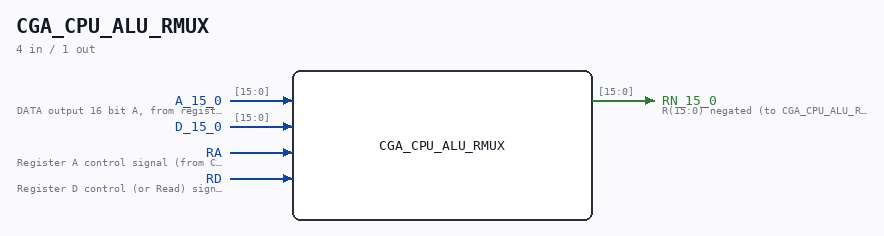
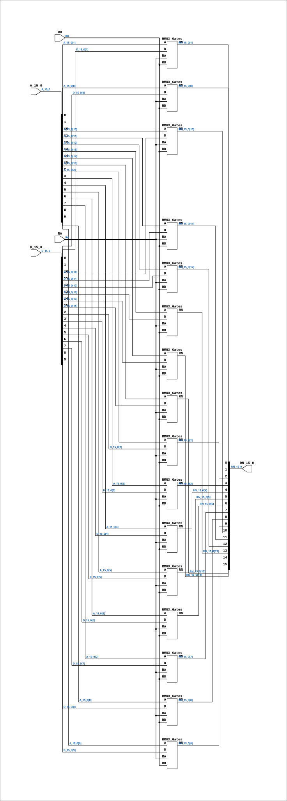

# CGA_CPU_ALU_RMUX

Source: `Verilog/DELILAH-CPU/CGA_ALU/circuit/CGA_CPU_ALU_RMUX.v`

<!-- Generated by Verilog/tests/module_doc.py from the //! comments in the source. Do not edit by hand - edit the RTL comments and regenerate. -->

<!-- HIERARCHY-NAV:BEGIN - written by Verilog/tests/gen_hierarchy.py, do not edit -->

**Where it sits** (Simulation): [ND120_TOP](../../../../doc/ND120_TOP.md) > [ND120_CORE](../../../../doc/ND120_CORE.md) > [ND3202D](../../../../CPU-BOARD-3202/circuit/doc/ND3202D.md) > [CPU_15](../../../../CPU-BOARD-3202/circuit/doc/CPU_15.md) > [CPU_PROC_32](../../../../CPU-BOARD-3202/circuit/doc/CPU_PROC_32.md) > [CPU_PROC_CGA_33](../../../../CPU-BOARD-3202/circuit/doc/CPU_PROC_CGA_33.md) > [CGA](../../../CGA/circuit/doc/CGA.md) > [CGA_ALU](CGA_ALU.md) > **CGA_CPU_ALU_RMUX**
- instance path: `CORE.CPU_BOARD.CPU.PROC.CGA.DELILAH.ALU.ALU_RMUX`

**Used in:** [CGA_ALU](CGA_ALU.md) (all tops)

**Contains:** [RMUX_Gates](../../../../Shared/ndlib/doc/RMUX_Gates.md) x16

[Module hierarchy](../../../../HIERARCHY.md) - [All modules](../../../../MODULES.md)

<!-- HIERARCHY-NAV:END -->



<!-- SCHEMATIC:BEGIN - written by Verilog/tests/gen_schematics.py, do not edit -->

## Schematic

Drawn from the Verilog: the yosys netlist of the Simulation (Verilator) build, instance `CORE.CPU_BOARD.CPU.PROC.CGA.DELILAH.ALU.ALU_RMUX`. Sub-modules are boxes (click the picture to open it full size; there every sub-module box links to its page, and every wire shows its Verilog name).

[](CGA_CPU_ALU_RMUX.svg)

<!-- SCHEMATIC:END -->

## Description

ND120 CGA (CPU Gate Array / DELILAH)
/CGA/CPU/ALU/RMUX
REGISTER MUX
Page 44
SHEET 1 of 1
Last reviewed: 10-NOV-2024
Ronny Hansen

## Ports

| Direction | Width | Name | Description |
|---|---|---|---|
| input | `[15:0]` | `A_15_0` | DATA output 16 bit A, from register selected by LAA_3_0 (from CGA_WRF.A_15_0) |
| input | `[15:0]` | `D_15_0` |  |
| input | `1` | `RA` | Register A control signal (from CGA_CPU_ALU_CONTR.RA) |
| input | `1` | `RD` | Register D control (or Read) signal (from CGA_CPU_ALU_CONTR.RD) |
| output | `[15:0]` | `RN_15_0` | R(15:0) negated (to CGA_CPU_ALU_RALU.RN_15_0) |

## Verilog source

[`Verilog/DELILAH-CPU/CGA_ALU/circuit/CGA_CPU_ALU_RMUX.v`](https://github.com/RetroCoreLabs/nd-120/blob/main/Verilog/DELILAH-CPU/CGA_ALU/circuit/CGA_CPU_ALU_RMUX.v) on GitHub.

<details markdown="1">
<summary>Show the Verilog of CGA_CPU_ALU_RMUX (183 lines)</summary>

```verilog
/**************************************************************************
** ND120 CGA (CPU Gate Array / DELILAH)                                  **
** /CGA/CPU/ALU/RMUX                                                     **
** REGISTER MUX                                                          **
**                                                                       **
** Page 44                                                               **
** SHEET 1 of 1                                                          **
**                                                                       **
** Last reviewed: 10-NOV-2024                                            **
** Ronny Hansen                                                          **
***************************************************************************/

module CGA_CPU_ALU_RMUX (
    input [15:0] A_15_0,  //! DATA output 16 bit A, from register selected by LAA_3_0 (from CGA_WRF.A_15_0)
    input [15:0] D_15_0,
    input        RA,  //! Register A control signal (from CGA_CPU_ALU_CONTR.RA)
    input        RD,  //! Register D control (or Read) signal (from CGA_CPU_ALU_CONTR.RD)

    output [15:0] RN_15_0  //! R(15:0) negated (to CGA_CPU_ALU_RALU.RN_15_0)
);

  /*******************************************************************************
   ** The wires are defined here                                                 **
   *******************************************************************************/
  wire [15:0] s_d_15_0;
  wire [15:0] s_a_15_0;
  wire [15:0] s_rn_15_0_out;
  wire        s_ra;
  wire        s_rd;

  /*******************************************************************************
   ** The module functionality is described here                                 **
   *******************************************************************************/

  /*******************************************************************************
   ** Here all input connections are defined                                     **
   *******************************************************************************/
  assign s_a_15_0[15:0] = A_15_0;
  assign s_d_15_0[15:0] = D_15_0;
  assign s_rd           = RD;
  assign s_ra           = RA;

  /*******************************************************************************
   ** Here all output connections are defined                                    **
   *******************************************************************************/
  assign RN_15_0        = s_rn_15_0_out[15:0];

  /*******************************************************************************
   ** Here all sub-circuits are defined                                          **
   *******************************************************************************/

 //TODO: Refactor to ONE 16 bits mux

  RMUX_Gates RN15 (
      .A (s_a_15_0[15]),
      .D (s_d_15_0[15]),
      .RA(s_ra),
      .RD(s_rd),
      .RN(s_rn_15_0_out[15])
  );

  RMUX_Gates RN14 (
      .A (s_a_15_0[14]),
      .D (s_d_15_0[14]),
      .RA(s_ra),
      .RD(s_rd),
      .RN(s_rn_15_0_out[14])
  );

  RMUX_Gates RN13 (
      .A (s_a_15_0[13]),
      .D (s_d_15_0[13]),
      .RA(s_ra),
      .RD(s_rd),
      .RN(s_rn_15_0_out[13])
  );

  RMUX_Gates RN12 (
      .A (s_a_15_0[12]),
      .D (s_d_15_0[12]),
      .RA(s_ra),
      .RD(s_rd),
      .RN(s_rn_15_0_out[12])
  );

  RMUX_Gates RN11 (
      .A (s_a_15_0[11]),
      .D (s_d_15_0[11]),
      .RA(s_ra),
      .RD(s_rd),
      .RN(s_rn_15_0_out[11])
  );

  RMUX_Gates RN10 (
      .A (s_a_15_0[10]),
      .D (s_d_15_0[10]),
      .RA(s_ra),
      .RD(s_rd),
      .RN(s_rn_15_0_out[10])
  );

  RMUX_Gates RN9 (
      .A (s_a_15_0[9]),
      .D (s_d_15_0[9]),
      .RA(s_ra),
      .RD(s_rd),
      .RN(s_rn_15_0_out[9])
  );

  RMUX_Gates RN8 (
      .A (s_a_15_0[8]),
      .D (s_d_15_0[8]),
      .RA(s_ra),
      .RD(s_rd),
      .RN(s_rn_15_0_out[8])
  );

  RMUX_Gates RN7 (
      .A (s_a_15_0[7]),
      .D (s_d_15_0[7]),
      .RA(s_ra),
      .RD(s_rd),
      .RN(s_rn_15_0_out[7])
  );

  RMUX_Gates RN6 (
      .A (s_a_15_0[6]),
      .D (s_d_15_0[6]),
      .RA(s_ra),
      .RD(s_rd),
      .RN(s_rn_15_0_out[6])
  );

  RMUX_Gates RN5 (
      .A (s_a_15_0[5]),
      .D (s_d_15_0[5]),
      .RA(s_ra),
      .RD(s_rd),
      .RN(s_rn_15_0_out[5])
  );

  RMUX_Gates RN4 (
      .A (s_a_15_0[4]),
      .D (s_d_15_0[4]),
      .RA(s_ra),
      .RD(s_rd),
      .RN(s_rn_15_0_out[4])
  );

  RMUX_Gates RN3 (
      .A (s_a_15_0[3]),
      .D (s_d_15_0[3]),
      .RA(s_ra),
      .RD(s_rd),
      .RN(s_rn_15_0_out[3])
  );

  RMUX_Gates RN2 (
      .A (s_a_15_0[2]),
      .D (s_d_15_0[2]),
      .RA(s_ra),
      .RD(s_rd),
      .RN(s_rn_15_0_out[2])
  );

  RMUX_Gates RN1 (
      .A (s_a_15_0[1]),
      .D (s_d_15_0[1]),
      .RA(s_ra),
      .RD(s_rd),
      .RN(s_rn_15_0_out[1])
  );

  RMUX_Gates RN0 (
      .A (s_a_15_0[0]),
      .D (s_d_15_0[0]),
      .RA(s_ra),
      .RD(s_rd),
      .RN(s_rn_15_0_out[0])
  );


endmodule
```

</details>
