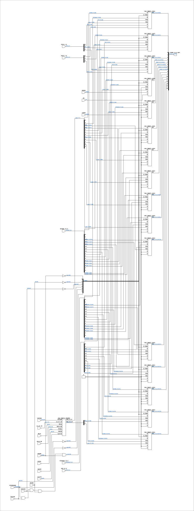

# CGA_IDBCTL

Source: `Verilog/DELILAH-CPU/CGA_IDBCTL/circuit/CGA_IDBCTL.v`

<!-- Generated by Verilog/tests/module_doc.py from the //! comments in the source. Do not edit by hand - edit the RTL comments and regenerate. -->

<!-- HIERARCHY-NAV:BEGIN - written by Verilog/tests/gen_hierarchy.py, do not edit -->

**Where it sits** (Simulation): [ND120_TOP](../../../../doc/ND120_TOP.md) > [ND120_CORE](../../../../doc/ND120_CORE.md) > [ND3202D](../../../../CPU-BOARD-3202/circuit/doc/ND3202D.md) > [CPU_15](../../../../CPU-BOARD-3202/circuit/doc/CPU_15.md) > [CPU_PROC_32](../../../../CPU-BOARD-3202/circuit/doc/CPU_PROC_32.md) > [CPU_PROC_CGA_33](../../../../CPU-BOARD-3202/circuit/doc/CPU_PROC_CGA_33.md) > [CGA](../../../CGA/circuit/doc/CGA.md) > **CGA_IDBCTL**
- instance path: `CORE.CPU_BOARD.CPU.PROC.CGA.DELILAH.IDBCTL`

**Used in:** [CGA](../../../CGA/circuit/doc/CGA.md) (all tops)

**Contains:** [CGA_IDBCTL_PGSREG](CGA_IDBCTL_PGSREG.md), [CGA_IDBCTL_SEL6](CGA_IDBCTL_SEL6.md) x16

[Module hierarchy](../../../../HIERARCHY.md) - [All modules](../../../../MODULES.md)

<!-- HIERARCHY-NAV:END -->


<!-- SCHEMATIC:BEGIN - written by Verilog/tests/gen_schematics.py, do not edit -->

## Schematic

Drawn from the Verilog: the yosys netlist of the Simulation (Verilator) build, instance `CORE.CPU_BOARD.CPU.PROC.CGA.DELILAH.IDBCTL`. Sub-modules are boxes (click the picture to open it full size; there every sub-module box links to its page, and every wire shows its Verilog name).

[](CGA_IDBCTL.svg)

<!-- SCHEMATIC:END -->

## Description

CPU GATE ARRAY - CGA - DELILAH
CGA/IDBCTL - IDB Control Logic
PDF page 97 of 108
Last reviewed: 02-FEB-2025
Ronny Hansen

## Ports

| Direction | Width | Name | Description |
|---|---|---|---|
| input | `1` | `sysclk` | FPGA system clock (P2: MCLK_EN capture) |
| input | `1` | `MCLK_EN` | MCLK clock-enable pulse (FPGA_FF_MODE, else 0) |
| input | `1` | `EPCRN` | EPCR negated (from CGA_DCD.EPCRN) |
| input | `1` | `EPGSN` | EPGS negated (from CGA_DCD.EPGSN) |
| input | `1` | `EPICMASKN` | EPIC Mask, active low (from CGA_INTR.EPICMASKN) |
| input | `1` | `EPICSN` | EPICS negated (from CGA_DCD.EPICSN) |
| input | `1` | `EPICVN` | EPICV negated (from CGA_DCD.EPICVN) |
| input | `1` | `FETCHN` | Fetch negated (from CGA_DCD.FETCHN) |
| input | `1` | `HIGSN` | High Speed signal, active low (from CGA_INTR.HIGSN) |
| input | `[11:0]` | `LA_21_10` | Latch Address bits 23 to 10 (from CGA_MAC.LA_23_10[11:0]) |
| input | `1` | `LOGSN` | Logical Segment Number, active low (from CGA_INTR.LOGSN) |
| input | `1` | `MCLK` | Microcycle clock (= TERM outside RWCS, stretched during RWCS) (from CPU_PROC_CGA_33.MCLK) |
| input | `[15:0]` | `PCR_15_0` | PCR registered readback tap for IDBCTL/SEL6 (IDB loop cut) (from CGA_MAC.PCR_RB_15_0) |
| input | `1` | `PD` | Power Down signal (from CGA_INTR.PD) |
| input | `[15:0]` | `PICMASK_15_0` | PIC Mask, 16-bit (from CGA_INTR.PICMASK_15_0) |
| input | `[2:0]` | `PICS_2_0` | PIC Select, 3-bit (from CGA_INTR.PICS_2_0) |
| input | `[2:0]` | `PICV_2_0` | PIC Vector, 3-bit (from CGA_INTR.PICV_2_0) |
| input | `1` | `PVIOL` |  |
| input | `1` | `VACCN` | VACC_n - passed straight down to CGA_IDBCTL_PGSREG as its load enable |
| input | `[15:0]` | `XFIDBI_15_0` | A output  (Connect to internal XFIDBI data bus) (from BusDriver16.A_15_0_OUT) |
| output | `[15:0]` | `FIDBI_15_0_OUT` |  |

## Verilog source

[`Verilog/DELILAH-CPU/CGA_IDBCTL/circuit/CGA_IDBCTL.v`](https://github.com/RetroCoreLabs/nd-120/blob/main/Verilog/DELILAH-CPU/CGA_IDBCTL/circuit/CGA_IDBCTL.v) on GitHub.

<details markdown="1">
<summary>Show the Verilog of CGA_IDBCTL (315 lines)</summary>

```verilog
/**************************************************************************
** CPU GATE ARRAY - CGA - DELILAH                                        **
**                                                                       **
** CGA/IDBCTL - IDB Control Logic                                        **
**                                                                       **
** PDF page 97 of 108                                                    **
**                                                                       **
** Last reviewed: 02-FEB-2025                                            **
** Ronny Hansen                                                          **
***************************************************************************/


module CGA_IDBCTL (
    // System input signals
    input        sysclk,   //! FPGA system clock (P2: MCLK_EN capture)
    input        MCLK_EN,  //! MCLK clock-enable pulse (FPGA_FF_MODE, else 0)

    // Input signal
    input        EPCRN,    //! EPCR negated (from CGA_DCD.EPCRN)
    input        EPGSN,    //! EPGS negated (from CGA_DCD.EPGSN)
    input        EPICMASKN,  //! EPIC Mask, active low (from CGA_INTR.EPICMASKN)
    input        EPICSN,   //! EPICS negated (from CGA_DCD.EPICSN)
    input        EPICVN,   //! EPICV negated (from CGA_DCD.EPICVN)
    input        FETCHN,   //! Fetch negated (from CGA_DCD.FETCHN)
    input        HIGSN,    //! High Speed signal, active low (from CGA_INTR.HIGSN)
    input [11:0] LA_21_10,  //! Latch Address bits 23 to 10 (from CGA_MAC.LA_23_10[11:0])
    input        LOGSN,    //! Logical Segment Number, active low (from CGA_INTR.LOGSN)
    input        MCLK,     //! Microcycle clock (= TERM outside RWCS, stretched during RWCS) (from CPU_PROC_CGA_33.MCLK)
    input [15:0] PCR_15_0,  //! PCR registered readback tap for IDBCTL/SEL6 (IDB loop cut) (from CGA_MAC.PCR_RB_15_0)
    input        PD,       //! Power Down signal (from CGA_INTR.PD)
    input [15:0] PICMASK_15_0,  //! PIC Mask, 16-bit (from CGA_INTR.PICMASK_15_0)
    input [ 2:0] PICS_2_0,  //! PIC Select, 3-bit (from CGA_INTR.PICS_2_0)
    input [ 2:0] PICV_2_0,  //! PIC Vector, 3-bit (from CGA_INTR.PICV_2_0)
    input        PVIOL,
    input        VACCN,        //! VACC_n - passed straight down to CGA_IDBCTL_PGSREG as its load enable
    input [15:0] XFIDBI_15_0,  //! A output  (Connect to internal XFIDBI data bus) (from BusDriver16.A_15_0_OUT)

    // Output signal
    output [15:0] FIDBI_15_0_OUT
);


  /*******************************************************************************
   ** The wires are defined here                                                 **
   *******************************************************************************/
  wire        s_epcr_n;
  wire        s_epgs_n;
  wire        s_epicmask_n;
  wire        s_epics_n;
  wire        s_epicv_n;
  wire        s_fetch_n;
  wire        s_gnd;
  wire        s_higs_n;
  wire        s_logs_n;
  wire        s_mclk;
  wire        s_pdf;
  wire        s_pviol;
  wire        s_vacc_n;
  wire [ 1:0] s_pgs_15_14;
  wire [11:0] s_la_21_10;
  wire [11:0] s_pgs_11_0;
  wire [15:0] s_fidbi_15_0_out;
  wire [15:0] s_pcr_15_0;
  wire [15:0] s_picmask_15_0;
  wire [15:0] s_xfidbi_15_0;
  wire [ 2:0] s_pics_2_0;
  wire [ 2:0] s_picv_2_0;
  wire [ 5:0] s_epins;

  /*******************************************************************************
   ** The module functionality is described here                                 **
   *******************************************************************************/

  /*******************************************************************************
   ** Here all input connections are defined                                     **
   *******************************************************************************/
  assign s_epcr_n             = EPCRN;
  assign s_epgs_n             = EPGSN;
  assign s_epicmask_n         = EPICMASKN;
  assign s_epics_n            = EPICSN;
  assign s_epicv_n            = EPICVN;
  assign s_fetch_n            = FETCHN;
  assign s_higs_n             = HIGSN;
  assign s_la_21_10[11:0]     = LA_21_10;
  assign s_logs_n             = LOGSN;
  assign s_mclk               = MCLK;
  assign s_pcr_15_0[15:0]     = PCR_15_0;
  assign s_pdf                = PD;
  assign s_picmask_15_0[15:0] = PICMASK_15_0;
  assign s_pics_2_0[2:0]      = PICS_2_0;
  assign s_picv_2_0[2:0]      = PICV_2_0;
  assign s_pviol              = PVIOL;
  assign s_vacc_n             = VACCN;
  assign s_xfidbi_15_0[15:0]  = XFIDBI_15_0;

  /*******************************************************************************
   ** Here all output connections are defined                                    **
   *******************************************************************************/
  assign FIDBI_15_0_OUT       = s_fidbi_15_0_out[15:0];

  /*******************************************************************************
   ** Here all in-lined components are defined                                   **
   *******************************************************************************/

  // Ground
  assign s_gnd                = 1'b0;

  // Assign signals to EPINS
  assign s_epins[0]           = ~s_epgs_n;
  assign s_epins[1]           = ~s_epcr_n;
  assign s_epins[2]           = ~s_epics_n;
  assign s_epins[3]           = ~s_epicv_n;
  assign s_epins[4]           = ~s_epicmask_n;
  assign s_epins[5]           = (s_epicmask_n & s_epicv_n & s_epics_n & s_epcr_n & s_epgs_n);


  // Code to make LINTER not complaing about bits not read in PCR 6:3
  (* keep = "true", DONT_TOUCH = "true" *) wire [4:0] unused_PCR_bits;
  assign unused_PCR_bits[4:0] = s_pcr_15_0[6:3];

  /*******************************************************************************
   ** Here all sub-circuits are defined                                          **
   *******************************************************************************/
  CGA_IDBCTL_SEL6 IDB15 (
      .D(s_xfidbi_15_0[15]),
      .D0(s_fidbi_15_0_out[15]),
      .E_PINS(s_epins[5:0]),
      .M(s_picmask_15_0[15]),
      .PCR(s_pcr_15_0[15]),
      .PGS(s_pgs_15_14[1]),
      .S(s_gnd),
      .V(s_gnd)
  );

  CGA_IDBCTL_SEL6 IDB14 (
      .D(s_xfidbi_15_0[14]),
      .D0(s_fidbi_15_0_out[14]),
      .E_PINS(s_epins[5:0]),
      .M(s_picmask_15_0[14]),
      .PCR(s_pcr_15_0[14]),
      .PGS(s_pgs_15_14[0]),
      .S(s_gnd),
      .V(s_gnd)
  );

  CGA_IDBCTL_SEL6 IDB13 (
      .D(s_xfidbi_15_0[13]),
      .D0(s_fidbi_15_0_out[13]),
      .E_PINS(s_epins[5:0]),
      .M(s_picmask_15_0[13]),
      .PCR(s_pcr_15_0[13]),
      .PGS(s_gnd),
      .S(s_gnd),
      .V(s_gnd)
  );

  CGA_IDBCTL_SEL6 IDB12 (
      .D(s_xfidbi_15_0[12]),
      .D0(s_fidbi_15_0_out[12]),
      .E_PINS(s_epins[5:0]),
      .M(s_picmask_15_0[12]),
      .PCR(s_pcr_15_0[12]),
      .PGS(s_gnd),
      .S(s_gnd),
      .V(s_gnd)
  );

  CGA_IDBCTL_SEL6 IDB11 (
      .D(s_xfidbi_15_0[11]),
      .D0(s_fidbi_15_0_out[11]),
      .E_PINS(s_epins[5:0]),
      .M(s_picmask_15_0[11]),
      .PCR(s_pcr_15_0[11]),
      .PGS(s_pgs_11_0[11]),
      .S(s_gnd),
      .V(s_gnd)
  );

  CGA_IDBCTL_SEL6 IDB10 (
      .D(s_xfidbi_15_0[10]),
      .D0(s_fidbi_15_0_out[10]),
      .E_PINS(s_epins[5:0]),
      .M(s_picmask_15_0[10]),
      .PCR(s_pcr_15_0[10]),
      .PGS(s_pgs_11_0[10]),
      .S(1'b0),
      .V(1'b0)
  );

  CGA_IDBCTL_SEL6 IDB9 (
      .D(s_xfidbi_15_0[9]),
      .D0(s_fidbi_15_0_out[9]),
      .E_PINS(s_epins[5:0]),
      .M(s_picmask_15_0[9]),
      .PCR(s_pcr_15_0[9]),
      .PGS(s_pgs_11_0[9]),
      .S(s_gnd),
      .V(s_gnd)
  );

  CGA_IDBCTL_SEL6 IDB8 (
      .D(s_xfidbi_15_0[8]),
      .D0(s_fidbi_15_0_out[8]),
      .E_PINS(s_epins[5:0]),
      .M(s_picmask_15_0[8]),
      .PCR(s_pcr_15_0[8]),
      .PGS(s_pgs_11_0[8]),
      .S(s_gnd),
      .V(s_gnd)
  );

  CGA_IDBCTL_SEL6 IDB7 (
      .D(s_xfidbi_15_0[7]),
      .D0(s_fidbi_15_0_out[7]),
      .E_PINS(s_epins[5:0]),
      .M(s_picmask_15_0[7]),
      .PCR(s_pcr_15_0[7]),
      .PGS(s_pgs_11_0[7]),
      .S(s_gnd),
      .V(s_gnd)
  );

  CGA_IDBCTL_SEL6 IDB6 (
      .D(s_xfidbi_15_0[6]),
      .D0(s_fidbi_15_0_out[6]),
      .E_PINS(s_epins[5:0]),
      .M(s_picmask_15_0[6]),
      .PCR(s_gnd),
      .PGS(s_pgs_11_0[6]),
      .S(s_gnd),
      .V(s_gnd)
  );

  CGA_IDBCTL_SEL6 IDB5 (
      .D(s_xfidbi_15_0[5]),
      .D0(s_fidbi_15_0_out[5]),
      .E_PINS(s_epins[5:0]),
      .M(s_picmask_15_0[5]),
      .PCR(s_gnd),
      .PGS(s_pgs_11_0[5]),
      .S(s_gnd),
      .V(s_gnd)
  );

  CGA_IDBCTL_SEL6 IDB4 (
      .D(s_xfidbi_15_0[4]),
      .D0(s_fidbi_15_0_out[4]),
      .E_PINS(s_epins[5:0]),
      .M(s_picmask_15_0[4]),
      .PCR(s_gnd),
      .PGS(s_pgs_11_0[4]),
      .S(s_logs_n),
      .V(s_gnd)
  );

  CGA_IDBCTL_SEL6 IDB3 (
      .D(s_xfidbi_15_0[3]),
      .D0(s_fidbi_15_0_out[3]),
      .E_PINS(s_epins[5:0]),
      .M(s_picmask_15_0[3]),
      .PCR(s_gnd),
      .PGS(s_pgs_11_0[3]),
      .S(s_higs_n),
      .V(s_pdf)
  );

  CGA_IDBCTL_SEL6 IDB2 (
      .D(s_xfidbi_15_0[2]),
      .D0(s_fidbi_15_0_out[2]),
      .E_PINS(s_epins[5:0]),
      .M(s_picmask_15_0[2]),
      .PCR(s_pcr_15_0[2]),
      .PGS(s_pgs_11_0[2]),
      .S(s_pics_2_0[2]),
      .V(s_picv_2_0[2])
  );

  CGA_IDBCTL_SEL6 IDB1 (
      .D(s_xfidbi_15_0[1]),
      .D0(s_fidbi_15_0_out[1]),
      .E_PINS(s_epins[5:0]),
      .M(s_picmask_15_0[1]),
      .PCR(s_pcr_15_0[1]),
      .PGS(s_pgs_11_0[1]),
      .S(s_pics_2_0[1]),
      .V(s_picv_2_0[1])
  );

  CGA_IDBCTL_SEL6 IDB0 (
      .D(s_xfidbi_15_0[0]),
      .D0(s_fidbi_15_0_out[0]),
      .E_PINS(s_epins[5:0]),
      .M(s_picmask_15_0[0]),
      .PCR(s_pcr_15_0[0]),
      .PGS(s_pgs_11_0[0]),
      .S(s_pics_2_0[0]),
      .V(s_picv_2_0[0])
  );


  CGA_IDBCTL_PGSREG PGSREG (
      .sysclk(sysclk),
      .MCLK_EN(MCLK_EN),
      .FETCHN(s_fetch_n),
      .LA_21_10(s_la_21_10[11:0]),
      .MCLK(s_mclk),
      .PGS_11_0(s_pgs_11_0[11:0]),
      .PGS_15_14(s_pgs_15_14[1:0]),
      .PVIOL(s_pviol),
      .VACCN(s_vacc_n)
  );

endmodule
```

</details>
