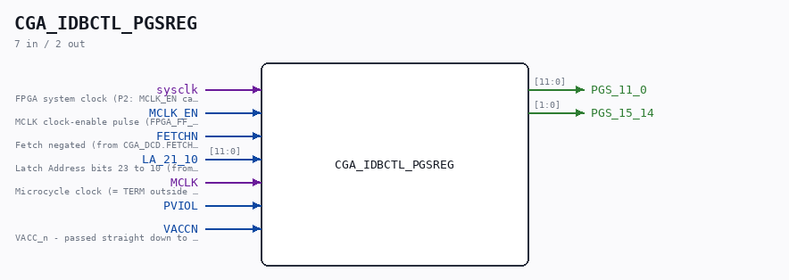

# CGA_IDBCTL_PGSREG

Source: `Verilog/DELILAH-CPU/CGA_IDBCTL/circuit/CGA_IDBCTL_PGSREG.v`

<!-- Generated by Verilog/tests/module_doc.py from the //! comments in the source. Do not edit by hand - edit the RTL comments and regenerate. -->

<!-- HIERARCHY-NAV:BEGIN - written by Verilog/tests/gen_hierarchy.py, do not edit -->

**Where it sits** (Simulation): [ND120_TOP](../../../../doc/ND120_TOP.md) > [ND120_CORE](../../../../doc/ND120_CORE.md) > [ND3202D](../../../../CPU-BOARD-3202/circuit/doc/ND3202D.md) > [CPU_15](../../../../CPU-BOARD-3202/circuit/doc/CPU_15.md) > [CPU_PROC_32](../../../../CPU-BOARD-3202/circuit/doc/CPU_PROC_32.md) > [CPU_PROC_CGA_33](../../../../CPU-BOARD-3202/circuit/doc/CPU_PROC_CGA_33.md) > [CGA](../../../CGA/circuit/doc/CGA.md) > [CGA_IDBCTL](CGA_IDBCTL.md) > **CGA_IDBCTL_PGSREG**
- instance path: `CORE.CPU_BOARD.CPU.PROC.CGA.DELILAH.IDBCTL.PGSREG`

**Used in:** [CGA_IDBCTL](CGA_IDBCTL.md) (all tops)

**Contains:** [SCAN_FF_EN](../../../../Shared/ndlib/doc/SCAN_FF_EN.md) x14

[Module hierarchy](../../../../HIERARCHY.md) - [All modules](../../../../MODULES.md)

<!-- HIERARCHY-NAV:END -->

## Description

CPU GATE ARRAY - CGA - DELILAH
CGA/IDBCTL/PGSREG - IDB Control Logic
PDF page 98 of 108
Last reviewed: 9-NOV-2024
Ronny Hansen

## Ports

| Direction | Width | Name | Description |
|---|---|---|---|
| input | `1` | `sysclk` | FPGA system clock (P2: MCLK_EN capture) |
| input | `1` | `MCLK_EN` | MCLK clock-enable pulse (FPGA_FF_MODE, else 0) |
| input | `1` | `FETCHN` |  |
| input | `[11:0]` | `LA_21_10` |  |
| input | `1` | `MCLK` |  |
| input | `1` | `PVIOL` |  |
| input | `1` | `VACCN` |  |
| output | `[11:0]` | `PGS_11_0` |  |
| output | `[1:0]` | `PGS_15_14` |  |
