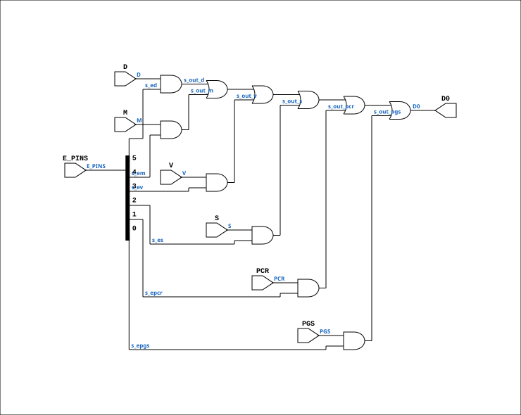

# CGA_IDBCTL_SEL6

Source: `Verilog/DELILAH-CPU/CGA_IDBCTL/circuit/CGA_IDBCTL_SEL6.v`

<!-- Generated by Verilog/tests/module_doc.py from the //! comments in the source. Do not edit by hand - edit the RTL comments and regenerate. -->

<!-- HIERARCHY-NAV:BEGIN - written by Verilog/tests/gen_hierarchy.py, do not edit -->

**Where it sits** (Simulation): [ND120_TOP](../../../../doc/ND120_TOP.md) > [ND120_CORE](../../../../doc/ND120_CORE.md) > [ND3202D](../../../../CPU-BOARD-3202/circuit/doc/ND3202D.md) > [CPU_15](../../../../CPU-BOARD-3202/circuit/doc/CPU_15.md) > [CPU_PROC_32](../../../../CPU-BOARD-3202/circuit/doc/CPU_PROC_32.md) > [CPU_PROC_CGA_33](../../../../CPU-BOARD-3202/circuit/doc/CPU_PROC_CGA_33.md) > [CGA](../../../CGA/circuit/doc/CGA.md) > [CGA_IDBCTL](CGA_IDBCTL.md) > **CGA_IDBCTL_SEL6**
- instance path: `CORE.CPU_BOARD.CPU.PROC.CGA.DELILAH.IDBCTL.IDB15`

**Used in:** [CGA_IDBCTL](CGA_IDBCTL.md) (all tops)

**Contains:** no other modules.

[Module hierarchy](../../../../HIERARCHY.md) - [All modules](../../../../MODULES.md)

<!-- HIERARCHY-NAV:END -->


<!-- SCHEMATIC:BEGIN - written by Verilog/tests/gen_schematics.py, do not edit -->

## Schematic

Drawn from the Verilog: the yosys netlist of the Simulation (Verilator) build, instance `CORE.CPU_BOARD.CPU.PROC.CGA.DELILAH.IDBCTL.IDB15`. Sub-modules are boxes (click the picture to open it full size; there every sub-module box links to its page, and every wire shows its Verilog name).

[](CGA_IDBCTL_SEL6.svg)

<!-- SCHEMATIC:END -->

## Description

CPU GATE ARRAY - CGA - DELILAH
CGA/IDBCTL/SEL6 - IDB Control Logic
PDF page 99 of 108
Last reviewed: 9-NOV-2024
Ronny Hansen

## Ports

| Direction | Width | Name | Description |
|---|---|---|---|
| input | `1` | `D` |  |
| input | `[5:0]` | `E_PINS` |  |
| input | `1` | `M` |  |
| input | `1` | `PCR` |  |
| input | `1` | `PGS` |  |
| input | `1` | `S` |  |
| input | `1` | `V` |  |
| output | `1` | `D0` |  |

## Verilog source

[`Verilog/DELILAH-CPU/CGA_IDBCTL/circuit/CGA_IDBCTL_SEL6.v`](https://github.com/RetroCoreLabs/nd-120/blob/main/Verilog/DELILAH-CPU/CGA_IDBCTL/circuit/CGA_IDBCTL_SEL6.v) on GitHub.

<details markdown="1">
<summary>Show the Verilog of CGA_IDBCTL_SEL6 (98 lines)</summary>

```verilog
/**************************************************************************
** CPU GATE ARRAY - CGA - DELILAH                                        **
**                                                                       **
** CGA/IDBCTL/SEL6 - IDB Control Logic                                   **
**                                                                       **
** PDF page 99 of 108                                                    **
**                                                                       **
** Last reviewed: 9-NOV-2024                                             **
** Ronny Hansen                                                          **
***************************************************************************/


module CGA_IDBCTL_SEL6 (
    input D,

    //ED=5, EM=4, EV=3, ES=2, EPCR=1, EPGS=0
    input [5:0] E_PINS,

    input M,
    input PCR,
    input PGS,
    input S,
    input V,

    output D0
);


  /*******************************************************************************
   ** The wires are defined here                                                 **
   *******************************************************************************/

  wire s_out_v;
  wire s_out_m;
  wire s_out_pcr;
  wire s_out_d;
  wire s_out_s;
  wire s_out_pgs;

  wire s_out_d0;

  wire s_d;
  wire s_m;
  wire s_v;
  wire s_s;
  wire s_pcr;
  wire s_pgs;

  wire s_ed;
  wire s_em;
  wire s_ev;
  wire s_es;
  wire s_epcr;
  wire s_epgs;

  /*******************************************************************************
   ** Here all input connections are defined                                     **
   *******************************************************************************/

  assign s_d       = D;
  assign s_m       = M;
  assign s_v       = V;
  assign s_s       = S;
  assign s_pcr     = PCR;
  assign s_pgs     = PGS;

  assign s_ed      = E_PINS[5];
  assign s_em      = E_PINS[4];
  assign s_ev      = E_PINS[3];
  assign s_es      = E_PINS[2];
  assign s_epcr    = E_PINS[1];
  assign s_epgs    = E_PINS[0];


  /*******************************************************************************
   ** Here all output connections are defined                                    **
   *******************************************************************************/
  assign D0        = s_out_d0;

  /*******************************************************************************
   ** Here all normal components are defined                                     **
   *******************************************************************************/

  /* Refactored the code to not use negated output on the AND chips, and removed the negation on the input on the 6 pin OR */

  assign s_out_d   = (s_d & s_ed);
  assign s_out_m   = (s_m & s_em);
  assign s_out_v   = (s_v & s_ev);
  assign s_out_s   = (s_s & s_es);
  assign s_out_pcr = (s_pcr & s_epcr);
  assign s_out_pgs = (s_pgs & s_epgs);

  assign s_out_d0  = s_out_d | s_out_m | s_out_v | s_out_s | s_out_pcr | s_out_pgs;


endmodule
```

</details>
