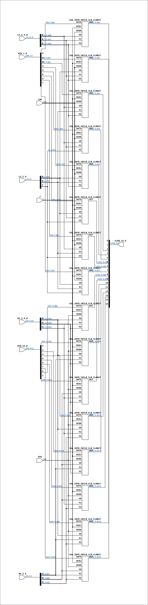

# CGA_INTR_CNTLR_CLR

Source: `Verilog/DELILAH-CPU/CGA_INTR/circuit/CGA_INTR_CNTLR_CLR.v`

<!-- Generated by Verilog/tests/module_doc.py from the //! comments in the source. Do not edit by hand - edit the RTL comments and regenerate. -->

<!-- HIERARCHY-NAV:BEGIN - written by Verilog/tests/gen_hierarchy.py, do not edit -->

**Where it sits** (Simulation): [ND120_TOP](../../../../doc/ND120_TOP.md) > [ND120_CORE](../../../../doc/ND120_CORE.md) > [ND3202D](../../../../CPU-BOARD-3202/circuit/doc/ND3202D.md) > [CPU_15](../../../../CPU-BOARD-3202/circuit/doc/CPU_15.md) > [CPU_PROC_32](../../../../CPU-BOARD-3202/circuit/doc/CPU_PROC_32.md) > [CPU_PROC_CGA_33](../../../../CPU-BOARD-3202/circuit/doc/CPU_PROC_CGA_33.md) > [CGA](../../../CGA/circuit/doc/CGA.md) > [CGA_INTR](CGA_INTR.md) > [CGA_INTR_CNTLR](CGA_INTR_CNTLR.md) > **CGA_INTR_CNTLR_CLR**
- instance path: `CORE.CPU_BOARD.CPU.PROC.CGA.DELILAH.INTR.CNTLR.CLR_CLEAR_CONTROL`

**Used in:** [CGA_INTR_CNTLR](CGA_INTR_CNTLR.md) (all tops)

**Contains:** [CGA_INTR_CNTLR_CLR_CLRBIT](CGA_INTR_CNTLR_CLR_CLRBIT.md) x16

[Module hierarchy](../../../../HIERARCHY.md) - [All modules](../../../../MODULES.md)

<!-- HIERARCHY-NAV:END -->


<!-- SCHEMATIC:BEGIN - written by Verilog/tests/gen_schematics.py, do not edit -->

## Schematic

Drawn from the Verilog: the yosys netlist of the Simulation (Verilator) build, instance `CORE.CPU_BOARD.CPU.PROC.CGA.DELILAH.INTR.CNTLR.CLR_CLEAR_CONTROL`. Sub-modules are boxes (click the picture to open it full size; there every sub-module box links to its page, and every wire shows its Verilog name).

[](CGA_INTR_CNTLR_CLR.svg)

<!-- SCHEMATIC:END -->

## Description

ND120 CGA (CPU Gate Array / DELILAH)
/CGA/INTR/CNTLR/CLR
CLR
Page 82
SHEET 1 of 1
Last reviewed: 10-NOV-2024
Ronny Hansen

## Ports

| Direction | Width | Name | Description |
|---|---|---|---|
| input | `1` | `HIK` | HI K |
| input | `1` | `J` | J |
| input | `1` | `LOK` | LO K |
| input | `[2:0]` | `HX_2_0_N` *(active low)* |  |
| input | `[2:0]` | `HX_2_0` |  |
| input | `[2:0]` | `LX_2_0_N` *(active low)* |  |
| input | `[2:0]` | `LX_2_0` |  |
| input | `[7:0]` | `DIN_15_8` |  |
| input | `[7:0]` | `DIN_7_0` |  |
| output | `[15:0]` | `CLRQ_15_0` |  |

## Verilog source

[`Verilog/DELILAH-CPU/CGA_INTR/circuit/CGA_INTR_CNTLR_CLR.v`](https://github.com/RetroCoreLabs/nd-120/blob/main/Verilog/DELILAH-CPU/CGA_INTR/circuit/CGA_INTR_CNTLR_CLR.v) on GitHub.

<details markdown="1">
<summary>Show the Verilog of CGA_INTR_CNTLR_CLR (228 lines)</summary>

```verilog
/**************************************************************************
** ND120 CGA (CPU Gate Array / DELILAH)                                  **
** /CGA/INTR/CNTLR/CLR                                                   **
** CLR                                                                   **
**                                                                       **
** Page 82                                                               **
** SHEET 1 of 1                                                          **
**                                                                       **
** Last reviewed: 10-NOV-2024                                            **
** Ronny Hansen                                                          **
***************************************************************************/


module CGA_INTR_CNTLR_CLR (
    input       HIK,          //! HI K
    input       J,            //! J
    input       LOK,          //! LO K
    input [2:0] HX_2_0_N,     //!
    input [2:0] HX_2_0,       //!
    input [2:0] LX_2_0_N,     //!
    input [2:0] LX_2_0,       //!
    input [7:0] DIN_15_8,     //!
    input [7:0] DIN_7_0,      //!

    output [15:0] CLRQ_15_0   //!
);

  /*******************************************************************************
   ** The wires are defined here                                                 **
   *******************************************************************************/
  wire [15:0] s_clrq_15_0_out;
  wire [ 2:0] s_hx_2_0;
  wire [ 7:0] s_din_15_8;
  wire [ 2:0] s_lx_2_0;
  wire [ 7:0] s_din_7_0;
  wire [ 2:0] s_hx_2_0_n;
  wire [ 2:0] s_lx_2_0_n;
  wire        s_hik;
  wire        s_j; 
  wire        s_lok;

  /*******************************************************************************
   ** The module functionality is described here                                 **
   *******************************************************************************/

  /*******************************************************************************
   ** Here all input connections are defined                                     **
   *******************************************************************************/
  assign s_din_15_8[7:0] = DIN_15_8;
  assign s_din_7_0[7:0]  = DIN_7_0;
  assign s_hik           = HIK;
  assign s_hx_2_0_n[2:0] = HX_2_0_N;
  assign s_hx_2_0[2:0]   = HX_2_0;
  assign s_j             = J;
  assign s_lok           = LOK;
  assign s_lx_2_0_n[2:0] = LX_2_0_N;
  assign s_lx_2_0[2:0]   = LX_2_0;

  /*******************************************************************************
   ** Here all output connections are defined                                    **
   *******************************************************************************/
  assign CLRQ_15_0            = s_clrq_15_0_out[15:0];

  /*******************************************************************************
   ** Here all sub-circuits are defined                                          **
   *******************************************************************************/

  CGA_INTR_CNTLR_CLR_CLRBIT CLRB3 (
      .BIT (s_clrq_15_0_out[3]),
      .DATA(s_din_7_0[3]),
      .DCDJ(s_j),
      .DCDK(s_lok),
      .X0  (s_lx_2_0[0]),
      .X1  (s_lx_2_0[1]),
      .X2  (s_lx_2_0_n[2])
  );

  CGA_INTR_CNTLR_CLR_CLRBIT CLRB2 (
      .BIT (s_clrq_15_0_out[2]),
      .DATA(s_din_7_0[2]),
      .DCDJ(s_j),
      .DCDK(s_lok),
      .X0  (s_lx_2_0_n[0]),
      .X1  (s_lx_2_0[1]),
      .X2  (s_lx_2_0_n[2])
  );

  CGA_INTR_CNTLR_CLR_CLRBIT CLRB1 (
      .BIT (s_clrq_15_0_out[1]),
      .DATA(s_din_7_0[1]),
      .DCDJ(s_j),
      .DCDK(s_lok),
      .X0  (s_lx_2_0[0]),
      .X1  (s_lx_2_0_n[1]),
      .X2  (s_lx_2_0_n[2])
  );

  CGA_INTR_CNTLR_CLR_CLRBIT CLRB0 (
      .BIT (s_clrq_15_0_out[0]),
      .DATA(s_din_7_0[0]),
      .DCDJ(s_j),
      .DCDK(s_lok),
      .X0  (s_lx_2_0_n[0]),
      .X1  (s_lx_2_0_n[1]),
      .X2  (s_lx_2_0_n[2])
  );

  CGA_INTR_CNTLR_CLR_CLRBIT CLRB7 (
      .BIT (s_clrq_15_0_out[7]),
      .DATA(s_din_7_0[7]),
      .DCDJ(s_j),
      .DCDK(s_lok),
      .X0  (s_lx_2_0[0]),
      .X1  (s_lx_2_0[1]),
      .X2  (s_lx_2_0[2])
  );

  CGA_INTR_CNTLR_CLR_CLRBIT CLRB6 (
      .BIT (s_clrq_15_0_out[6]),
      .DATA(s_din_7_0[6]),
      .DCDJ(s_j),
      .DCDK(s_lok),
      .X0  (s_lx_2_0_n[0]),
      .X1  (s_lx_2_0[1]),
      .X2  (s_lx_2_0[2])
  );

  CGA_INTR_CNTLR_CLR_CLRBIT CLRB5 (
      .BIT (s_clrq_15_0_out[5]),
      .DATA(s_din_7_0[5]),
      .DCDJ(s_j),
      .DCDK(s_lok),
      .X0  (s_lx_2_0[0]),
      .X1  (s_lx_2_0_n[1]),
      .X2  (s_lx_2_0[2])
  );

  CGA_INTR_CNTLR_CLR_CLRBIT CLRB4 (
      .BIT (s_clrq_15_0_out[4]),
      .DATA(s_din_7_0[4]),
      .DCDJ(s_j),
      .DCDK(s_lok),
      .X0  (s_lx_2_0_n[0]),
      .X1  (s_lx_2_0_n[1]),
      .X2  (s_lx_2_0[2])
  );

  CGA_INTR_CNTLR_CLR_CLRBIT CLRB11 (
      .BIT (s_clrq_15_0_out[11]),
      .DATA(s_din_15_8[3]),
      .DCDJ(s_j),
      .DCDK(s_hik),
      .X0  (s_hx_2_0[0]),
      .X1  (s_hx_2_0[1]),
      .X2  (s_hx_2_0_n[2])
  );

  CGA_INTR_CNTLR_CLR_CLRBIT CLRB10 (
      .BIT (s_clrq_15_0_out[10]),
      .DATA(s_din_15_8[2]),
      .DCDJ(s_j),
      .DCDK(s_hik),
      .X0  (s_hx_2_0_n[0]),
      .X1  (s_hx_2_0[1]),
      .X2  (s_hx_2_0_n[2])
  );

  CGA_INTR_CNTLR_CLR_CLRBIT CLRB9 (
      .BIT (s_clrq_15_0_out[9]),
      .DATA(s_din_15_8[1]),
      .DCDJ(s_j),
      .DCDK(s_hik),
      .X0  (s_hx_2_0[0]),
      .X1  (s_hx_2_0_n[1]),
      .X2  (s_hx_2_0_n[2])
  );

  CGA_INTR_CNTLR_CLR_CLRBIT CLRB8 (
      .BIT (s_clrq_15_0_out[8]),
      .DATA(s_din_15_8[0]),
      .DCDJ(s_j),
      .DCDK(s_hik),
      .X0  (s_hx_2_0_n[0]),
      .X1  (s_hx_2_0_n[1]),
      .X2  (s_hx_2_0_n[2])
  );

  CGA_INTR_CNTLR_CLR_CLRBIT CLRB15 (
      .BIT (s_clrq_15_0_out[15]),
      .DATA(s_din_15_8[7]),
      .DCDJ(s_j),
      .DCDK(s_hik),
      .X0  (s_hx_2_0[0]),
      .X1  (s_hx_2_0[1]),
      .X2  (s_hx_2_0[2])
  );

  CGA_INTR_CNTLR_CLR_CLRBIT CLRB14 (
      .BIT (s_clrq_15_0_out[14]),
      .DATA(s_din_15_8[6]),
      .DCDJ(s_j),
      .DCDK(s_hik),
      .X0  (s_hx_2_0_n[0]),
      .X1  (s_hx_2_0[1]),
      .X2  (s_hx_2_0[2])
  );

  CGA_INTR_CNTLR_CLR_CLRBIT CLRB13 (
      .BIT (s_clrq_15_0_out[13]),
      .DATA(s_din_15_8[5]),
      .DCDJ(s_j),
      .DCDK(s_hik),
      .X0  (s_hx_2_0[0]),
      .X1  (s_hx_2_0_n[1]),
      .X2  (s_hx_2_0[2])
  );

  CGA_INTR_CNTLR_CLR_CLRBIT CLRB12 (
      .BIT (s_clrq_15_0_out[12]),
      .DATA(s_din_15_8[4]),
      .DCDJ(s_j),
      .DCDK(s_hik),
      .X0  (s_hx_2_0_n[0]),
      .X1  (s_hx_2_0_n[1]),
      .X2  (s_hx_2_0[2])
  );

endmodule
```

</details>
