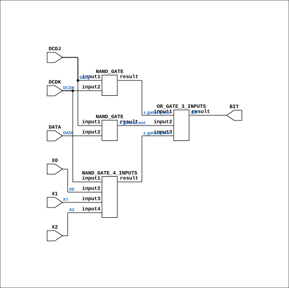

# CGA_INTR_CNTLR_CLR_CLRBIT

Source: `Verilog/DELILAH-CPU/CGA_INTR/circuit/CGA_INTR_CNTLR_CLR_CLRBIT.v`

<!-- Generated by Verilog/tests/module_doc.py from the //! comments in the source. Do not edit by hand - edit the RTL comments and regenerate. -->

<!-- HIERARCHY-NAV:BEGIN - written by Verilog/tests/gen_hierarchy.py, do not edit -->

**Where it sits** (Simulation): [ND120_TOP](../../../../doc/ND120_TOP.md) > [ND120_CORE](../../../../doc/ND120_CORE.md) > [ND3202D](../../../../CPU-BOARD-3202/circuit/doc/ND3202D.md) > [CPU_15](../../../../CPU-BOARD-3202/circuit/doc/CPU_15.md) > [CPU_PROC_32](../../../../CPU-BOARD-3202/circuit/doc/CPU_PROC_32.md) > [CPU_PROC_CGA_33](../../../../CPU-BOARD-3202/circuit/doc/CPU_PROC_CGA_33.md) > [CGA](../../../CGA/circuit/doc/CGA.md) > [CGA_INTR](CGA_INTR.md) > [CGA_INTR_CNTLR](CGA_INTR_CNTLR.md) > [CGA_INTR_CNTLR_CLR](CGA_INTR_CNTLR_CLR.md) > **CGA_INTR_CNTLR_CLR_CLRBIT**
- instance path: `CORE.CPU_BOARD.CPU.PROC.CGA.DELILAH.INTR.CNTLR.CLR_CLEAR_CONTROL.CLRB3`

**Used in:** [CGA_INTR_CNTLR_CLR](CGA_INTR_CNTLR_CLR.md) (all tops)

**Contains:** [NAND_GATE](../../../../Shared/logisim/doc/NAND_GATE.md) x2, [NAND_GATE_4_INPUTS](../../../../Shared/logisim/doc/NAND_GATE_4_INPUTS.md), [OR_GATE_3_INPUTS](../../../../Shared/logisim/doc/OR_GATE_3_INPUTS.md)

[Module hierarchy](../../../../HIERARCHY.md) - [All modules](../../../../MODULES.md)

<!-- HIERARCHY-NAV:END -->


<!-- SCHEMATIC:BEGIN - written by Verilog/tests/gen_schematics.py, do not edit -->

## Schematic

Drawn from the Verilog: the yosys netlist of the Simulation (Verilator) build, instance `CORE.CPU_BOARD.CPU.PROC.CGA.DELILAH.INTR.CNTLR.CLR_CLEAR_CONTROL.CLRB3`. Sub-modules are boxes (click the picture to open it full size; there every sub-module box links to its page, and every wire shows its Verilog name).

[](CGA_INTR_CNTLR_CLR_CLRBIT.svg)

<!-- SCHEMATIC:END -->

## Description

ND120 CGA (CPU Gate Array / DELILAH)
/CGA/INTR/CNTLR/CLR/CLRBIT
CLRBIT
Page 82
SHEET 1 of 1
Last reviewed: 10-NOV-2024
Ronny Hansen

## Ports

| Direction | Width | Name | Description |
|---|---|---|---|
| input | `1` | `DATA` |  |
| input | `1` | `DCDJ` |  |
| input | `1` | `DCDK` |  |
| input | `1` | `X0` |  |
| input | `1` | `X1` |  |
| input | `1` | `X2` |  |
| output | `1` | `BIT` |  |

## Verilog source

[`Verilog/DELILAH-CPU/CGA_INTR/circuit/CGA_INTR_CNTLR_CLR_CLRBIT.v`](https://github.com/RetroCoreLabs/nd-120/blob/main/Verilog/DELILAH-CPU/CGA_INTR/circuit/CGA_INTR_CNTLR_CLR_CLRBIT.v) on GitHub.

<details markdown="1">
<summary>Show the Verilog of CGA_INTR_CNTLR_CLR_CLRBIT (92 lines)</summary>

```verilog
/**************************************************************************
** ND120 CGA (CPU Gate Array / DELILAH)                                  **
** /CGA/INTR/CNTLR/CLR/CLRBIT                                            **
** CLRBIT                                                                **
**                                                                       **
** Page 82                                                               **
** SHEET 1 of 1                                                          **
**                                                                       **
** Last reviewed: 10-NOV-2024                                            **
** Ronny Hansen                                                          **
***************************************************************************/

module CGA_INTR_CNTLR_CLR_CLRBIT (
    input DATA,
    input DCDJ,
    input DCDK,
    input X0,
    input X1,
    input X2,

    output BIT
);

  /*******************************************************************************
   ** The wires are defined here                                                 **
   *******************************************************************************/
  wire s_dcdj;
  wire s_dcdk;
  wire s_x2;
  wire s_gates3_out;
  wire s_bit_out;
  wire s_gates1_out;
  wire s_x0;
  wire s_x1;
  wire s_data;
  wire s_gates2_out;

  /*******************************************************************************
   ** Here all input connections are defined                                     **
   *******************************************************************************/
  assign s_dcdj = DCDJ;
  assign s_dcdk = DCDK;
  assign s_x2 = X2;
  assign s_x0 = X0;
  assign s_x1 = X1;
  assign s_data = DATA;

  /*******************************************************************************
   ** Here all output connections are defined                                    **
   *******************************************************************************/
  assign BIT = s_bit_out;

  /*******************************************************************************
   ** Here all normal components are defined                                     **
   *******************************************************************************/
  NAND_GATE #(
      .BubblesMask(2'b00)
  ) GATES_1 (
      .input1(s_dcdj),
      .input2(s_dcdk),
      .result(s_gates1_out)
  );

  NAND_GATE #(
      .BubblesMask(2'b00)
  ) GATES_2 (
      .input1(s_dcdj),
      .input2(s_data),
      .result(s_gates2_out)
  );

  NAND_GATE_4_INPUTS #(
      .BubblesMask(4'h0)
  ) GATES_3 (
      .input1(s_dcdk),
      .input2(s_x0),
      .input3(s_x1),
      .input4(s_x2),
      .result(s_gates3_out)
  );

  OR_GATE_3_INPUTS #(
      .BubblesMask(3'b111)
  ) GATES_4 (
      .input1(s_gates1_out),
      .input2(s_gates2_out),
      .input3(s_gates3_out),
      .result(s_bit_out)
  );


endmodule
```

</details>
